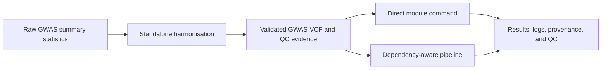

# PostGWAS

PostGWAS is a command-line toolkit for converting heterogeneous genome-wide
association study (GWAS) summary statistics into validated GWAS-VCF and for
running reproducible post-GWAS analyses. It provides one configuration system,
consistent logging and QC, standalone scientific modules, and a dependency-aware
pipeline for multi-stage analyses.

> **Research software:** validate the genome build, ancestry, allele convention,
> sample-size definition, reference resources, resolved configuration, QC
> reports, and external-tool output before interpreting results.

## At a glance

- **Input:** raw GWAS summary-statistics tables for harmonisation, or a
  harmonised GWAS-VCF for downstream analysis.
- **Core preparation:** coordinate, allele, frequency, effect-statistic,
  sample-size, INFO, reference, and VCF validation with rejection provenance.
- **Execution:** run one module directly or let the pipeline resolve and execute
  the registered dependencies for one or more final analyses.
- **Analysis:** filtering, imputation, LD analysis, fine-mapping, heritability,
  gene and gene-set testing, gene prioritisation, single-cell integration,
  architecture analysis, enrichment, plotting, and QC reporting.
- **Reproducibility:** schema-validated YAML, resolved settings, canonical logs,
  commands, software metadata, QC summaries, and completion validation.

## Workflow



Harmonisation is deliberately performed before the downstream pipeline. The
pipeline starts from a harmonised GWAS-VCF; it does not ingest the original raw
summary-statistics table.

## Execution modes

### Harmonisation: required preparation for raw data

Create one version-2 sample-sheet row per GWAS dataset, using the maintained
[quantitative](examples/configs/harmonisation/sample_sheet_quantitative.csv) or
[case-control](examples/configs/harmonisation/sample_sheet_case_control.csv)
template. Map the columns actually present in the study rather than renaming or
guessing their scientific meaning.

```console
postgwas harmonisation \
  --sample-sheet studies.csv \
  --run-config harmonisation.yaml \
  --resource-directory /absolute/path/to/resources \
  --output-directory /absolute/path/to/results \
  --validate
```

Normal harmonisation validation is always active. `--validate` adds a
post-harmonisation concordance comparison between each original dataset and its
same-build merged GWAS-VCF. See the [harmonisation overview](docs/wiki/harmonisation/overview.md),
[sample-sheet guide](docs/wiki/harmonisation/sample-sheet.md), and
[processing order](docs/wiki/harmonisation/processing-order.md).

### Direct mode: run one module

Use direct mode when the required upstream artifact already exists and you want
to control one module explicitly:

```console
postgwas finemap --help
postgwas magma --help
postgwas pathway_enrichment --help
```

In direct mode, you are responsible for supplying all required inputs and for
confirming that their genome build, ancestry, alleles, identifiers, sample-size
definition, and reference resources are compatible. Direct execution does not
infer or recreate missing upstream analyses.

### Pipeline mode: request final analyses

Use pipeline mode when PostGWAS should plan and run registered dependencies.
Select the final results you want; the planner expands them into a deterministic
execution order and runs shared prerequisites once where possible.

Inspect the plan and its context-specific options first:

```console
postgwas pipeline \
  --modules finemap magma pops \
  --apply-filter \
  --help
```

Export a complete configuration for the selected workflow:

```console
postgwas config export \
  --pipeline finemap magma pops \
  --style full \
  --output analysis_pipeline.yaml
```

Then run from the harmonised GWAS-VCF:

```console
postgwas pipeline \
  --modules finemap magma pops \
  --apply-filter \
  --vcf STUDY_GRCh37_merged.vcf.gz \
  --dataset-id STUDY \
  --output-directory results \
  --run-config analysis_pipeline.yaml
```

Optional pipeline switches can add pre-analysis filtering, imputation,
Manhattan/QQ plotting, and LDSC heritability. Formatting may intentionally run
before and after imputation because those stages produce different artifacts.
See [Pipeline Workflow](docs/wiki/core/pipeline-workflow.md).

## Supported modules

The table below reflects the current public command registry. **Direct** means
the module has its own `postgwas COMMAND` interface. **Pipeline** shows the
target name accepted by `postgwas pipeline --modules`.

| Command | Purpose | Direct | Pipeline |
|---|---|:---:|:---:|
| [`harmonisation`](docs/wiki/harmonisation/overview.md) | Standardise raw summary statistics and create validated GWAS-VCF artifacts. | Yes | No — required before the pipeline |
| [`sumstat_filter`](docs/wiki/modules/filtering.md) | Apply configured GWAS-VCF quality-control filters. | Yes | `sumstat_filter` |
| [`formatter`](docs/wiki/modules/formatting.md) | Create validated inputs for downstream scientific tools. | Yes | `formatter` |
| [`imputation`](docs/wiki/modules/imputation.md) | Impute missing summary statistics. | Yes | `imputation` |
| [`annot_ldblock`](docs/wiki/modules/ld-annotation.md) | Annotate variants with population-specific LD blocks. | Yes | `annot_ldblock` |
| [`ld_clump`](docs/wiki/modules/ld-clumping.md) | Identify independent significant variants and genomic loci. | Yes | `ld_clump` |
| [`manhattan`](docs/wiki/modules/manhattan.md) | Generate Manhattan and QQ plots. | Yes | `manhattan` |
| [`qc`](docs/wiki/modules/qc-summary.md) | Generate a GWAS-VCF QC summary. | Yes | `qc_summary` |
| [`heritability`](docs/wiki/modules/ldsc.md) | Estimate SNP heritability with LDSC. | Yes | `heritability` |
| [`finemap`](docs/wiki/modules/fine-mapping.md) | Run SuSiE or FINEMAP fine-mapping. | Yes | `finemap` |
| [`magma`](docs/wiki/modules/magma.md) | Run MAGMA gene and gene-set association analysis. | Yes | `magma` |
| [`gcta_cojo`](docs/modules/gcta_cojo/README.md) | Run GCTA-COJO conditional, joint, or stepwise association analysis. | Yes | `gcta_cojo` |
| [`gcta_gene`](docs/wiki/modules/gcta-gene.md) | Run GCTA fastBAT or mBAT-combo gene, segment, or set analysis. | Yes | `gcta_gene` |
| [`magmacovar`](docs/wiki/modules/magmacovar.md) | Run MAGMA gene-property analysis. | Yes | `magmacovar` |
| [`single_cell`](docs/wiki/modules/single-cell.md) | Identify GWAS-associated cell types using single-cell expression data. | Yes | `single_cell` |
| [`pops`](docs/wiki/modules/pops.md) | Prioritise genes with PoPS. | Yes | `pops` |
| [`kpops`](docs/modules/kpops.md) | Prioritise genes with kernel-based K-POPS. | Yes | `kpops` |
| [`caldera`](docs/modules/caldera.md) | Prioritise causal genes using PoPS and fine-mapped credible sets. | Yes | `caldera` |
| [`flames`](docs/wiki/modules/flames.md) | Integrate fine-mapping, MAGMA, gene-property, and PoPS evidence. | Yes | `flames` |
| [`mixer`](docs/wiki/modules/mixer.md) | Run single-trait MiXeR architecture or GSA gene-set analysis. | Yes | `mixer` |
| [`pathway_enrichment`](docs/wiki/modules/pathway-enrichment.md) | Run pathway and interaction enrichment analyses. | Yes | No — standalone terminal analysis |

Supporting commands are not scientific pipeline targets:

| Command | Purpose |
|---|---|
| `postgwas config` | Validate, inspect, show, and export resolved configuration. |
| `postgwas resources` | Install or validate supported pinned scientific resource bundles. |
| `postgwas pipeline` | Plan and execute a multi-module downstream workflow. |
| `postgwas --validate` | Compare an original summary-statistics dataset with an existing same-build harmonised GWAS-VCF. |

Run `postgwas --help` for the authoritative installed command list and
`postgwas COMMAND --help` for the current options of a direct module.

## Installation

### Recommended: container

The repository Dockerfile is the complete software-stack definition. Build it
from the repository root:
```console
docker build --platform linux/amd64 -t postgwas:local .
docker run --rm --platform linux/amd64 postgwas:local postgwas --help
```

The image pins bcftools/htslib 1.23.1 with the `liftover` plugin, PLINK 1.9 and
2, MAGMA 1.10, GCTA, LDstore 2.0, FINEMAP 1.4.2, SMR, LDSC, Ensembl VEP,
GSA-MiXeR 2.2.1, K-POPS, CALDERA, and R with SuSiE. `linux/amd64` is required:
several pinned binaries and the MiXeR container are x86-64 only.

Mount input, output, and reference-resource directories into the container and
use the paths visible inside the container in commands and YAML. Review the
licenses of bundled third-party tools before redistributing an image.

### Local development

```console
conda env create -f environment.yml
conda activate postgwas
python -m pip install -e .
postgwas --help
```

A plain `pip install -e .` installs only the CLI, configuration and validation
layers. Scientific dependencies live in the `analysis`, `enrichment` and
`single-cell` extras, and **no** external binary or reference resource is
installed by pip. Python 3.10 or newer is required.

The Installation and Resource Setup pages of the
[user guide](docs/wiki/home.md) describe the supported setup paths and the
reference-data tree in full.

## Input requirements

### Stage 1 — raw summary statistics

Harmonisation is driven by a CSV or TSV **sample sheet**, one row per dataset,
with `config_version: 2`. Column names of the raw file are declared in the
sample sheet rather than assumed, so no pre-formatting is needed.

| Group | Sample-sheet columns | Requirement |
|---|---|---|
| Identity | `config_version`, `dataset_id`, `input_file` | required |
| Coordinates | `chromosome_column` + `position_column`, or `chromosome_position_column` | one of the two |
| Alleles | `effect_allele_column`, `other_allele_column` | required |
| Effect | `effect_column` or `z_score_column` (+ `standard_error_column`) | at least one |
| Significance | `p_value_column` | required |
| Frequency | `effect_allele_frequency_column`, or `external_eaf_file` + `external_eaf_column` | exactly one |
| Sample size | `control_count_column`/`control_count`; case-control also needs `case_count_column`/`case_count` | required |
| Imputation quality | `imputation_info_column`, or `external_info_file` + `external_info_column`, or `--fixed-info` | one source |
| Declared or inferred | `trait_type`, `effect_type`, `p_value_type`, `variant_id_column`, `delimiter` | optional, default `auto` |

Templates:

```text
examples/configs/harmonisation/sample_sheet_quantitative.csv
examples/configs/harmonisation/sample_sheet_case_control.csv
examples/configs/harmonisation/run_config.yaml
```

Harmonisation also needs a reference tree containing, per genome build and
chromosome, a reference FASTA, a dbSNP VCF, an allele-frequency VCF, an Ensembl
GFF3 annotation, and chain files for liftover. All resource paths are resolved
from `resources.root` using configurable layout templates.

### Stage 2 — harmonised GWAS-VCF

Every analysis module consumes a bgzipped, tabix-indexed GWAS-VCF carrying the
standard GWAS-VCF FORMAT fields (`ES`, `SE`, `LP`, `AF`, `SI`, `SS`, `NC`,
`EZ` and related). Reference panels for downstream tools — PLINK LD references,
LD-block BEDs, pairwise LD tables, PoPS feature matrices, FLAMES annotations,
LDSC scores — are supplied by configuration and are not bundled.

## Validation and QC

PostGWAS validates configuration and required inputs before expensive work,
then applies module-specific scientific and technical checks. Harmonisation
additionally validates coordinates, alleles, duplicates, genome-build evidence,
strand orientation, EAF/MAF interpretation, sample size, INFO, BETA/OR, SE, Z,
P-value consistency, chromosome completion, VCF structure, indexes, liftover,
merge completeness, and variant accounting.

To validate an existing same-build merged GWAS-VCF against its original input:

```console
postgwas --validate \
  --sample-sheet studies.csv \
  --dataset-id STUDY \
  --vcf results/STUDY/harmonisation/STUDY_GRCh37_merged.vcf.gz \
  --output-directory results
```

## Configuration

Settings resolve in a fixed precedence: **packaged defaults → user YAML
(`--run-config`) → explicit command-line values**. Unset flags never override
YAML, and `execution.threads`/`memory_gb` set to `auto` are resolved from the
host after merging. User YAML may pull in other files with an `include:` list.
Unknown keys are rejected with their full dotted path.

Top-level configuration keys:

| Key | Controls |
|---|---|
| `run` | output directory, dataset identifier, `resume`, `overwrite` |
| `execution` | threads, memory, random seed, retries, temporary directory |
| `logging` | console and file levels, log filename, progress display |
| `resources` | resource root, executable locations, genomes, populations |
| `modules` | per-module scientific settings and output layout |

Export a starting configuration instead of copying one from an older run:

```console
postgwas config export \
  --pipeline finemap \
  --style full \
  --output finemap_pipeline.yaml

postgwas config validate --config finemap_pipeline.yaml
postgwas config show --config finemap_pipeline.yaml --module fine_mapping
```

`--pipeline` includes every required preceding module in execution order.
`--style` controls comment density only; the resolved values are identical.

### Reference resources

`postgwas resources` installs and revalidates the pinned MAGMA
functional-mapping bundle, including the eMAGMA, H-MAGMA, nMAGMA and chromMAGMA
mapping sets, with SHA-256 verification and a generated configuration fragment:

```console
postgwas resources prepare magma --output-directory /path/to/resources/magma
```

All other reference data — genome FASTA, dbSNP, allele-frequency panels, chain
files, PLINK references, LD panels, PoPS features, FLAMES annotations, LDSC
scores, single-cell atlases — is prepared by the user. Helper scripts are in
`tools/resource_preparation/`, and the expected layout is documented on the
Reference Resources page.

## Outputs

Harmonisation writes one tree per dataset:

```text
results/
├── run_metadata/                    # resolved config, run summary, top-level log
└── STUDY/
    ├── run_metadata/                # resolved config, sample-sheet row, command
    └── harmonisation/
        ├── STUDY_GRCh37_merged.vcf.gz(.tbi)
        ├── STUDY_GRCh38_merged.vcf.gz(.tbi)
        ├── STUDY_run_manifest.json
        ├── logs/                    # dataset, per-chromosome and combined logs
        ├── rejected/                # rejected variants with reason and step
        ├── qc_summary/              # QC report, reject-reason matrix, concordance
        └── eaf_qc/
```

Pipeline runs number each step in execution order under the output directory,
so the directory listing is the executed plan:

```text
results/analysis/
├── 01_annot_ldblock/
├── 02_formatter/
├── 03_ld_clump/
├── 04_finemap/
├── 05_magma/
├── 06_magma_covar/
├── 07_pops/
└── 08_flames/
```

Within a step, modules use a consistent layout: `results/` for normalised
tables, `raw/` for native tool output, `inputs/` for prepared tool inputs,
`logs/`, and `run_metadata/` for the resolved configuration and completion
manifest. Exact filenames are configuration, so read the resolved YAML rather
than reconstructing paths; the Output Structure page describes the output
classes and how to archive a run.

## QC, logging and reproducibility

- **Rejection evidence.** Harmonisation records every discarded variant with its
  original row, the processing step, and a registered reason, and writes a
  reason-by-chromosome matrix in which a zero is positive evidence that the
  check ran. Row counts are reconciled per chromosome.
- **QC assessment.** After merging, harmonisation evaluates MAF, INFO,
  frequency discordance, palindromic and MHC filters as *reports* without
  removing variants; `sumstat_filter` is where removal happens, and it audits
  how many variants each rule removed.
- **Canonical logs.** Modules log through one formatter with explicit markers
  (`STEP`, `INPUT`, `PARAM`, `DECIDE`, `ACTION`, `RESULT`, `OUTPUT`, `STATUS`),
  so a log can be read as the executed method.
- **Provenance.** Runs write the resolved configuration, the executed command,
  external-tool versions and a run manifest alongside results.
- **Resume.** Modules that support it write a completion manifest recording the
  configuration digest and the checksums of every input and output. `--resume`
  reuses a step only when all of these still match; `--overwrite` always takes
  precedence and reruns the step. Support is per module, not universal.

## Scope and current limitations

- `harmonisation` runs only as a standalone command; it is not a pipeline stage.
  Start pipelines from a harmonised GWAS-VCF.
- `imputation` currently implements the PRED-LD engine only.
- `pathway_enrichment` is a standalone terminal analysis that needs network
  access and user-supplied BioGRID and DAVID credentials; its providers are not
  individually selectable.
- `heritability` provides single-trait h² only — no partitioned heritability and
  no genetic correlation. `mixer` provides single-trait and GSA analyses only;
  cross-trait MiXeR is not exposed.
- `caldera` in pipeline mode supports GRCh37 only.
- `gcta_cojo`, `gcta_gene`, `heritability`, `mixer`, `qc`, `manhattan` and
  `pathway_enrichment` are terminal: no module consumes their results.
- Genome build, ancestry and reference panels must agree across the study and
  every resource; PostGWAS validates what it can but cannot infer intent.
- External tools and reference data are not bundled outside the container.

## Documentation

The complete user guide is stored as version-controlled Markdown in this
repository, so it remains available when GitHub Wiki access is not enabled.
Start with the [PostGWAS User Guide](docs/wiki/home.md), or open a topic below.

**Getting started** ·
[Installation](docs/wiki/getting-started/installation.md) ·
[Quick Start](docs/wiki/getting-started/quick-start.md) ·
[Resource Setup](docs/wiki/getting-started/resource-setup.md)

**Core concepts** ·
[Configuration](docs/wiki/core/configuration.md) ·
[Pipeline Workflow](docs/wiki/core/pipeline-workflow.md) ·
[Input and Output Contracts](docs/wiki/core/input-output-contracts.md) ·
[Logging and Reproducibility](docs/wiki/core/logging-and-reproducibility.md) ·
[Scientific Considerations](docs/wiki/core/scientific-considerations.md) ·
[Running Modules Independently](docs/wiki/core/running-modules-independently.md)

**Harmonisation** ·
[Overview](docs/wiki/harmonisation/overview.md) ·
[Sample Sheet](docs/wiki/harmonisation/sample-sheet.md) ·
[Configuration](docs/modules/harmonisation/configuration.md) ·
[Processing Order](docs/wiki/harmonisation/processing-order.md) ·
[Outputs and QC](docs/wiki/harmonisation/outputs-and-qc.md)

**Analysis modules** ·
[Filtering](docs/wiki/modules/filtering.md) ·
[Formatting](docs/wiki/modules/formatting.md) ·
[QC Summary](docs/wiki/modules/qc-summary.md) ·
[Manhattan Plots](docs/wiki/modules/manhattan.md) ·
[Imputation](docs/wiki/modules/imputation.md) ·
[LD Annotation](docs/wiki/modules/ld-annotation.md) ·
[LD Clumping](docs/wiki/modules/ld-clumping.md) ·
[LDSC Heritability](docs/wiki/modules/ldsc.md) ·
[Fine Mapping](docs/wiki/modules/fine-mapping.md) ·
[MAGMA](docs/wiki/modules/magma.md) ·
[GCTA Gene Analysis](docs/wiki/modules/gcta-gene.md) ·
[MAGMAcovar](docs/wiki/modules/magmacovar.md) ·
[Single-Cell Integration](docs/wiki/modules/single-cell.md) ·
[PoPS](docs/wiki/modules/pops.md) ·
[K-POPS](docs/modules/kpops.md) ·
[CALDERA](docs/modules/caldera.md) ·
[FLAMES](docs/wiki/modules/flames.md) ·
[MiXeR](docs/wiki/modules/mixer.md) ·
[Pathway Enrichment](docs/wiki/modules/pathway-enrichment.md)

**Reference** ·
[Input Data](docs/wiki/reference/input-data.md) ·
[Reference Resources](docs/wiki/reference/reference-resources.md) ·
[Configuration Defaults](docs/wiki/reference/configuration-defaults.md) ·
[Output Structure](docs/wiki/reference/output-structure.md) ·
[Command Reference](docs/wiki/reference/command-reference.md) ·
[Validation Reference](docs/wiki/reference/validation.md) ·
[Scientific References](docs/wiki/reference/scientific-references.md) ·
[scDRS Evidence Review](docs/wiki/reference/scdrs-evidence-review.md)

**Help** ·
[Troubleshooting](docs/wiki/help/troubleshooting.md) ·
[Frequently Asked Questions](docs/wiki/help/faq.md) ·
[Error Messages](docs/wiki/help/error-messages.md)

Module documentation follows the methods of the underlying tools; see
[Scientific References](docs/wiki/reference/scientific-references.md) for the
publications behind MAGMA, GCTA, SuSiE, FINEMAP, LDSC, PoPS, CALDERA, FLAMES,
MiXeR, scDRS and PRED-LD.

## Development

```console
python -m pytest -q
python tools/docs/build_wiki.py --check
python tools/docs/validate_wiki_cli.py
```

The user guide under `docs/wiki/` is the source of truth for the published Wiki:
pages are generated from `docs/wiki.yml`, and CI validates that every documented
command and option exists in the installed CLI. Edit the source pages, not
generated copies.

Repository development must follow [AGENTS.md](AGENTS.md), including scientific
validation, focused regression tests, cumulative-diff review, and protection of
the bundled harmonisation adapters.
## License

See [LICENSE](LICENSE). Third-party tools and reference datasets may have
additional terms that apply independently.
