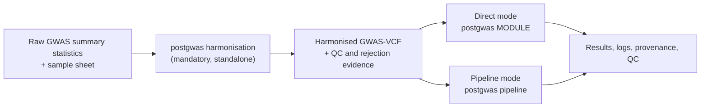

# PostGWAS

PostGWAS is a command-line toolkit that converts heterogeneous genome-wide
association study (GWAS) summary statistics into a validated GWAS-VCF, and then
runs reproducible post-GWAS analyses from that file. It provides one
configuration system, one logging and QC convention, standalone analysis
modules, and a dependency-aware pipeline for multi-stage analyses.

> **Research software.** A command that exits successfully is not evidence that
> the analysis was valid. Verify the genome build, ancestry,
> allele convention, sample-size definition, reference resources, resolved
> configuration, QC reports, and external-tool output before interpreting
> results.

## Contents

**Using PostGWAS** — [Overview](#overview) · [Execution modes](#execution-modes) ·
[Quick start](#quick-start) · [Modules and execution order](#modules-and-execution-order)

**Setting up** — [Installation](#installation) ·
[External software](#external-software) ·
[Reference data](#reference-data-and-resource-files) ·
[Input formats](#input-formats) · [Configuration](#configuration)

**Results and support** — [Outputs](#outputs) ·
[QC, logging and provenance](#qc-logging-and-provenance) ·
[Troubleshooting](#troubleshooting) ·
[Scope and current limitations](#scope-and-current-limitations) ·
[Documentation](#documentation) · [Development](#development) ·
[License](#license)

## Overview

PostGWAS separates data preparation from analysis, and the boundary between them
is a validated GWAS-VCF.



1. **Preparation.** `harmonisation` reads raw summary-statistics tables described
   by a sample sheet, standardises coordinates, alleles, frequencies, effect
   statistics, sample sizes and imputation quality, and writes a
   bgzip-compressed, tabix-indexed GWAS-VCF for each configured genome build,
   together with rejection and QC evidence. It is a mandatory, standalone first
   step and is deliberately not a pipeline stage.
2. **Analysis.** Every downstream module reads that GWAS-VCF, or an artifact
   derived from it: filtering and QC, LD annotation and clumping, fine-mapping,
   heritability, gene and gene-set testing, gene prioritisation, single-cell
   integration, polygenic architecture, and pathway enrichment. Run one module
   yourself (*direct mode*), or let `pipeline` resolve and execute the registered
   prerequisites of the analyses you ask for (*pipeline mode*).

Both modes consume the same GWAS-VCF and differ only in who produces the
intermediate artifacts. [Modules and execution
order](#modules-and-execution-order) lists every available analysis, its
command, and its pipeline dependencies.

## Execution modes

### Harmonisation: required preparation for raw data

Harmonisation is driven by a **sample sheet**: a CSV or TSV file with one row per
dataset that maps the column names actually present in each study to the concepts
PostGWAS requires. Column meanings are declared, not guessed, so raw files do not
have to be pre-formatted. The column reference is under
[Input formats](#input-formats); a filled-in example and its matching GWAS file
ship in `tests/data/harmonisation/`.

```console
postgwas harmonisation \
  --sample-sheet studies.csv \
  --run-config harmonisation.yaml \
  --resource-directory /absolute/path/to/resources \
  --output-directory /absolute/path/to/results \
  --validate
```

`--resource-directory` is required unless `resources.root` is set in
`--run-config`. `--dataset-id` restricts the run to one row of the sample sheet;
without it every row is processed.

Structural and cross-field harmonisation checks always run. `--validate` adds an
independent post-harmonisation concordance comparison between each original
dataset and its same-build merged GWAS-VCF. The same comparison can be run later
against an existing file:

```console
postgwas --validate \
  --sample-sheet studies.csv \
  --dataset-id STUDY \
  --vcf results/STUDY/harmonisation/STUDY_GRCh37_merged.vcf.gz \
  --output-directory results
```

**To understand what harmonisation actually does to your data, read
[How Harmonisation Processes Your Data](docs/wiki/harmonisation/processing-order.md).**
It walks through all seven stages and the 29 numbered steps in the exact order
they run — using the same labels that appear in the log files — and explains what
each step reads, decides, and writes.

See also the [harmonisation overview](docs/wiki/harmonisation/overview.md),
[sample-sheet guide](docs/wiki/harmonisation/sample-sheet.md),
[outputs and QC](docs/wiki/harmonisation/outputs-and-qc.md), and the
[validation reference](docs/wiki/reference/validation.md).

### Direct mode: run one module

Use direct mode when the module's required input already exists and you want to
control that one step explicitly. **You** supply every input: the harmonised
GWAS-VCF or the upstream artifact the module consumes, all reference files, and
all analysis parameters. Direct execution never infers, plans, or recreates a
missing upstream analysis, and it does not check that inputs produced elsewhere
share a compatible genome build, ancestry, allele convention or sample-size
definition.

`postgwas COMMAND --help` is authoritative for option names, packaged defaults
and a worked example for that module. The examples below are the ones those help
pages print.

Create the tables downstream tools need, then run MAGMA from them:

```console
postgwas formatter \
  --vcf study.vcf.gz \
  --dataset-id STUDY \
  --output-directory formatted \
  --format magma ldsc
```

```console
postgwas magma \
  --snp-location-file formatted/STUDY_magma_snp_loc.tsv \
  --p-value-file formatted/STUDY_magma_p_values.tsv \
  --magma-ld-reference reference/1000G_EUR \
  --gene-location-file reference/NCBI37.3.gene.loc \
  --resolve-variants-to-reference \
  --dataset-id STUDY \
  --output-directory results
```

Run SuSiE-RSS fine-mapping:

```console
postgwas finemap \
  --finemap-method susie \
  --susie-input-file formatted/STUDY_susie.tsv.gz \
  --locus-file loci.tsv \
  --finemap-ld-reference reference/1000G_EUR \
  --dataset-id STUDY \
  --output-directory results
```

`STUDY` is your `--dataset-id`; `study.vcf.gz` is a merged GWAS-VCF from
harmonisation; files under `formatted/` are written by `formatter`; `loci.tsv` is
a locus file, which `ld_clump` produces; paths under `reference/` are downloaded
resources. Any module can also run entirely from an exported configuration, which
is the reproducible form — see [Configuration](#configuration).

See [Running Modules Independently](docs/wiki/core/running-modules-independently.md).

### Pipeline mode: request final analyses

Use pipeline mode when PostGWAS should plan and run the registered
prerequisites. You name the final analyses with `--modules`; the planner expands
them into a deterministic execution order and runs shared prerequisites once
where possible.

**You provide** one harmonised GWAS-VCF (`--vcf`), a dataset identifier
(`--dataset-id`), an output directory (`--output-directory`), the analysis
settings and reference paths for every selected module (as options or through
`--run-config`), and the analyses you want.

**PostGWAS provides** the execution order, including modules you did not name,
and the intermediate artifacts passed between steps — the LD-block annotated VCF,
formatter tables, the clumped locus file, MAGMA gene results, PoPS scores. The
options that carry those artifacts are hidden from the contextual help because
setting them has no effect.

**Ordering.** Each target's registered dependencies are expanded recursively,
cycles are rejected, and steps are emitted in a fixed order: filtering; then
formatting and imputation, with an automatic post-imputation filtering step when
both are active; then LD-block annotation; then formatting for downstream tools;
then the analysis modules; then plotting and QC summaries. Formatting can
legitimately appear twice, because the pre- and post-imputation representations
are different data.

**Workflow switches.** `--apply-filter`, `--apply-imputation`,
`--apply-manhattan` and `--heritability` add `sumstat_filter`, `imputation`,
`manhattan` and `heritability` to the plan without naming them as targets.

**Inspect before running.** With `--help`, the pipeline prints the exact steps
that will run, only the options that apply to them, and a worked example for the
selected target:

```console
postgwas pipeline --modules finemap magma pops --help
```

For that selection the plan is `annot_ldblock`, `formatter`, `ld_clump`,
`magma`, `pops`, `finemap`.

**Run the plan.** The examples below are the ones the command prints for those
targets. LD annotation, clumping, formatting and SuSiE fine-mapping:

```console
postgwas pipeline \
  --modules finemap \
  --vcf study_GRCh37.vcf.gz \
  --genome-build GRCh37 \
  --ld-region-dir reference/ld_blocks \
  --ld-block-populations EUR \
  --ld-folder reference/pairwise_ld \
  --population EUR \
  --variant-id-type unique \
  --finemap-method susie \
  --finemap-ld-reference reference/1000G_EUR \
  --plink plink \
  --bcftools bcftools \
  --dataset-id STUDY \
  --output-directory results
```

MAGMA gene analysis followed by PoPS prioritisation:

```console
postgwas pipeline \
  --modules pops \
  --vcf study.vcf.gz \
  --magma-ld-reference reference/1000G_EUR \
  --gene-location-file reference/FUMA/ENSGv102.coding.genes.txt \
  --feature-matrix-prefix reference/pops/features_munged/pops_features \
  --feature-matrix-chunks 116 \
  --pops-gene-location-file reference/pops/gene_annots.txt \
  --control-features-file reference/pops/control.features \
  --pops-genome-build GRCh37 \
  --dataset-id STUDY \
  --output-directory results
```

A `--run-config` can replace any of the analysis options above:

```console
postgwas pipeline \
  --modules finemap magma pops \
  --vcf study_GRCh37.vcf.gz \
  --dataset-id STUDY \
  --output-directory results \
  --run-config analysis_pipeline.yaml
```

Execution stops at the first failed step. A later step is never reported as
complete unless execution reached it successfully. See
[Pipeline Workflow](docs/wiki/core/pipeline-workflow.md).

## Installation

Two installation paths provide the same `postgwas` command but different
platform and external-tool coverage. Neither path supplies the
reference files required by the analyses.

### Container image

The repository `Dockerfile` attempts to assemble the broadest Linux x86-64
software stack, including programs unavailable natively on Apple Silicon.
Build and smoke-test it from the repository root, and read the `Dockerfile`
itself for the exact programs and versions it installs.

```console
docker build --platform linux/amd64 -t postgwas:local .
docker run --rm --platform linux/amd64 postgwas:local postgwas --help
```

Mount input, output and reference-resource directories into the container, and
use the paths visible **inside** the container in commands and YAML. Review the
licences of the bundled third-party tools before redistributing an image.

### Local installation

```console
bash tools/setup/install_postgwas.sh --editable
conda activate postgwas
postgwas --help
```

The installer supports macOS arm64/x86-64 and glibc-based Linux x86-64. It
creates the environment, installs this checkout, builds the bcftools liftover
plugin inside the environment, and verifies the software layer. `environment.yml`
remains the authoritative dependency list. Platform-specific or licensed
programs and all reference resources still need the preparation described in
the installation guide.

See [Installation](docs/wiki/getting-started/installation.md).

## External software

PostGWAS calls external programs rather than reimplementing them. Every
executable below is a key under `resources.executables`, and most commands also
expose a matching flag. The defaults are the plain command names shown in the
second column, so any program on `PATH` works without configuration.

| `resources.executables` key | Default | CLI flag | Used by |
|---|---|---|---|
| `bcftools` | `bcftools` | `--bcftools` | `harmonisation`, `sumstat_filter`, `formatter`, `annot_ldblock`, `ld_clump`, `qc`, `gcta_gene` |
| `tabix` | `tabix` | `--tabix` (FLAMES) | `harmonisation`, `annot_ldblock`, `ld_clump`, `flames` |
| `bash` | `bash` | — | `harmonisation`, `sumstat_filter`, `ld_clump`, `qc` |
| `python` | `python` | — | `harmonisation` (GWAS-to-VCF adapter), `kpops` |
| `pigz` | `pigz` | — | `harmonisation` (optional; falls back to gzip) |
| `plink` | `plink` | `--plink` | `finemap` |
| `plink2` | `plink2` | — | `finemap` (FINEMAP engine) |
| `rscript` | `Rscript` | — | `finemap` (SuSiE), `manhattan`, `caldera` |
| `finemap` | `finemap` | — | `finemap` (FINEMAP engine, together with `ldstore` and `bgenix` on `PATH`) |
| `magma` | `magma` | `--magma` | `magma`, `magmacovar`, `single_cell` |
| `gcta` | `gcta64` | `--gcta` | `gcta_cojo`, `gcta_gene` |
| `ldsc` | `ldsc.py` | `--ldsc` (single-cell only) | `heritability`, `single_cell` |
| `munge_sumstats` | `munge_sumstats.py` | `--munge-sumstats` (single-cell only) | `heritability`, `single_cell` |
| `scdrs` | `scdrs` | `--scdrs` | `single_cell` |
| `mixer`, `mixer_figures` | `/tools/mixer/precimed/mixer*.py` | `--mixer`, `--mixer-figures` | `mixer` |

`resources.containers.mixer` configures the GSA-MiXeR container alternative
(`ghcr.io/precimed/gsa-mixer:2.2.1`, `linux/amd64`) selected with
`--mixer-backend`. `kpops` additionally needs the upstream `k-pops.py` script
(`--kpops-script`), `caldera` needs the upstream CALDERA R repository
(`--caldera-repository`), `flames` needs Ensembl VEP and CADD either locally
(`--vep-command`, `--vep-cache`, `--cadd-file`) or through their web APIs, and
`pathway_enrichment` needs network access with a BioGRID key and a registered
DAVID email.

The repository `Dockerfile` attempts to install these for Linux x86-64. Treat
the image as ready only after its build and relevant tool smoke tests pass.

## Reference data and resource files

> **All reference and resource files must be downloaded.** PostGWAS does not
> generate them, and none of them ship with the package.
>
> **Download link:** _to be added._
>
> Until the link is published, create the directory structure below and place the
> downloaded files in it.

Every path is resolved from a single **resource root**, supplied as
`--resource-directory` or as `resources.root` in a run configuration.

### Harmonisation resource folder structure

These seven templates are the exact patterns harmonisation expands
(`modules.harmonisation.resource_layout`). `{build}` is `GRCh37` or `GRCh38`,
`{chromosome}` is the chromosome label without a `chr` prefix, and `{source}` is
the configured panel name.

```text
<resource-root>/
├── GRCh37/
│   ├── fasta_files/            GRCh37_chr{chromosome}.fa            (+ .fai)
│   ├── dbSNP/vcf_files/        GRCh37_dbSNP157_chr{chromosome}.vcf.gz   (+ .tbi/.csi)
│   ├── external_af/vcf_files/  GRCh37_ALFA_freq_chr{chromosome}.vcf.gz  (+ .tbi/.csi)
│   ├── default_af/tab_files/   GRCh37_ALFA_freq_chr{chromosome}.tsv.gz
│   └── gff_files/              GRCh37_ensembl.gff3.gz
├── GRCh38/
│   └── (same five subdirectories, with GRCh38 in place of GRCh37)
├── chain_files/                GRCh37_to_GRCh38.chain
│                               GRCh38_to_GRCh37.chain
└── GRCh37_38_check_files/      GRCh37_check_file.tsv
                                GRCh38_check_file.tsv
```

The `{source}` token is a configuration value, not a fixed filename. The
allele-frequency VCF used for annotation and QC accepts `ALFA` or `1000G`
(`modules.harmonisation.comparison_af.source`, default `ALFA`). The tabular
frequency table used for strand and MAF/EAF resolution accepts `ALFA`,
`wgs_ukb`, `panukb`, `1000G` or `fingen`
(`modules.harmonisation.default_eaf.source`, default `ALFA`). The dbSNP token
comes from `modules.harmonisation.reference.dbsnp_source` (default `dbSNP157`).
Change a source and the filenames must change with it.

Files are needed only for the chromosomes present in your study. Missing files,
missing indexes, wrong chromosome labels and wrong header tags are all reported
together by the resource preflight before any chromosome worker starts.

### Downstream module resources

Each downstream module takes its reference data through its own options. The
**Reference data** column of [Modules and execution
order](#modules-and-execution-order) names them per module; download only what
the analyses you plan to run require.

One bundle has a built-in installer. `postgwas resources` downloads, SHA-256
verifies and installs the pinned MAGMA functional-mapping bundle, including the
eMAGMA, H-MAGMA, nMAGMA and chromMAGMA mapping sets, and writes a matching
configuration fragment:

```console
postgwas resources prepare magma --output-directory /path/to/resources/magma
```

See [Resource Setup](docs/wiki/getting-started/resource-setup.md) and
[Reference Resources](docs/wiki/reference/reference-resources.md).

## Input formats

### Stage 1 — raw summary statistics

Harmonisation reads a CSV or TSV **sample sheet** with `config_version: 2` and
one row per dataset. Unrecognised columns are rejected.

| Group | Sample-sheet columns | Requirement |
|---|---|---|
| Identity | `config_version`, `dataset_id`, `input_file` | required |
| Coordinates | `chromosome_column` + `position_column`, or `chromosome_position_column` | one of the two |
| Alleles | `effect_allele_column`, `other_allele_column` | required |
| Effect | `effect_column` or `z_score_column`, with optional `standard_error_column` | at least one |
| Significance | `p_value_column` | required |
| Frequency | `effect_allele_frequency_column`, or `external_eaf_file` + `external_eaf_column` | exactly one source |
| Sample size | `control_count_column` or `control_count`; case-control also needs `case_count_column` or `case_count` | required |
| Imputation quality | `imputation_info_column`, or `external_info_file` + `external_info_column`, or the `--fixed-info` flag | one source |
| Declared or inferred | `trait_type`, `effect_type`, `p_value_type`, `variant_id_column`, `delimiter` | optional; the inferable fields default to `auto` |

Relative `input_file` and external-file paths are resolved from the directory
containing the sample sheet; absolute paths are also accepted. A filled-in
example is `tests/data/harmonisation/manifest_v2.csv`. The full column
reference, accepted values and validation rules are in
[Input Data](docs/wiki/reference/input-data.md) and the
[sample-sheet guide](docs/wiki/harmonisation/sample-sheet.md).

### Stage 2 — harmonised GWAS-VCF

Every analysis module consumes a bgzipped, tabix-indexed GWAS-VCF carrying the
standard GWAS-VCF FORMAT fields (`ES`, `SE`, `LP`, `AF`, `SI`, `SS`, `NC`, `EZ`
and related). Some modules consume a table derived from that VCF by `formatter`
rather than the VCF itself; the per-module input contract is stated on each
module page and summarised under
[Input and Output Contracts](docs/wiki/core/input-output-contracts.md).

## Configuration

Settings resolve in a fixed precedence: **packaged defaults → user YAML
(`--run-config`) → explicit command-line values**. Unset flags never override
YAML. `execution.threads` and `execution.memory_gb` set to `auto` are resolved
from the host after merging. A user YAML file may pull in other files with an
`include:` list. Unknown keys are rejected with their full dotted path.

| Top-level key | Controls |
|---|---|
| `config_version` | configuration schema version |
| `run` | output directory, dataset identifier, `resume`, `overwrite` |
| `execution` | threads, memory, random seed, retries, temporary directory |
| `logging` | console and file levels, terminal display, screen transcript, canonical log filename, progress display |
| `resources` | resource root, executable locations, container settings, genome builds, populations |
| `pipeline` | a validated record of the intended module list; module selection itself comes from `--modules` |
| `modules` | per-module analysis settings and output layout |

Export a starting configuration instead of copying one from an older run:

```console
postgwas config export \
  --pipeline finemap \
  --style full \
  --output finemap_pipeline.yaml

postgwas config export \
  --module formatting \
  --format ldsc \
  --style minimal \
  --output formatting.yaml

postgwas config validate --config finemap_pipeline.yaml
postgwas config show --config finemap_pipeline.yaml --module fine_mapping
```

`--pipeline` accepts pipeline target names and includes every required preceding
module in execution order. `--module` accepts configuration module names, which
are not always identical to command names — for example `filtering`,
`fine_mapping`, `qc_summary` and `enrichment`. `--style` controls comment
density only; the resolved values are identical. With `--module formatting`,
`--format` limits the exported file to shared formatter settings and the
selected target schemas. It does not apply to pipeline or other module exports.

See [Configuration](docs/wiki/core/configuration.md) and
[Configuration Defaults](docs/wiki/reference/configuration-defaults.md).

## Quick start

The order of work, with the section covering each step:

| # | Step | See |
|---|---|---|
| 1 | Install the container image or the local environment | [Installation](#installation) |
| 2 | Confirm the external programs your analyses need are on the path | [External software](#external-software) |
| 3 | Download the reference data into one resource root | [Reference data](#reference-data-and-resource-files) |
| 4 | Write a sample sheet describing each raw GWAS file | [Input formats](#input-formats) |
| 5 | Harmonise, then read the QC and rejection reports before going further | [Harmonisation](#harmonisation-required-preparation-for-raw-data) |
| 6 | Export and complete a configuration for the analyses you want | [Configuration](#configuration) |
| 7 | Run those analyses from the harmonised GWAS-VCF | [Direct mode](#direct-mode-run-one-module) or [pipeline mode](#pipeline-mode-request-final-analyses) |
| 8 | Review the complete run record, not only the final table or plot | [QC, logging and provenance](#qc-logging-and-provenance) |

The [Quick Start](docs/wiki/getting-started/quick-start.md) page walks through the
same sequence with more explanation.

## Modules and execution order

This is the single reference for what each module does, how it is selected, what
it depends on, and what reference data you must download for it. Every module has
its own `postgwas COMMAND` interface. **Pipeline target** is the name accepted by
`postgwas pipeline --modules`. **Requires** lists the dependencies the planner
inserts automatically. **Reference data** names the options that take downloaded
files; the pipeline supplies everything else from earlier steps.

| Command | Purpose | Pipeline target | Requires | Reference data |
|---|---|---|---|---|
| [`harmonisation`](docs/wiki/harmonisation/overview.md) | Standardise raw summary statistics and create validated GWAS-VCF artifacts. | No — required before the pipeline | — | resource root (`--resource-directory`) |
| [`sumstat_filter`](docs/wiki/modules/filtering.md) | Apply configured GWAS-VCF quality-control filters. | `sumstat_filter` | — | none |
| [`formatter`](docs/wiki/modules/formatting.md) | Create validated inputs for downstream analysis tools. | `formatter` | — | none |
| [`imputation`](docs/wiki/modules/imputation.md) | Impute missing summary statistics. | `imputation` | `formatter` | PRED-LD panel (`--imputation-ld-reference`), resource root (`--resource-directory`) |
| [`annot_ldblock`](docs/wiki/modules/ld-annotation.md) | Annotate variants with population-specific LD blocks. | `annot_ldblock` | — | LD-block BEDs (`--ld-region-dir`) |
| [`ld_clump`](docs/wiki/modules/ld-clumping.md) | Identify independent significant variants and genomic loci. | `ld_clump` | `annot_ldblock` | pairwise LD tables (`--ld-folder`) |
| [`manhattan`](docs/wiki/modules/manhattan.md) | Generate Manhattan and QQ plots. | `manhattan` | — | none |
| [`qc`](docs/wiki/modules/qc-summary.md) | Generate a GWAS-VCF QC summary. | `qc_summary` | — | none |
| [`heritability`](docs/wiki/modules/ldsc.md) | Estimate SNP heritability with LDSC. | `heritability` | `formatter` | LD scores and weights (`--ref-ld-chr`, `--w-ld-chr`, `--merge-alleles`) |
| [`finemap`](docs/wiki/modules/fine-mapping.md) | Run SuSiE or FINEMAP fine-mapping. | `finemap` | `ld_clump`, `formatter` | PLINK genotype reference (`--finemap-ld-reference`) |
| [`magma`](docs/wiki/modules/magma.md) | Run MAGMA gene and gene-set association analysis. | `magma` | `formatter` | PLINK LD reference (`--magma-ld-reference`), gene locations (`--gene-location-file`), optional gene sets (`--gene-set-file`) |
| [`gcta_cojo`](docs/modules/gcta_cojo/README.md) | Run GCTA-COJO conditional, joint, or stepwise association analysis. | `gcta_cojo` | `formatter` | PLINK reference (`--cojo-reference-prefix`) |
| [`gcta_gene`](docs/wiki/modules/gcta-gene.md) | Run GCTA fastBAT or mBAT-combo gene, segment, or set analysis. | `gcta_gene` | `formatter` | PLINK reference (`--gcta-reference-prefix`), gene list (`--gene-list`), optional GMT sets (`--gmt`) |
| [`magmacovar`](docs/wiki/modules/magmacovar.md) | Run MAGMA gene-property analysis. | `magmacovar` | `magma` | gene-level covariate table (`--covariates`) |
| [`single_cell`](docs/wiki/modules/single-cell.md) | Identify GWAS-associated cell types using single-cell expression data. | `single_cell` | `magma`, or `formatter` for LDSC cell-type analysis | per tool: expression matrix (`--single-cell-covariates`), H5AD atlas and gene-ID map (`--scdrs-h5ad-file`, `--scdrs-gene-id-map`), or LDSC cell-type files (`--ldsc-celltype-ldcts-file`, `--ldsc-celltype-baseline-prefix`, `--ldsc-celltype-weights-prefix`, `--ldsc-celltype-merge-alleles-file`) |
| [`pops`](docs/wiki/modules/pops.md) | Prioritise genes with PoPS. | `pops` | `magma` | feature matrix (`--feature-matrix-prefix`, `--feature-matrix-chunks`), gene annotation (`--pops-gene-location-file`), optional control features (`--control-features-file`) |
| [`kpops`](docs/modules/kpops.md) | Prioritise genes with kernel-based K-POPS. | `kpops` | `magma` | gene annotation (`--kpops-gene-annotation-file`), kernel matrix (`--kernel-matrix-prefix`) |
| [`caldera`](docs/modules/caldera.md) | Prioritise causal genes using PoPS and fine-mapped credible sets. | `caldera` | `pops`, `finemap` | CALDERA repository with its data and model (`--caldera-repository`) |
| [`flames`](docs/wiki/modules/flames.md) | Integrate fine-mapping, MAGMA, gene-property, and PoPS evidence. | `flames` | `finemap`, `magmacovar`, `pops` | annotation bundle (`--flames-annotation-directory`), optional local VEP cache and CADD file |
| [`mixer`](docs/wiki/modules/mixer.md) | Run single-trait MiXeR architecture or GSA gene-set analysis. | `mixer` | `formatter` | BIM and LD patterns (`--bim-file-pattern`, `--ld-file-pattern`), plus GO tables for GSA |
| [`pathway_enrichment`](docs/wiki/modules/pathway-enrichment.md) | Run pathway and interaction enrichment analyses. | No — standalone terminal analysis | — | none; providers are queried over the network |

One additional step, `post_imputation_filter`, is internal: the planner inserts
it automatically when filtering and imputation are combined, and it cannot be
selected on the command line.

Supporting commands are not pipeline targets:

| Command | Purpose |
|---|---|
| `postgwas config` | Validate, inspect, show, and export resolved configuration. |
| `postgwas resources` | Install or validate supported pinned reference bundles. |
| `postgwas pipeline` | Plan and execute a multi-module downstream workflow. |
| `postgwas --validate` | Compare an original summary-statistics dataset with an existing same-build harmonised GWAS-VCF. |

Run `postgwas --help` for the authoritative installed command list, and
`postgwas COMMAND --help` for the current options of a module. The
[Command Reference](docs/wiki/reference/command-reference.md) maps every command
to its documentation page.

## Outputs

Harmonisation writes one tree per dataset:

```text
results/
├── run_metadata/                    # resolved config, run summary, top-level log
└── STUDY/
    ├── run_metadata/                # resolved config, sample-sheet row, command
    └── harmonisation/
        ├── STUDY_GRCh37_merged.vcf.gz(.tbi)
        ├── STUDY_GRCh38_merged.vcf.gz(.tbi)
        ├── STUDY_run_manifest.json
        ├── STUDY_screen_report.txt
        ├── logs/                    # dataset, per-chromosome and combined logs
        ├── rejected/                # rejected variants with reason and step
        ├── qc_summary/              # QC report, reject-reason matrix, concordance
        └── eaf_qc/
```

Pipeline runs number each step in execution order directly below
`--output-directory`, so the directory listing is the executed plan. For
`--modules flames` the tree is:

```text
<output-directory>/
├── 01_annot_ldblock/
├── 02_formatter/
├── 03_ld_clump/
├── 04_magma/
├── 05_magma_covar/
├── 06_pops/
├── 07_finemap/
└── 08_flames/
```

Step numbers are positions in the plan, not fixed module identifiers: the same
module can appear twice with two different numbers, and a different target set
produces different numbers.

Within a step, modules use a consistent layout — `results/` for normalised
tables, `raw/` for native tool output, `inputs/` for prepared tool inputs,
`logs/`, and `run_metadata/` for the resolved configuration and completion
manifest. Exact filenames are configuration, so read the resolved YAML rather
than reconstructing paths. [Output Structure](docs/wiki/reference/output-structure.md)
describes the output classes and how to archive a run.

## QC, logging and provenance

- **Rejection evidence.** Harmonisation records every discarded variant with its
  original row, the processing step, and a registered reason, and writes a
  reason-by-chromosome matrix in which a zero is positive evidence that the check
  ran. Row counts are reconciled per chromosome.
- **QC assessment.** After merging, harmonisation evaluates MAF, INFO, frequency
  discordance, palindromic and MHC criteria as *reports* without removing
  variants. Removal happens in `sumstat_filter`, which audits how many variants
  each rule removed.
- **Canonical logs.** Modules log through one formatter with explicit markers
  (`STEP`, `INPUT`, `PARAM`, `DECIDE`, `ACTION`, `RESULT`, `OUTPUT`, `STATUS`),
  so a log can be read as the executed method.
- **Screen transcript.** Terminal display defaults to on and can be controlled
  for every module and pipeline with `--show-screen` or
  `--hide-screen`. Both modes append stdout and stderr to the configured
  transcript; its packaged path is `run_metadata/screen.log`. Hiding changes
  only the terminal copy.
- **Provenance.** Runs write the resolved configuration, the executed command,
  external-tool versions and a run manifest alongside results.
- **Failure reporting.** A failed step records `STATUS: FAILED` with the external
  command, its output and the corrective guidance. Partially written outputs are
  not evidence of completion; harmonisation additionally reports per-dataset
  statuses such as `PARTIAL`, `FAILED` and `PREFLIGHT_FAILED` in its run summary.
- **Global validated resume.** Every direct command and pipeline
  stage uses the schema-validated `run.resume_policy`. The default `--resume`
  reuses only checksum-validated completed boundaries. Real partial results
  restart from the earliest safe incomplete boundary; changed parameters or
  tracked inputs print and log a warning, invalidate downstream checkpoints,
  and rerun automatically. PostGWAS replaces only checksum-matching files it
  recorded as owned inside the output root; modified or unproven files are
  preserved and refused. `--overwrite` remains the explicit forced restart and
  takes precedence.

See [Logging and Reproducibility](docs/wiki/core/logging-and-reproducibility.md).

## Troubleshooting

Start from the first validation or execution error, not the final missing-file
symptom.

| Symptom | First checks |
|---|---|
| Command not found | The environment is active and the checkout is installed; external tools such as bcftools, PLINK, MAGMA, GCTA or R are on the path. |
| Configuration rejected | Run `postgwas config validate` on the same file, then `postgwas config show` for the module. Unknown keys are reported with their full dotted path. |
| Sample-sheet paths fail | Relative paths resolve from the sample sheet's directory; check the delimiter, header spelling, duplicate dataset IDs, and the mutually exclusive internal-versus-external frequency and INFO mappings. |
| Few variants survive | Read the rejection-reason matrix and the filter reason summary before changing thresholds. |
| Poor reference join rate | Check genome build, chromosome naming, variant-ID representation, allele order, population and resource release. |
| External tool failed | Read both the PostGWAS canonical log and the tool's own log; confirm every companion file and index exists. |
| Unexpected pipeline order | Print the plan with `--help`; the planner inserts dependencies and can repeat formatting around imputation. |

[Troubleshooting](docs/wiki/help/troubleshooting.md),
[Frequently Asked Questions](docs/wiki/help/faq.md) and
[Error Messages](docs/wiki/help/error-messages.md) cover these in full.

## Scope and current limitations

Each limitation below is stated by the code itself — the module registry's
reason strings, an option's declared choices, or an explicit guard.

- **`harmonisation` is not a pipeline stage.** The registry records the reason as
  "full-pipeline adapter is not implemented; use `postgwas harmonisation`". Start
  pipelines from a harmonised GWAS-VCF.
- **`pathway_enrichment` is a standalone terminal analysis** — the registry's
  reason is "enrichment currently runs as a standalone terminal analysis". It
  requires network access, a BioGRID key and a registered DAVID email, and its
  providers are not individually selectable.
- **`imputation` offers one engine.** `--imputation-engine` declares
  `pred_ld` as its only available option.
- **`mixer` is single-trait only.** `--analysis` accepts `univariate`, `gsa` or
  `all`; the command's own description states that no multi-trait analysis is
  exposed.
- **`heritability` reports observed- and liability-scale h² only.** There is no
  partitioned-heritability or genetic-correlation interface.
- **`caldera` rejects GRCh38 in pipeline mode.** The service raises because the
  fine-mapping interchange cannot carry the gene or rsID column that GRCh38
  needs; direct mode accepts GRCh38 when the credible-set file supplies one.
  Pipeline mode also requires the CALDERA and fine-mapping builds to match.
- **`single_cell` changes the plan with `--tools`.** `magma_celltype` and
  `scdrs` depend on `magma`; `ldsc_celltype` depends on `formatter` only.
- **Terminal modules.** No registered module declares a dependency on
  `caldera`, `flames`, `gcta_cojo`, `gcta_gene`, `heritability`, `kpops`,
  `manhattan`, `mixer`, `qc_summary` or `single_cell`, so nothing consumes their
  results. `sumstat_filter` is also not a declared dependency of anything, but it
  does hand its filtered VCF to later steps through the shared `--vcf` input.
- **`--apply-filter` cannot be combined with a target whose plan also defines a
  genome-build option** — this includes `finemap`, `ld_clump`, `qc_summary`,
  `caldera`, `flames`, `mixer`, `gcta_cojo` and `gcta_gene`. Run
  `postgwas sumstat_filter` as a separate step and pass the filtered VCF to the
  pipeline instead.
- **Compatibility is declared, not inferred.** Genome build, ancestry and
  reference panels must agree across the study and every resource. Several
  modules refuse to guess a build or population and require it explicitly.
- **Reference data are not bundled.** Reference and resource data must be
  downloaded. The local environment installs only the portable external
  programs available for its host platform; the container attempts the broader
  Linux x86-64 stack.

## Documentation

The complete user guide is stored as version-controlled Markdown in this
repository, so it remains available when GitHub Wiki access is not enabled.
Start with the [PostGWAS User Guide](docs/wiki/home.md), or open a topic below.

**Getting started** ·
[Installation](docs/wiki/getting-started/installation.md) ·
[Quick Start](docs/wiki/getting-started/quick-start.md) ·
[Resource Setup](docs/wiki/getting-started/resource-setup.md)

**Core concepts** ·
[Configuration](docs/wiki/core/configuration.md) ·
[Pipeline Workflow](docs/wiki/core/pipeline-workflow.md) ·
[Input and Output Contracts](docs/wiki/core/input-output-contracts.md) ·
[Logging and Reproducibility](docs/wiki/core/logging-and-reproducibility.md) ·
[Method and Data Considerations](docs/wiki/core/scientific-considerations.md) ·
[Running Modules Independently](docs/wiki/core/running-modules-independently.md)

**Harmonisation** ·
[Overview](docs/wiki/harmonisation/overview.md) ·
[Sample Sheet](docs/wiki/harmonisation/sample-sheet.md) ·
[Configuration](docs/modules/harmonisation/configuration.md) ·
[How Harmonisation Processes Your Data](docs/wiki/harmonisation/processing-order.md) ·
[Outputs and QC](docs/wiki/harmonisation/outputs-and-qc.md)

**Analysis modules** ·
[Filtering](docs/wiki/modules/filtering.md) ·
[Formatting](docs/wiki/modules/formatting.md) ·
[QC Summary](docs/wiki/modules/qc-summary.md) ·
[Manhattan Plots](docs/wiki/modules/manhattan.md) ·
[Imputation](docs/wiki/modules/imputation.md) ·
[LD Annotation](docs/wiki/modules/ld-annotation.md) ·
[LD Clumping](docs/wiki/modules/ld-clumping.md) ·
[LDSC Heritability](docs/wiki/modules/ldsc.md) ·
[Fine Mapping](docs/wiki/modules/fine-mapping.md) ·
[MAGMA](docs/wiki/modules/magma.md) ·
[GCTA Gene Analysis](docs/wiki/modules/gcta-gene.md) ·
[MAGMAcovar](docs/wiki/modules/magmacovar.md) ·
[Single-Cell Integration](docs/wiki/modules/single-cell.md) ·
[PoPS](docs/wiki/modules/pops.md) ·
[K-POPS](docs/modules/kpops.md) ·
[CALDERA](docs/modules/caldera.md) ·
[FLAMES](docs/wiki/modules/flames.md) ·
[MiXeR](docs/wiki/modules/mixer.md) ·
[Pathway Enrichment](docs/wiki/modules/pathway-enrichment.md)

**Reference** ·
[Input Data](docs/wiki/reference/input-data.md) ·
[Reference Resources](docs/wiki/reference/reference-resources.md) ·
[Configuration Defaults](docs/wiki/reference/configuration-defaults.md) ·
[Output Structure](docs/wiki/reference/output-structure.md) ·
[Command Reference](docs/wiki/reference/command-reference.md) ·
[Validation Reference](docs/wiki/reference/validation.md) ·
[Method References](docs/wiki/reference/scientific-references.md) ·
[scDRS Evidence Review](docs/wiki/reference/scdrs-evidence-review.md)

**Help** ·
[Troubleshooting](docs/wiki/help/troubleshooting.md) ·
[Frequently Asked Questions](docs/wiki/help/faq.md) ·
[Error Messages](docs/wiki/help/error-messages.md)

`gcta_cojo` is documented in [docs/modules/gcta_cojo/README.md](docs/modules/gcta_cojo/README.md).
Module documentation follows the methods of the underlying tools; see
[Method References](docs/wiki/reference/scientific-references.md) for the
publications behind MAGMA, GCTA, SuSiE, FINEMAP, LDSC, PoPS, CALDERA, FLAMES,
MiXeR, scDRS and PRED-LD.

## Development

```console
python -m pytest -q
python tools/docs/build_wiki.py --check
python tools/docs/validate_wiki_cli.py
```

The user guide under `docs/wiki/` is the source of truth for the published
guide: pages are listed in `docs/wiki.yml`, and CI validates that every
documented command and option exists in the installed CLI. Edit the source
pages, not generated copies. When adding a page, follow the contract in
[docs/wiki/README.md](docs/wiki/README.md) and start module pages from
[docs/templates/module-page.md](docs/templates/module-page.md).

Repository development must follow [AGENTS.md](AGENTS.md), including method
validation, focused regression tests, cumulative-diff review, and protection of
the bundled harmonisation adapters.

## License

See [LICENSE](LICENSE). Third-party tools and reference datasets carry their own
terms, which apply independently of this repository's licence.
