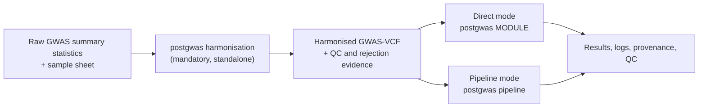

# PostGWAS

PostGWAS is a command-line toolkit that converts heterogeneous genome-wide
association study (GWAS) summary statistics into a validated GWAS-VCF, and then
runs reproducible post-GWAS analyses from that file. It provides one
configuration system, one logging and QC convention, standalone analysis
modules, and a dependency-aware pipeline for multi-stage analyses.

> **Research software.** A command that exits successfully is not evidence that
> the analysis was valid. Verify the genome build, ancestry,
> allele convention, sample-size definition, reference resources, resolved
> configuration, QC reports, and external-tool output before interpreting
> results.

## Contents

**Using PostGWAS** — [Overview](#overview) · [Execution modes](#execution-modes) ·
[Harmonisation workflow and configuration](#complete-harmonisation-workflow-and-decision-reference) ·
[Quick start](#quick-start) · [Modules and execution order](#modules-and-execution-order)

**Setting up** — [Installation](#installation) ·
[External software](#external-software) ·
[Reference data](#reference-data-and-resource-files) ·
[Input formats](#input-formats) · [Configuration](#configuration)

**Results and support** — [Outputs](#outputs) ·
[QC, logging and provenance](#qc-logging-and-provenance) ·
[Troubleshooting](#troubleshooting) ·
[Scope and current limitations](#scope-and-current-limitations) ·
[Documentation](#documentation) · [Development](#development) ·
[Licensing status](#licensing-status)

## Overview

PostGWAS separates data preparation from analysis, and the boundary between them
is a validated GWAS-VCF.



1. **Preparation.** `harmonisation` reads raw summary-statistics tables described
   by a sample sheet, standardises coordinates, alleles, frequencies, effect
   statistics, sample sizes and imputation quality, and writes a
   bgzip-compressed, tabix-indexed GWAS-VCF for each configured genome build,
   together with rejection and QC evidence. It is a mandatory, standalone first
   step and is deliberately not a pipeline stage.
2. **Analysis.** Every downstream module reads that GWAS-VCF, or an artifact
   derived from it: filtering and QC, LD annotation and clumping, fine-mapping,
   heritability, gene and gene-set testing, gene prioritisation, single-cell
   integration, polygenic architecture, and pathway enrichment. Run one module
   yourself (*direct mode*), or let `pipeline` resolve and execute the registered
   prerequisites of the analyses you ask for (*pipeline mode*).

Both modes consume the same GWAS-VCF and differ only in who produces the
intermediate artifacts. [Modules and execution
order](#modules-and-execution-order) lists every available analysis, its
command, and its pipeline dependencies.

## Execution modes

### Harmonisation: required preparation for raw data

Harmonisation is driven by a **sample sheet**: a CSV or TSV file with one row per
dataset that maps the column names actually present in each study to the concepts
PostGWAS requires. Column meanings are declared, not guessed, so raw files do not
have to be pre-formatted. The column reference is under
[Input formats](#input-formats); a filled-in example and its matching GWAS file
ship in `tests/data/harmonisation/`.

```console
postgwas harmonisation \
  --sample-sheet studies.csv \
  --run-config harmonisation.yaml \
  --resource-directory /absolute/path/to/resources \
  --output-directory /absolute/path/to/results \
  --validate
```

`--resource-directory` is required unless `resources.root` is set in
`--run-config`. `--dataset-id` restricts the run to one row of the sample sheet;
without it every row is processed.

Harmonisation operates at three scopes: it prepares the complete dataset and
makes study-wide decisions once, processes and validates each chromosome, then
merges and assesses the whole-genome outputs. The input genome build, strand
consensus, BETA-versus-odds-ratio interpretation, odds-ratio SE scale, raw-
versus-negative-log10 P representation, and EAF-versus-MAF interpretation are
recorded as `DECIDE` entries in the canonical log. Ambiguous or incompatible
inputs are refused rather than guessed. Variants can be rejected during dataset
or chromosome processing for reasons including duplicate or conflicting sites,
unsupported reference orientation, unresolved palindromic orientation, invalid
or endpoint EAF, insufficient information for Z-only effect reconstruction, and
unrecoverable effect statistics. Each table-level rejection retains the
original row, processing step, and registered reason under `rejected/` and in
the reason-by-chromosome matrix. The required whole-genome VCFs are written in
the input build and its paired target build; target-build liftover can reject
records, so its audited loss counts and any generated not-lifted VCF must also
be reviewed.

Structural and cross-field harmonisation checks always run. `--validate` adds an
independent post-harmonisation concordance comparison between each original
dataset and its same-build merged GWAS-VCF. The same comparison can be run later
against an existing file:

```console
postgwas --validate \
  --sample-sheet studies.csv \
  --dataset-id STUDY \
  --vcf results/STUDY/harmonisation/STUDY_GRCh37_merged.vcf.gz \
  --output-directory results
```

**To understand what harmonisation actually does to your data, read
[How Harmonisation Processes Your Data](docs/wiki/harmonisation/processing-order.md).**
It walks through all seven stages and the 29 numbered steps in the exact order
they run — using the same labels that appear in the log files — and explains what
each step reads, decides, and writes.

See also the [harmonisation overview](docs/wiki/harmonisation/overview.md),
[sample-sheet guide](docs/wiki/harmonisation/sample-sheet.md),
[outputs and QC](docs/wiki/harmonisation/outputs-and-qc.md), and the
[validation reference](docs/wiki/reference/validation.md).

#### Complete harmonisation workflow and decision reference

This section is the user-facing contract for the complete harmonisation run. It
follows the current runtime order, names the decision made at every stage, and
identifies the YAML setting that controls each alternative. The canonical source
of truth is
[`harmonisation.yaml`](src/postgwas/config/defaults/modules/harmonisation.yaml);
the tables below are checked against that file so a packaged policy cannot be
added silently without being documented here.

Configuration is resolved once in this order:

1. packaged, schema-validated defaults;
2. values in `--run-config`;
3. explicit command-line overrides.

Harmonisation policy overrides belong below
`modules.harmonisation.policies`. Module resources, mappings, VCF contracts,
population QC and optional concordance remain directly below
`modules.harmonisation`:

```yaml
modules:
  harmonisation:
    default_eaf:
      source: ALFA
      column: EUR
    policies:
      build:
        mode: auto
      strand:
        mode: auto
      effect:
        type: auto
      pvalue:
        type: auto
```

An explicit sample-sheet declaration remains authoritative unless the selected
declaration-mismatch policy says to fail. Automatic decisions are made once on
the complete study and passed unchanged to every chromosome worker.

##### Required source choices

| Concept | Accepted source choices | Resolution |
|---|---|---|
| Coordinates | `chromosome_column` plus `position_column`; or `chromosome_position_column` | Exactly one complete representation is required. Combined values are split using `position.extraction`. |
| Alleles | `effect_allele_column` plus `other_allele_column` | Both are required and all effects/frequencies are interpreted relative to the effect allele. |
| Effect statistic | `effect_column`; or `z_score_column`; or both | At least one is required. Missing BETA, SE or Z may be reconstructed only through the documented chromosome decision tree. |
| P value | `p_value_column` | Required. `p_value_type` is `auto`, `raw`, or `neglog10`. |
| Study EAF | `effect_allele_frequency_column`; or `external_eaf_file` plus `external_eaf_column` | Exactly one source is required. An external source never row-wise fills a selected internal column. |
| INFO | `imputation_info_column`; otherwise `external_info_file` plus `external_info_column`; otherwise explicit `--fixed-info VALUE` | Internal INFO has priority. A fixed value is accepted only in `[0,1]` and is recorded as user-assigned, not measured. |
| Sample size | `control_count_column` or `control_count`; plus cases for case-control studies | For quantitative studies, the control-labelled field represents total N and case fields are forbidden. |
| Trait type | `auto`, `quantitative`, or `case_control` | The declaration is validated against the supplied count fields and `sample_size.trait_type`. |
| Effect type | `auto`, `beta`, or `odds_ratio` | The sample-sheet declaration is compared with whole-study evidence; `effect.type` can make the policy explicit. |
| Input P scale | `auto`, `raw`, or `neglog10` | The declaration is compared with whole-study evidence; signed log10 or natural-log P values are not accepted representations. |
| Delimiter | `auto`, `tab`, `comma`, `semicolon`, `space`, or `whitespace` | Automatic detection uses the configured candidate list and sample size once, then header and data readers reuse the result. |

<details>
<summary>Complete version-2 sample-sheet field contract</summary>

| Field | Required/default | Accepted value and decision |
|---|---|---|
| `config_version` | Required | Exactly `2`. |
| `dataset_id` | Required and unique | Letters, numbers, `.`, `_` and `-`, beginning with a letter or number. |
| `input_file` | Required and unique | Existing, non-empty regular file; a relative path is resolved from the sample-sheet directory. |
| `trait_type` | Default `auto` | `auto`, `quantitative`, `case_control`. |
| `chromosome_column` | Conditional | Exact study header; provide with `position_column`, or leave both absent and provide `chromosome_position_column`. |
| `position_column` | Conditional | Exact study header paired with `chromosome_column`. |
| `chromosome_position_column` | Conditional | Exact combined-coordinate header used instead of separate chromosome/position columns. |
| `variant_id_column` | Optional | Exact study header; missing row IDs are constructed later. |
| `effect_allele_column` | Required | Exact study header for the allele to which BETA/OR, Z and EAF refer. |
| `other_allele_column` | Required | Exact study header for the non-effect allele. |
| `effect_allele_frequency_column` | Conditional | Exact internal EAF/MAF header; mutually exclusive with the external EAF pair. |
| `external_eaf_file` | Conditional | One existing all-chromosome file or a path template using `{chromosome}` and optional `{build}`; requires `external_eaf_column`. |
| `external_eaf_column` | Conditional | Exact frequency column in `external_eaf_file`. |
| `effect_column` | Conditional | Exact BETA/OR header; at least this field or `z_score_column` is required. |
| `effect_type` | Default `auto` | `auto`, `beta`, `odds_ratio`. |
| `standard_error_column` | Optional | Exact study SE header; missing values in a selected SE column are not silently filled row by row. |
| `z_score_column` | Conditional | Exact signed-Z header; at least this field or `effect_column` is required. |
| `p_value_column` | Required | Exact study P-value header. |
| `p_value_type` | Default `auto` | `auto`, `raw`, `neglog10`. |
| `control_count_column` | Conditional | Per-row controls for case-control data, or total analyzed N for quantitative data. Alternative to fixed `control_count`. |
| `control_count` | Conditional | Positive whole-number fixed controls/total N. Alternative to `control_count_column`. |
| `case_count_column` | Conditional | Per-row cases; required with explicit `case_control` unless fixed cases are supplied, and forbidden for `quantitative`. |
| `case_count` | Conditional | Positive whole-number fixed cases; alternative to `case_count_column`. |
| `imputation_info_column` | Optional source with priority | Exact internal INFO header. When set, any external INFO source is reported and ignored. |
| `external_info_file` | Conditional fallback | Existing all-chromosome file or explicit `{chromosome}`/optional `{build}` template; requires `external_info_column` and is used only without internal INFO. |
| `external_info_column` | Conditional fallback | Exact score column in `external_info_file`. |
| `delimiter` | Default `auto` | `auto`, `tab`, `comma`, `semicolon`, `space`, `whitespace`. |

Missing sample-sheet text is normalized from blank, `NA`, `N/A`, `NAN`,
`NONE`, `NULL`, `-`, `.`, or `NOT_APPLICABLE`.
Blank or unrecognized `trait_type`, `effect_type`, `p_value_type` and
`delimiter` declarations are normalized to `auto` with a row warning; the
subsequent complete-study detection and declaration checks still run.
Unknown sample-sheet fields, duplicate normalized headers, duplicate dataset IDs,
duplicate input files and incomplete source pairs fail before analysis. With no
INFO file source, `--fixed-info` must be supplied separately on the command
line.

</details>

##### Stage 1 — preflight before the large input is read

PostGWAS resolves the selected sample-sheet rows and effective configuration,
validates every conditionally required argument, chooses the INFO source,
checks the resource/output roots, executables and bcftools liftover plugin, and
initializes the canonical logs and run-summary rows. Missing or incompatible
requirements fail before chromosome work or scientific outputs begin. Dataset
rows are then run one at a time; one failed dataset does not erase another
completed dataset.

Important controls at this boundary are the selected reference sources and
their mappings, `input.*`, `logging.*`, `execution.*`, and the explicit CLI
controls `--dataset-id`, `--fixed-info`, `--validate`, `--resume`,
`--overwrite`, `--hide-screen`, and
`--keep_gwas2vcf_intermediate`.

##### Stage 2 — eight complete-dataset steps

| Step | Operation and decision | Main YAML controls |
|---:|---|---|
| 1 | Validate column alternatives, EAF/INFO/sample-size sources, paths, resources, and cross-policy compatibility without reading the full table. | `columns.*`, reference mappings, source selections, `sample_size.*` |
| 2 | Read the header, verify every configured column, determine one delimiter, test readability/truncation, and count rows for later accounting. | `input.delimiter*`, `input.check_truncation`, `input.strip_double_hash_lines` |
| 3 | Read the study; assign stable source-row IDs; preserve raw rejection provenance; normalize exact integer coordinates, chromosome labels and uppercase alleles; coerce configured scientific numeric columns; reject missing mandatory values, malformed positions, unsupported chromosomes and invalid alleles; aggregate configured multi-value INFO; then resolve input duplicates deterministically. The packaged chromosome scope is autosomes 1–22 plus X. | `input.*`, `columns.mandatory`, `chromosome.*`, `position.*`, `allele.pattern`, `info.multi_value_*`, `duplicates.*` |
| 4 | Validate parsed content, quantify missing sample size, and calculate one study-wide mean/median fill value when requested. The input ledger must reconcile exactly. Apply the chromosome-X Z-only guard before expensive reference work. | `sample_size.missing_action`, `sample_size.max_missing_fraction`, `effect_from_z.x_chromosome_z_only_action` |
| 5 | Infer or verify GRCh37 versus GRCh38 from allele-compatible, coordinate-testable variants. Automatic selection must pass the absolute match count, study-testable fraction, reference-panel coverage and winning-share thresholds together; weak or ambiguous evidence fails. | `build.mode`, `build.min_match_count`, `build.min_match_fraction`, `build.min_reference_match_fraction`, `build.confidence_ratio`, `build.deduplicate_reference` |
| 6 | Infer whole-study forward versus reverse-complement strand consensus from informative non-palindromic SNVs, or accept an explicit reference-aligned declaration. Palindromic variants never vote. | `strand.mode`, `strand.consensus_threshold`, `strand.min_informative_variants` |
| 7 | Decide or verify BETA versus odds ratio, OR standard-error scale, BETA/Z direction agreement, raw versus negative-log10 P, and EAF-like versus MAF-like frequency distribution. Negative P-value fractions and declaration conflicts are checked before splitting. | `effect.*`, `pvalue.type`, `pvalue.max_negative_fraction`, `validation.declaration_mismatch_action`, `eaf.maf_decision_cutoff` |
| 8 | Split the study into typed Parquet partitions, optionally stage one whole-genome external EAF/INFO file into bounded chromosome partitions, make one dataset-wide standard-INFO versus MaCH-Rsq decision, enforce its invalid-value fraction, and calculate bounded worker/thread counts. | `input.chromosome_partition_compression`, `external_reference_staging.*`, `info.score_type`, `info.auto_mach_rsq_fraction`, `info.maximum_invalid_fraction`, `execution.*` |

Dataset step 4 stops a Z-only chromosome-X reconstruction by default because
pooled EAF and Neff do not identify male dosage coding, sex composition, or PAR
status. `effect_from_z.x_chromosome_z_only_action` permits either the safe
`fail` default or the explicit expert choice `allow_autosomal_assumption`.

After dataset step 7 and before dataset step 8, an unnumbered fail-fast resource
gate resolves every exact file required by the observed chromosomes and inferred
build. It validates existence, size, table schemas, indexed VCF records and INFO
headers, FASTA contigs, GFF records and chain structure together. Any problem is
reported as one grouped list, and no chromosome partition or worker is created.
The controls are the selected reference sources, all reference mappings,
`resource_layout.*`, and the observed build/chromosome set.

##### Stage 3 — sixteen steps repeated for every chromosome

Chromosomes may run in parallel, but each worker always performs these steps in
this order.

| Step | Operation and decision | Main YAML controls |
|---:|---|---|
| 1 | Load the typed partition and immutable source-row snapshot; no text schema is inferred again. | `input.chromosome_partition_compression` |
| 2 | Reuse the preflighted build, strand, EAF, INFO, dbSNP, FASTA, annotation and chain resources; recheck only that required files/indexes still exist. | source selections, reference mappings, `resource_layout.*` |
| 3 | Put the effect on the canonical BETA scale. BETA is retained; positive OR becomes `ln(OR)`. If SE is raw OR-scale, convert it before any allele swap. | `effect.type`, `effect.or_non_positive`, `effect.se_scale`, `effect.se_scale_*` |
| 4 | Match chromosome, position and alleles; determine forward, forward-swapped, reverse-complement or reverse-complement-swapped orientation where scientifically permitted; resolve or reject palindromic SNVs; flip BETA/Z and `EAF = 1-EAF` for swapped effect alleles; obtain internal or external EAF; reference-confirm any MAF-like suspicion; validate reference AF concordance; and resolve duplicates created by final orientation. | `strand.*`, `eaf.*`, `external_reference.*`, `duplicates.*`, `chromosome.*` |
| 5 | Calculate final sample size. Case-control uses `Neff = 4 / (1/Ncase + 1/Ncontrol)`; quantitative uses total N and cannot enter the case-control formula. | `sample_size.*` |
| 6 | Complete BETA or SE from supplied Z when possible. Z-only reconstruction requires EAF in `(0,1)`, finite positive denominator and sufficient effective variance. BETA/Z sign conflicts and low information follow explicit policies. | `effect_from_z.*` |
| 7 | Convert the study-wide P representation into canonical raw `PVAL`; retain extreme probabilities through log-space provenance; and handle missing, non-finite, negative, zero or out-of-range values explicitly. | `pvalue.*` |
| 8 | If SE remains unavailable, derive it from BETA and P using the configured tail. A literal `p=0` without supplied SE or usable Z fails by default unless approximation/rejection is explicitly selected. | `pvalue.se_tail`, `pvalue.zero_missing_se`, `pvalue.derive_partial_missing_se`, `validation.se_from_clipped_pval` |
| 9 | Retain supplied Z or calculate `Z = BETA / SE` only from finite inputs and a sufficiently positive SE. A valid zero BETA yields Z=0 and is retained. | `validation.se_division_floor`, `validation.beta_zero` |
| 10 | Apply the final BETA/SE/Z validity masks once; check `Z ≈ BETA/SE`; check two-sided GWAS Z/P agreement; and warn or fail on excessive rejection fractions. | `validation.*` |
| 11 | Harmonize INFO from the chosen internal, external allele-matched, or fixed source; classify standard INFO versus MaCH Rsq; preserve separate missing and out-of-range reasons. | `info.*`, `external_reference.*` |
| 12 | Preserve/normalize the study variant ID and fill a missing ID with the configured chromosome-position-allele form. dbSNP assignment occurs later by exact CHROM/POS/REF/ALT. | VCF `missing_id_format` and identifier mapping |
| 13 | Require every configured final column and apply `reject`, `fail`, or `keep` to missing row values. A wholly absent required column cannot be silently skipped. Then prove `rows read - rows rejected = rows ready for export`. | `final_check.require`, `final_check.treat_as_missing`, `final_check.on_missing` |
| 14 | Export the harmonized GWAS-to-VCF table, positional JSON mapping, statistics and audit-only `strand_action`. | `gwas2vcf_input.*` and output layout |
| 15 | Run GWAS-to-VCF, require a non-zero failure code on invalid input, and prove the indexed raw VCF record count equals exported rows. | VCF input schema, tool/resource configuration |
| 16 | Normalize/split with the source FASTA, remove exact duplicates, assign exact dbSNP IDs and fallback IDs, annotate population AF and consequences, lift to the paired build while updating every configured allele-specific tag, normalize/sort/index again, and enforce loss/empty-output policies. | `vcf.*`, `vcf_processing.*` |

The row-level strand outcome is always one of the following:

| Outcome | Scientific action |
|---|---|
| `forward` | Keep allele order and allele-specific statistics. |
| `forward_swapped` | Swap effect/other alleles, negate signed BETA/Z, and use `1-EAF`. |
| `reverse_complement` | Complement SNV alleles; preserve effect-allele order and signed statistics. |
| `reverse_complement_swapped` | Complement and swap; negate signed BETA/Z and use `1-EAF`. |
| `palindromic_resolved` | Retain only when whole-study consensus and/or decisive internal study EAF supports one orientation without conflict. |
| `palindromic_ambiguous` | Apply `strand.ambiguous_action`; packaged behavior rejects the row. |
| `reference_unmatched` | Apply `strand.unmatched_action`; packaged behavior rejects the row. |
| `reference_unmatched_retained` | Explicit opt-in only: preserve the supplied effect-allele order for mandatory genome-FASTA validation, with no population-reference AF. |
| `reference_unmatched_retained_reverse_complement` | Explicit opt-in only: under a strong reverse study consensus, complement the unmatched SNV without swapping its effect-allele order, then require genome-FASTA validation. |
| reference ambiguous | Apply the configured ambiguous/reference-duplicate policies; no arbitrary reference row is selected. |

The missing-effect decision order is:

| Available input | Result |
|---|---|
| BETA/OR and SE | Normalize effect scale, keep/convert supplied SE, calculate or validate Z. |
| BETA/OR and Z, no SE | Derive positive `SE = abs(BETA/Z)` for usable rows and check sign consistency. |
| Z and SE, no BETA/OR | Derive `BETA = Z * SE`. |
| Z only | Reconstruct standardized BETA and SE from Z, EAF and Neff only when the effective-variance and chromosome policies allow it. |
| BETA/OR and P, no SE or Z | Derive SE from the P-implied Z under `pvalue.se_tail`, then calculate Z. |
| No usable combination | Reject or fail through the configured validation/final-completeness policy; never fabricate a value silently. |

##### Stage 4 — chromosome retry and row reconciliation

Completed chromosomes are retained. Failed chromosomes are cleaned and retried
up to `execution.max_retry_rounds`; `execution.retry_requires_progress`
prevents identical no-progress rounds. Remaining failure makes the dataset fail
by default through `execution.fail_dataset_on_chr_error`; if explicitly allowed,
the status is `PARTIAL`, never `OK`. Rejected shards are streamed into one
dataset rejection file, source files are removed only after the combined file
validates, and all parsed, rejected, exported and genuinely unprocessed rows
must reconcile. The chromosome evidence also finalizes the EAF/MAF decision
used by later QC and concordance.

##### Stage 5 — five post-merge steps

| Step | Operation and decision | Main YAML controls |
|---:|---|---|
| 1 | Validate every expected chromosome VCF/index and concatenate the required input-build, target-build and raw-adapter groups. Missing inputs and invalid/index/merge failures count as failures; attempts are bounded. Complete scientific/resource provenance and genome-build headers are added in the existing stream. | `vcf.concat_max_workers`, `vcf.concat_max_attempts`, `vcf.on_merge_failure`, `vcf_processing.required_merge_groups` |
| 2 | Query the raw input-build merged VCF once; calculate population AF missingness, Pearson correlation, direct/inverted mean absolute difference, closest population and filename-population warnings. A strong, clearly better inverted relationship fails as suspected frequency inversion. | `population_frequency_qc.*` |
| 3 | Merge validated adapter mappings/summaries, archive adapter inputs, compress configured outputs, and delete only PostGWAS-owned intermediates whose required successor exists. | output/runtime layouts and cleanup contract |
| 4 | Extract the raw merged VCF once and calculate raw metrics plus six virtual QC rules: study EAF, INFO, reference-AF concordance, variant type, frequency-ambiguous palindromes and MHC region. Rules may overlap and do not rewrite the raw VCF. | QC module settings plus harmonisation VCF field mappings |
| 5 | Validate required merged VCFs, indexes, chromosome/merge status and output counts; write QC reports, final takeaways, logs, output paths, elapsed time and terminal manifest status. On a successful run, delete the raw merged GWAS-to-VCF adapter intermediate and its index by default, or retain them only when explicitly requested. | `vcf.min_valid_size_bytes`, `vcf.keep_gwas2vcf_intermediate`, logging/output/runtime layouts |

Liftover action choices are controlled by `vcf.liftover_swap`: `exclude`
(packaged conservative behavior) or `keep`. In both cases the liftover plugin is
given the complete configured AF and signed-effect tag roles and updates them;
tag correction is not a separate user choice. Warning, critical and failure
fractions are independent. A required target VCF with zero retained variants
fails regardless of byte-size validation.

##### Stage 6 — optional input-to-VCF concordance

`--validate` or `concordance_validation.enabled: true` adds an independent
same-build comparison after final outputs exist. It stages the original input,
checks VCF build metadata, compares chromosomes incrementally, reports SNP,
indel and other-variant membership separately, accepts configured direct,
swapped and optional complement orientations, and compares effect, SE, EAF, Z
and `FORMAT/LP` P values within absolute/relative tolerances. It writes
mismatches, input-only, VCF-only, duplicate-VCF and same-position diagnostics.
Allele-aware keys ignore only shared VCF padding while preserving the reported
input and VCF coordinates and alleles; this recognizes minimal-representation
equivalence but does not perform FASTA-backed indel left-alignment.
`palindromic_action` accepts `exclude`, `compare_resolved`, or
`compare_as_listed`. Failure limits decide the validation verdict without
deleting the harmonized VCFs.

##### Stage 7 — multi-dataset summary and final states

After every dataset, PostGWAS atomically updates
`run_metadata/harmonisation_run_summary.csv` in analysis order. A dataset ends
as `OK`, `PARTIAL`, or `FAILED`; an interrupted dataset not reached remains
`NOT_RUN`. `OK` requires all expected chromosomes, required merges, indexes,
VCFs, rejection provenance and final validations to succeed. The run summary
retains whatever scientifically valid evidence existed before a partial/failure
and never converts an incomplete merge into `OK`.

The same update also writes a standalone
`<dataset>/harmonisation/<dataset>_harmonisation_report.html` for each selected
sample and one combined `run_metadata/harmonisation_run_report.html` containing
every sample in sample-sheet order. These HTML files are presentation views of
the existing run-summary row, dataset manifest, chromosome summaries, and QC
report references. They do not reread the input or VCF and do not calculate new
scientific metrics.

##### Module-level YAML choices outside `policies`

These settings choose resources or optional audits; they are not duplicated in
the policy registry below.

| YAML setting | Default | Allowed values or constraint | Effect |
|---|---|---|---|
| `enabled` | `false` | `true`, `false` | Generic module-selection flag in the resolved configuration; invoking the public harmonisation command selects the operation explicitly. |
| `comparison_af.source` | `ALFA` | `ALFA`, `1000G` | Indexed VCF used for population AF annotation and comparison. |
| `comparison_af.column` | `EUR` | Non-empty INFO field name present in the selected resource | Population column used for reference-frequency concordance. |
| `default_eaf.source` | `ALFA` | `ALFA`, `wgs_ukb`, `panukb`, `1000G`, `fingen` | Tabular panel used for allele orientation and MAF/EAF confirmation. |
| `default_eaf.column` | `EUR` | Non-empty column present in the selected table | ALT-frequency column read from the default EAF panel. |
| `reference.dbsnp_source` | `dbSNP157` | Non-empty configured resource token | Selects the exact-allele dbSNP annotation VCF. |
| `default_eaf_mapping` | `CHROM`, `POS`, `ALT`, `REF`, `tab` | Four unique non-empty structural columns plus an allowed delimiter | Declares that packaged EAF values refer to ALT. |
| `build_check_mapping` | `CHROM`, `POS`, `REF`, `ALT`, `tab` | Four unique non-empty structural columns plus an allowed delimiter | Defines allele keys in build-check tables. |
| `external_eaf_mapping` / `external_info_mapping` | `CHROM`, `POS`, `ALT`, `REF`, `auto` | Four unique non-empty structural columns plus an allowed delimiter | Defines user-reference allele keys; the named sample-sheet value column remains separate. |
| `*_mapping.delimiter` | `tab` for default/build; `auto` for user EAF/INFO | `auto`, `tab`, `comma`, `semicolon`, `space`, `whitespace`, `pipe` | Reads the corresponding structural reference table. Structural chromosome, position, effect/ALT and other/REF column names must be unique and non-empty. |
| `fixed_info.value` | `null` | Publicly supplied through `--fixed-info`; number from 0 through 1 | Used only when no internal or external INFO source is selected. |
| `sample_sheet_generator.trait_type` | `auto` | `auto` | Generated drafts do not guess trait semantics. |
| `sample_sheet_generator.effect_type` | `auto` | `auto` | Generated drafts do not guess effect semantics. |
| `sample_sheet_generator.p_value_type` | `auto` | `auto` | Generated drafts do not guess P-value scale. |
| `sample_sheet_generator.failure_policy` | `write_valid` | `write_valid`, `fail_all` | Write valid rows plus a rejection report, or fail the whole draft. |
| `sample_sheet_generator.on_missing_sample_size` | `write_draft` | `write_draft`, `fail` | Leave fields visibly incomplete for user editing, or stop generation. |
| `sample_sheet_generator.supported_suffixes` / aliases | Packaged suffix and header-alias lists | Non-empty, unique lists; suffixes must begin with `.` and aliases cannot overlap scientific fields after normalization | Controls draft discovery and column-name selection only; final preflight still validates exact user columns and meanings. |
| `external_reference_staging.batch_rows` | `100000` | Integer at least 1 | Bounds memory while partitioning a whole-genome user reference. |
| `external_reference_staging.compression` | `zstd` | `none`, `snappy`, `gzip`, `brotli`, `lz4`, `zstd` | Compression for temporary reference Parquet partitions only. |
| `external_reference_staging.compressed_suffixes` | `[.gz, .bgz, .bz2, .xz, .lzma, .zip]` | Non-empty unique list of dot-prefixed suffixes | Identifies compressed whole-genome user references during staging. |
| `external_reference_staging.atomic_output_suffix` | `.tmp` | Dot-prefixed filename suffix without path separators | Keeps incomplete staged partitions from being mistaken for valid inputs. |
| `population_frequency_qc.enabled` | `true` | `true`, `false` | Enables descriptive population similarity on the raw merged VCF. |
| `population_frequency_qc.study_field` | `%INFO/AF` | Valid bcftools INFO query | Selects the study ALT-frequency field. |
| `population_frequency_qc.population_fields` | `{AFR: %INFO/AFR, EAS: %INFO/EAS, EUR: %INFO/EUR, SAS: %INFO/SAS}` | At least two unique uppercase population labels mapped to unique INFO queries | Defines the populations included in similarity and missingness calculations. |
| `population_frequency_qc.minimum_comparable_variants` | `10000` | Integer at least 2 | Minimum complete AF pairs required for a population decision. |
| `population_frequency_qc.minimum_correlation` | `0.80` | Number from -1 through 1 | Minimum correlation for a candidate population. |
| `population_frequency_qc.minimum_correlation_gap` | `0.01` | Number from 0 through 2 | Required winner-versus-runner-up correlation gap. |
| `population_frequency_qc.inversion_minimum_absolute_correlation` | `0.80` | Number from 0 through 1 | Minimum absolute negative relationship before inversion is considered. |
| `population_frequency_qc.inversion_maximum_mean_absolute_difference` | `0.10` | Number from 0 through 1 | Largest allowed error after applying `1-AF`. |
| `population_frequency_qc.inversion_minimum_mean_absolute_difference_improvement` | `0.10` | Number from 0 through 1 | Minimum direct-versus-inverted error improvement. |
| `population_frequency_qc.require_mae_agreement` | `true` | `true`, `false` | Requires correlation and mean-error evidence to agree. |
| `population_frequency_qc.warn_on_filename_mismatch` | `true` | `true`, `false` | Warns when external filenames imply a different population. |
| `population_frequency_qc.on_error` | `warn` | `warn`, `fail` | Response to an operational population-QC error; diagnosed frequency inversion remains scientific failure. |
| `concordance_validation.enabled` | `false` | `true`, `false`; CLI `--validate` also enables it | Runs the optional original-input versus final-VCF audit. |
| `concordance_validation.staging_batch_rows` | `100000` | Integer at least 1 | Bounds concordance staging memory. |
| `concordance_validation.staging_compression` | `zstd` | `none`, `snappy`, `gzip`, `brotli`, `lz4`, `zstd` | Temporary concordance Parquet compression. |
| `concordance_validation.allow_strand_complement` | `true` | `true`, `false` | Permits complement and complement-swapped SNP matches. |
| `concordance_validation.palindromic_action` | `compare_resolved` | `exclude`, `compare_resolved`, `compare_as_listed` | Determines how retained A/T and C/G SNP values are compared. |
| `concordance_validation.write_all_matches` | `false` | `true`, `false` | Writes the optional potentially large all-match table. |
| `concordance_validation.effect` | `{absolute: 1e-6, relative: 1e-5}` | Both numbers non-negative | Oriented effect-value tolerance. |
| `concordance_validation.standard_error` | `{absolute: 1e-6, relative: 1e-5}` | Both numbers non-negative | Standard-error tolerance. |
| `concordance_validation.allele_frequency` | `{absolute: 1e-6, relative: 1e-5}` | Both numbers non-negative | Oriented EAF tolerance. |
| `concordance_validation.z_score` | `{absolute: 1e-5, relative: 1e-5}` | Both numbers non-negative | Oriented Z-score tolerance. |
| `concordance_validation.p_value` | `{absolute: 1e-5, relative: 1e-5}` | Both numbers non-negative | P-value tolerance on GWAS-VCF `FORMAT/LP` scale. |
| `concordance_validation.failure.maximum_value_mismatch_fraction` | `0.0` | Number from 0 through 1 | Largest permitted mismatched-value fraction. |
| `concordance_validation.failure.maximum_vcf_duplicate_records` | `0` | Integer at least 0 | Largest permitted duplicate VCF record count. |
| `concordance_validation.failure.maximum_invalid_vcf_records` | `0` | Integer at least 0 | Largest permitted invalid VCF record count. |

`resource_layout`, `output_layout`, `runtime`, `gwas2vcf_input` and
`vcf_processing` are schema-validated structural contracts rather than
scientific threshold choices. Resource templates must remain relative to the
resource root; output/runtime templates must remain relative to the output
root; required GWAS-to-VCF columns and merge groups must remain complete; the
build map must be reversible; VCF field roles must be unique and valid
`INFO/TAG` or `FORMAT/TAG` names; and the provenance header map must remain
complete. Their exact packaged paths, fields and header names are listed in the
canonical YAML and copied into the resolved run configuration and VCF header.

<details>
<summary>Structural resource, adapter, VCF and output defaults</summary>

| YAML setting | Packaged default | Validation contract |
|---|---|---|
| `resource_layout.default_eaf` | `{build}/default_af/tab_files/{build}_{source}_freq_chr{chromosome}.tsv.gz` | Relative template below the resource directory. |
| `resource_layout.comparison_af` | `{build}/external_af/vcf_files/{build}_{source}_freq_chr{chromosome}.vcf.gz` | Relative template below the resource directory. |
| `resource_layout.dbsnp` | `{build}/dbSNP/vcf_files/{build}_{source}_chr{chromosome}.vcf.gz` | Relative template below the resource directory. |
| `resource_layout.fasta` | `{build}/fasta_files/{build}_chr{chromosome}.fa` | Relative template below the resource directory. |
| `resource_layout.annotation` | `{build}/gff_files/{build}_ensembl.gff3.gz` | Relative template below the resource directory. |
| `resource_layout.chain` | `chain_files/{source_build}_to_{target_build}.chain` | Relative template below the resource directory. |
| `resource_layout.build_check` | `GRCh37_38_check_files/{build}_check_file.tsv` | Relative template below the resource directory. |
| `output_layout.dataset_directory` | `{dataset_id}/harmonisation` | Dataset root below the run output. Every other output layout value is a non-empty path relative to this root; chromosome Parquet and post-orientation duplicate patterns must contain the required dataset/chromosome placeholders and extensions. |
| `gwas2vcf_input.required_column_keys` | `[chr_col, pos_col, snp_id_col, ea_col, oa_col, eaf_col, beta_col, se_col, imp_z_col, pval_col, ncontrol_col]` | Unique, non-empty adapter-key list. |
| `gwas2vcf_input.optional_column_keys` | `[ncase_col, imp_info_col]` | Must not overlap required keys. |
| `gwas2vcf_input.audit_columns` | `[strand_action]` | Unique audit fields retained in the TSV but omitted from positional adapter JSON. |
| `gwas2vcf_input.renamed_keys` | `{snp_id_col: snp_col}` | Keys must exist in the required/optional adapter contract. |
| `gwas2vcf_input.delimiter` / `header` | tab / `true` | Exactly one delimiter character and a Boolean header flag. |
| `vcf_processing.external_frequency_columns` | `[CHROM, POS, REF, ALT, INFO/AFR, INFO/EAS, INFO/EUR, INFO/SAS]` | Non-empty unique annotation-column list. |
| `vcf_processing.missing_id_format` | `+%CHROM_%POS_%REF_%ALT` | Must start with `+` and contain CHROM, POS, REF and ALT tokens. |
| `vcf_processing.genome_build_header` | `##genome_build={build}` | Exactly one build placeholder in a valid single VCF metadata line. |
| `vcf_processing.target_builds` | `{GRCh37: GRCh38, GRCh38: GRCh37}` | At least two non-self, reversible build mappings. |
| `vcf_processing.required_merge_groups` | `[input_build, target_build, raw_gwas2vcf]` | Must contain exactly these three groups. |
| `vcf_processing.liftover_plugin` | `liftover` | Non-empty bcftools plugin name; availability is checked in preflight. |
| `vcf_processing.liftover_tag_roles` | AF: `[INFO/AF, FORMAT/AF]`; signed effects: `[FORMAT/ES, FORMAT/EZ]` | Unique qualified VCF fields; roles cannot overlap and signed effects must be FORMAT fields. Population AF roles are derived from the annotation columns. |
| `vcf_processing.provenance.output_fields` | AF `FORMAT/AF`; INFO `FORMAT/SI`; effect `FORMAT/ES`; SE `FORMAT/SE`; Z `FORMAT/EZ`; P `FORMAT/LP`; N `FORMAT/NEF` | Must define exactly these seven semantic outputs with valid qualified fields. The complete unique `postgwas_*` header-name map is mandatory. |
| `vcf_processing.concordance_fields` | CHROM, POS, ID, REF, ALT, ES, SE, EZ, AF and LP bcftools queries | Must define every listed field as a non-empty query. |
| `vcf_processing.table_*` | tab delimiter; null inputs `['', '.']`; empty null output; `.tsv` temporary suffix; `1048576`-byte buffer | Delimiter is one character, null tokens are unique, suffix is non-empty and buffer is positive. |
| `runtime.*` | dataset metadata under `{dataset_id}/run_metadata`; run CSV and combined HTML under `run_metadata/harmonisation_run_summary.csv` and `run_metadata/harmonisation_run_report.html`; resolved config, sample row, command and supplied-config snapshots | Every path is non-empty, relative, and cannot traverse above the output root. |
| `output_layout.*` | Exact dataset, chromosome, rejection, QC, concordance, log, HTML-report and VCF patterns in the canonical YAML | The schema requires the complete output-name contract; values cannot be empty and specialized chromosome artifacts must retain their required placeholders/extensions. |

</details>

##### Complete harmonisation policy registry

Every key below is written in runtime order. “Default” is the packaged value;
“Allowed values” comes from the schema validator. Use the full path
`modules.harmonisation.policies.<group>.<setting>` in a run configuration.

<!-- BEGIN GENERATED HARMONISATION POLICY REFERENCE -->

<details>
<summary><code>input</code> — dataset 03 / 08 read the study and write typed chromosome work files (10 settings)</summary>

| Setting | Default | Allowed values | Decision or action |
|---|---|---|---|
| `input.strip_double_hash_lines` | `true` | `true` or `false` | Removes the '##' metadata lines from the top of the study file before parsing. Applies: dataset step 03, as the very first thing done to the file, before the delimiter is guessed and before anything is read. |
| `input.delimiter` | `auto` | `auto`, `tab`, `comma`, `semicolon`, `space`, `whitespace` | Sets the character that separates columns in the summary-statistics file. Applies: dataset step 02 (the header check) and dataset step 03 (the read); any value other than 'auto' skips the guessing in both. |
| `input.delimiter_candidates` | `[tab, comma, semicolon, space, pipe]` | non-empty unique list selected from `tab`, `comma`, `semicolon`, `space`, `whitespace`, `pipe` | Ordered delimiter names evaluated when input.delimiter is auto. |
| `input.delimiter_sample_rows` | `500` | Integer ≥ `1` and ≤ `10000` | Number of non-empty, non-metadata rows used for delimiter detection. |
| `input.delimiter_min_columns` | `2` | Integer ≥ `1` and ≤ `1000` | Sets the fewest columns a candidate separator must produce to be accepted. Applies: dataset steps 02 and 03, and only while input.delimiter is 'auto'. It is ignored the moment you name a separator explicitly. |
| `input.delimiter_max_columns` | `100` | Integer ≥ `1` and ≤ `100000` | Sets the most columns a candidate separator may produce before it is treated as a bad guess. Applies: dataset steps 02 and 03, and only while input.delimiter is 'auto'. It is ignored the moment you name a separator explicitly. |
| `input.null_values` | `[NA, NAN, "", .]` | possibly empty list of text values | Lists the exact text values that are read as 'missing' rather than as data. Applies: dataset step 03, on every read attempt (first read, low-memory retry, whitespace-repaired read), and at chromosome step 12 to spot an identifier that must be rebuilt. |
| `input.schema_inference_rows` | `0` | Integer ≥ `0` and ≤ `10000000` | Sets how many rows are examined before each column's data type is fixed. Applies: dataset step 03, on every read of the study file. |
| `input.chromosome_partition_compression` | `zstd` | `zstd`, `lz4`, `snappy`, `gzip`, `brotli`, `uncompressed` | Selects compression for typed internal chromosome work files and immutable source snapshots. Applies: dataset step 08, before chromosome workers start. |
| `input.check_truncation` | `true` | `true` or `false` | Checks that the study file looks complete before the pipeline commits to a long run. Applies: once per dataset, after the header check (dataset step 02) and before the file is read (dataset step 03). |

</details>

<details>
<summary><code>columns</code> — dataset 03 which columns a variant must have (1 setting)</summary>

| Setting | Default | Allowed values | Decision or action |
|---|---|---|---|
| `columns.mandatory` | `[chr, pos, ea, oa, pval, [beta, zscore]]` | non-empty unique list selected from `chr`, `pos`, `snp`, `ea`, `oa`, `eaf`, `beta`, `se`, `zscore`, `pval`, `info`, `n`; nested lists express alternatives | Lists what a variant must carry before it is kept. Applies: dataset step 03, immediately after the input table is read. |

</details>

<details>
<summary><code>chromosome</code> — dataset 03; reference readers throughout — chromosome naming and filtering (6 settings)</summary>

| Setting | Default | Allowed values | Decision or action |
|---|---|---|---|
| `chromosome.drop_mt` | `true` | `true` or `false` | Whether mitochondrial variants are thrown away. Applies: chromosome step 02 and the same coordinate step inside dataset step 03, after chromosome.rename_map has run, on whatever then carries the label MT. |
| `chromosome.allowed_after_split` | `[1, 2, 3, 4, 5, 6, 7, 8, 9, 10, 11, 12, 13, 14, 15, 16, 17, 18, 19, 20, 21, 22, X]` | Unique chromosome list selected from `1`, `2`, `3`, `4`, `5`, `6`, `7`, `8`, `9`, `10`, `11`, `12`, `13`, `14`, `15`, `16`, `17`, `18`, `19`, `20`, `21`, `22`, `X`, `Y`, `XY`, `MT` | The chromosome labels that survive the coordinate step; every other non-empty label is removed with the separate unsupported_chromosome rejection reason. Applies: chromosome step 02, and the same coordinate step run inside dataset step 03. It is consulted after chromosome.rename_map has renamed labels, and chromosome.drop_mt can remove MT from this list but never adds an unlisted chromosome. Registry recommendation: `same as chromosome.allowed`. |
| `chromosome.strip_chr_prefix` | `true` | `true` or `false` | Whether a leading 'chr' is taken off the chromosome label before anything is compared. Applies: Every study, genome-build, strand, external EAF, external INFO, concordance-reference and extracted-VCF chromosome key before matching. |
| `chromosome.strip_leading_zero` | `true` | `true` or `false` | Removes leading zeroes from chromosome labels made entirely of digits. Applies: Every study, genome-build, strand, external EAF, external INFO, concordance-reference and extracted-VCF chromosome key before matching. |
| `chromosome.rename_map` | `{23: X, 24: Y, 25: X, 26: MT, XY: X, PAR1: X, PAR2: X, M: MT}` | String map whose values are selected from `1`, `2`, `3`, `4`, `5`, `6`, `7`, `8`, `9`, `10`, `11`, `12`, `13`, `14`, `15`, `16`, `17`, `18`, `19`, `20`, `21`, `22`, `X`, `Y`, `XY`, `MT` | Renames non-standard chromosome labels to standard ones. Applies: Every study, genome-build, strand, external EAF, external INFO, concordance-reference and extracted-VCF chromosome key, after prefix, integral-suffix and leading-zero normalization. Study labels are then checked against chromosome.allowed_after_split. |
| `chromosome.allowed` | `[1, 2, 3, 4, 5, 6, 7, 8, 9, 10, 11, 12, 13, 14, 15, 16, 17, 18, 19, 20, 21, 22, X]` | Unique chromosome list selected from `1`, `2`, `3`, `4`, `5`, `6`, `7`, `8`, `9`, `10`, `11`, `12`, `13`, `14`, `15`, `16`, `17`, `18`, `19`, `20`, `21`, `22`, `X`, `Y`, `XY`, `MT` | Lists the chromosome labels accepted by direct content validation and used to classify chromosome-level QC output. The authoritative dataset filter is chromosome.allowed_after_split. Applies: direct content validation when the canonical dataset-level coordinate step has not already run, and QC/report classification after chromosome processing. |

</details>

<details>
<summary><code>position</code> — dataset 03; reference readers throughout — position parsing and bounds (2 settings)</summary>

| Setting | Default | Allowed values | Decision or action |
|---|---|---|---|
| `position.min_value` | `1` | Integer ≥ `1` | The smallest base-pair position a variant is allowed to have. Applies: chromosome step 02 and the same coordinate step inside dataset step 03, only when a position column is present, and after the position has been turned into a whole number. dataset step 04, the content check, also uses it when working out whether any variant would pass the basic coordinate and allele checks. |
| `position.extraction` | `leading_digits` | `strip_non_digits`, `leading_digits`, `none` | How the base-pair position is pulled out of the second half of a combined chromosome:position field. Applies: only when the coordinate step splits a combined column, that is when chr_pos_col names a column that exists and either chr_col or pos_col is missing. A file with genuine chromosome and position columns never consults it. The split normally happens once during the read (dataset step 03), otherwise at chromosome step 02. |

</details>

<details>
<summary><code>allele</code> — dataset 03 allele validation (1 setting)</summary>

| Setting | Default | Allowed values | Decision or action |
|---|---|---|---|
| `allele.pattern` | `^[ACGT]+$` | Text satisfying a regular expression | Sets the pattern that both the effect and the other allele must match for a variant to be kept. Applies: dataset step 03, after the chromosome and position checks and before duplicate removal, and only when both ea_col and oa_col name a column that is in the file. The same pattern is applied again at dataset step 04 as a sanity check that at least some variants survive the basic checks. |

</details>

<details>
<summary><code>info</code> — dataset 03/08 / chromosome 11 imputation quality aggregation, scale and values (15 settings)</summary>

| Setting | Default | Allowed values | Decision or action |
|---|---|---|---|
| `info.multi_value_delimiter` | `,` | Text satisfying one INFO-list separator character outside numeric syntax | Defines the single literal character separating multiple study INFO values within one variant cell. Applies: dataset step 03 when the selected internal INFO column is inspected and parsed before duplicate validation. |
| `info.multi_value_aggregation` | `median` | `median`, `mean`, `fail` | Selects how a delimiter-separated list of study INFO values in one variant row is reduced to the single scalar INFO value required by downstream harmonisation. Applies: dataset step 03, after configured numeric parsing and before duplicate validation, so the resulting scalar can participate in duplicates.selection_order. |
| `info.multi_value_output_column` | `__postgwas_multi_value_info` | Text satisfying a reserved PostGWAS working column beginning with __postgwas_ | Names the collision-checked internal Float64 column that receives the scalar result selected by info.multi_value_aggregation. Applies: dataset step 03 only when the selected internal INFO column contains at least one row using info.multi_value_delimiter and aggregation is not fail. |
| `info.multi_value_invalid_token_action` | `ignore` | `ignore`, `fail` | Decides how multi-value INFO aggregation handles a non-missing token that is not a finite number. Applies: dataset step 03 only when info.multi_value_aggregation is median or mean. |
| `info.score_type` | `auto` | `auto`, `standard_info`, `mach_rsq` | Declares the numerical meaning of the selected imputation-quality column, or asks PostGWAS to resolve it once from the complete selected source before chromosome fan-out. Applies: dataset step 08, after the internal, external, or fixed INFO source has been resolved and before any chromosome worker starts. Every chromosome receives the same decision. |
| `info.out_of_range` | `reject` | `null`, `reject`, `fail` | Decides what happens to an imputation quality score outside the allowed window. Applies: chromosome step 11. The upper boundary is info.clip_tolerance for standard_info and info.mach_rsq_max for mach_rsq. Standard-INFO rounding overshoot between info.clip_max and info.clip_tolerance is rescaled before this action. |
| `info.clip_min` | `0.0` | Number ≥ `0.0` and ≤ `1.0` | Sets the lowest imputation quality score the pipeline treats as legitimate. Applies: chromosome step 11 (imputation quality), on every run, whether the score came from the study's own column or from a reference file. |
| `info.clip_max` | `1.0` | Number ≥ `0.0` and ≤ `100.0` | Sets the theoretical standard-INFO ceiling and the value to which permitted rounding overshoot is rescaled. Applies: chromosome step 11 only when the resolved score type is standard_info. |
| `info.clip_tolerance` | `1.05` | Number ≥ `1.0` and ≤ `100.0` | Sets the standard-INFO rounding-tolerance ceiling and the boundary separating standard INFO evidence from possible MaCH Rsq evidence during automatic detection. Applies: dataset step 08 for automatic detection and chromosome step 11 when the resolved score type is standard_info. It must be at least info.clip_max and below info.mach_rsq_max. |
| `info.mach_rsq_max` | `2.0` | Number > `0.0` and ≤ `100.0` | Sets the largest value accepted when info.score_type resolves to mach_rsq and the gross-invalid boundary used for every score type. Applies: dataset step 08 for the fraction-above-maximum guard and chromosome step 11 as the mach_rsq upper bound. |
| `info.auto_mach_rsq_fraction` | `0.001` | Number > `0.0` and ≤ `1.0` | Requires dataset-level agreement before automatic detection selects mach_rsq. Applies: only when info.score_type is auto. The numerator is finite values above info.clip_tolerance and no higher than info.mach_rsq_max; the denominator is every finite numeric value in the selected complete INFO source. |
| `info.maximum_invalid_fraction` | `0.001` | Number ≥ `0.0` and ≤ `1.0` | Stops a dataset when too many finite INFO-source values exceed info.mach_rsq_max, which is evidence of a mis-mapped or incompatible column. Applies: dataset step 08 under auto, standard_info, and mach_rsq. The denominator is every finite numeric value in the complete selected source. The run stops only when the observed fraction is strictly greater than this setting. |
| `info.low_quality_threshold` | `0.3` | Number ≥ `0.0` and ≤ `1.0` | Sets the score at or below which a variant is counted and reported as poorly imputed. Applies: chromosome step 11, on every run. It is a reporting threshold only - no variant is changed, blanked or removed because of it. |
| `info.on_missing` | `keep` | `keep`, `reject`, `fail` | Decides what happens to a variant that still has no imputation quality score after the range handling has run. Applies: chromosome step 11, after info.out_of_range has been applied - so a score that info.out_of_range blanked out with 'null' is counted as missing here as well. |
| `info.source` | `auto` | `auto`, `study`, `reference`, `external` | Chooses where each variant's imputation quality score comes from. Applies: chromosome step 11, at the very start, before any score is read. |

</details>

<details>
<summary><code>duplicates</code> — dataset 03 / chromosome 04 — input and reference-aligned duplicate checks (6 settings)</summary>

| Setting | Default | Allowed values | Decision or action |
|---|---|---|---|
| `duplicates.key` | `[chr, pos, ea, oa]` | non-empty unique list selected from `chr`, `pos`, `snp`, `ea`, `oa`, `eaf`, `beta`, `se`, `zscore`, `pval`, `info`, `n`, `ncontrol`, `ncase` | Names the fields whose combined value makes two rows the same variant. When pos, ea and oa are present, PostGWAS removes shared trailing and then leading VCF padding in private key columns, adjusts only the private key position for removed leading bases, and uses the resulting normalized unordered allele pair. Original study values are never rewritten by duplicate detection. Applies: first at dataset step 03 after chromosome, position and allele checks, then again after reference orientation and final effect-frequency alignment within chromosome step 04. Every listed field must resolve to its own column in both passes. |
| `duplicates.consistency_fields` | `[beta, se, zscore, pval, eaf]` | non-empty unique list selected from `beta`, `se`, `zscore`, `pval`, `eaf`, `info`, `n`, `ncontrol`, `ncase` | Defines the scientific values that must agree within a duplicate group before PostGWAS is allowed to keep one row. For each available field, null values are ignored and all remaining values must pass the consistency rule for the active duplicate pass. Applies: dataset step 03 and the reference-aligned duplicate pass inside chromosome step 04, only to groups identified by duplicates.key. Fields without a configured input column are omitted, but at least one configured field must be available. At the second pass, BETA, Z and a study EAF have already been transformed to reference ALT orientation. Swapped-orientation groups found before reference orientation are removed before any row can be selected, although their raw disagreements remain listed in the report. |
| `duplicates.post_orientation_relative_tolerance` | `1e-12` | Number ≥ `0.0` and ≤ `1e-09` | Prevents harmless floating-point roundoff introduced by step-04 allele transformations from turning mathematically equal aligned values into a duplicate conflict. Applies: only to numeric beta, SE, Z, p-value, EAF and INFO comparisons in the reference-aligned duplicate pass at chromosome step 04. Dataset step 03 remains exact. |
| `duplicates.quality_fields` | `[beta, se, zscore, pval, eaf, ncontrol, ncase, info]` | non-empty unique list selected from `beta`, `se`, `zscore`, `pval`, `eaf`, `info`, `n`, `ncontrol`, `ncase` | Names the analysis fields counted when the 'completeness' ranking criterion compares scientifically consistent duplicate rows. The row with more non-empty resolved fields ranks first. Applies: dataset step 03 or the chromosome step-04 post-orientation pass, after consistency is confirmed and only when duplicates.selection_order contains completeness. |
| `duplicates.selection_order` | `[completeness, sample_size, info, input_order]` | non-empty unique list selected from `completeness`, `sample_size`, `info`, `input_order` | Gives the ordered tie-breakers used to retain exactly one row from a scientifically consistent duplicate group. Applies: dataset step 03 or the chromosome step-04 post-orientation pass, after duplicates.consistency_fields agree and every row uses the same effect/other-allele order. |
| `duplicates.conflicting_action` | `remove_all` | `remove_all`, `fail_dataset` | Controls the dataset outcome when non-empty values in one or more duplicates.consistency_fields disagree within a same-orientation duplicate group, or when a normalized allele-pair group contains both effect/other-allele orders. Applies: dataset step 03 or the chromosome step-04 post-orientation pass, after the conflicting rows and their evidence have been written to the duplicate and rejected-variant reports. |

</details>

<details>
<summary><code>sample_size</code> — dataset 04 / chromosome 05 missing sample size and effective N (6 settings)</summary>

| Setting | Default | Allowed values | Decision or action |
|---|---|---|---|
| `sample_size.trait_type` | `auto` | `auto`, `binary`, `quantitative` | Declares the study design and guards which sample-count inputs and effective sample-size calculation are scientifically valid for that design. Applies: During sample-sheet validation, before the summary-statistics file is analysed, and again at chromosome step 05 to protect direct library callers. |
| `sample_size.min_value` | `1` | Integer ≥ `1` | Sets the smallest case count, control count or effective sample size that is allowed to survive. Applies: Three places. The configuration check at dataset step 01 tests the fixed ncase / ncontrol / n / total_n numbers written in the config; chromosome step 05 tests the per-variant case and control count columns and then Neff; chromosome step 06 tests Neff again before BETA and SE are derived from a Z score. |
| `sample_size.controls_only` | `use_ncontrol_as_total` | `use_ncontrol_as_total`, `fail` | Says what a control count means when it is the only sample-size count the study provides. Applies: chromosome step 05, and only when a control count (a column or one fixed number) is configured and no case count is. When both are configured the case/control formula wins and this setting is never consulted. |
| `sample_size.cases_only` | `fail` | `fail` | Says what a case count means when it is the only sample-size count the study provides. Applies: chromosome step 05, and only when a case count is configured and no control count is. When both are configured this setting is never consulted. |
| `sample_size.missing_action` | `remove` | `remove`, `median`, `mean`, `fail` | Controls what happens to variants whose configured per-variant case, control or total sample-size value is missing. Applies: Dataset step 04 first measures missingness over the complete study. If the allowed fraction is not exceeded, chromosome step 05 applies this action before Neff is calculated. Fixed sample sizes from the sample sheet cannot be missing per row. |
| `sample_size.max_missing_fraction` | `0.01` | Number ≥ `0.0` and ≤ `1.0` | Sets the largest fraction of variants allowed to have a missing configured case, control or total sample size. A row is counted once even when both case and control counts are missing. Applies: Dataset step 04, after the complete input has been read and before genome build inference or chromosome splitting. The comparison is strictly greater-than, so a missing fraction exactly equal to this value is allowed. |

</details>

<details>
<summary><code>build</code> — dataset 05 genome build inference (6 settings)</summary>

| Setting | Default | Allowed values | Decision or action |
|---|---|---|---|
| `build.mode` | `auto` | `auto`, `GRCh37`, `GRCh38` | Decides whether the input's genome build is worked out from the data or simply declared in the config. Applies: dataset step 05 (genome build), always. confidence_ratio, min_match_count, min_reference_match_fraction and min_match_fraction are consulted only when this is 'auto'; reference deduplication also applies to the one selected reference when a build is declared. |
| `build.confidence_ratio` | `0.9` | Number ≥ `0.5` and ≤ `1.0` | Sets how lopsided the two builds' match counts must be before one of them is declared the winner. Applies: dataset step 05 (genome build), only when build.mode is 'auto'. |
| `build.min_match_count` | `100` | Integer ≥ `1` | Sets the minimum absolute number of allele-compatible study variants that the winning build must have before automatic inference is trusted. Applies: dataset step 05 (genome build), only when build.mode is 'auto'. |
| `build.min_reference_match_fraction` | `0.1` | Number ≥ `0.0` and ≤ `1.0` | Sets the smallest share of the winning build's representative reference markers that must be found with compatible alleles before automatic inference is trusted. Applies: dataset step 05 (genome build), only when build.mode is 'auto'. Only normalized chromosome labels present in the cleaned study contribute reference markers to the denominator. |
| `build.min_match_fraction` | `0.8` | Number ≥ `0.0` and ≤ `1.0` | Sets the smallest share of coordinate-testable study variants whose alleles must match the winning reference before automatic inference is trusted. Applies: dataset step 05 (genome build), only when build.mode is 'auto'. It is combined with build.min_match_count, build.min_reference_match_fraction and build.confidence_ratio. |
| `build.deduplicate_reference` | `true` | `true` or `false` | Removes repeated chromosome/position/ref/alt rows from each build reference file before the input is matched against it. Applies: dataset step 05 (genome build). Both references are treated the same way in auto mode; only the declared build's reference is treated in forced mode. |

</details>

<details>
<summary><code>strand</code> — dataset 06 / chromosome 04 strand consensus and allele orientation (12 settings)</summary>

| Setting | Default | Allowed values | Decision or action |
|---|---|---|---|
| `strand.mode` | `auto` | `auto`, `reference_aligned` | Selects how study alleles are oriented, while always validating every retained row against the selected build's configured CHROM/POS/REF/ALT/AF reference. Applies: dataset step 06 either calculates consensus from non-palindromic matches or records an explicit reference-aligned declaration; chromosome step 04 performs the configured row-level reference checks before allele-frequency harmonisation. |
| `strand.consensus_threshold` | `0.99` | Number ≥ `0.5` and ≤ `1.0` | Sets the minimum dominant forward- or reverse-strand fraction required for a study-wide consensus call. Applies: dataset step 06, among uniquely classified non-palindromic variants for the selected genome build. Palindromic variants never contribute to this calculation. |
| `strand.min_informative_variants` | `1000` | Integer ≥ `0` | Requires this many uniquely forward- or reverse-matched non-palindromic variants before a study-wide strand consensus is trusted. Applies: dataset step 06. A smaller evidence set is labelled unresolved; ordinary non-palindromic variants can still be oriented individually. A palindromic variant then requires decisive internal study-EAF evidence under all four configured palindromic AF rules or is rejected. |
| `strand.palindromic_af_ambiguity_lower` | `0.4` | Number > `0.0` and ≤ `0.5` | Sets the inclusive lower edge of the uninformative frequency interval used when distinguishing the two orientations of an A/T or C/G variant. Applies: chromosome step 04. A study effect-allele frequency and the aligned population-reference AF must both lie outside the configured lower/upper interval before frequency may resolve an otherwise ambiguous internal-EAF palindrome. An independent external-panel AF is aligned only after study orientation and never supplies this evidence. |
| `strand.palindromic_af_ambiguity_upper` | `0.6` | Number ≥ `0.5` and ≤ `1.0` | Sets the inclusive upper edge of the uninformative frequency interval used when distinguishing the two orientations of an A/T or C/G variant. Applies: chromosome step 04 together with strand.palindromic_af_ambiguity_lower. |
| `strand.palindromic_af_max_difference` | `0.1` | Number ≥ `0.0` and ≤ `1.0` | Sets the largest absolute difference allowed between a candidate effect-aligned internal study frequency and population-reference ALT frequency before that candidate can resolve a palindromic variant. Applies: chromosome step 04 only after both frequencies are outside the configured ambiguity interval. Exactly the configured difference passes. |
| `strand.palindromic_af_min_error_margin` | `0.2` | Number > `0.0` and ≤ `1.0` | Requires the winning palindromic frequency orientation to have an absolute AF error at least this much smaller than every competing orientation. Applies: chromosome step 04 together with the maximum-difference rule. Exactly the configured error separation passes; a tie or smaller separation is ambiguous. |
| `strand.unmatched_action` | `reject` | `reject`, `retain`, `fail` | Controls variants for which no REF/ALT ordering at the coordinate matches the supplied chromosome reference under forward, swap, reverse-complement or both operations. Applies: chromosome step 04 after the single coordinate join. |
| `strand.ambiguous_action` | `reject` | `reject`, `fail` | Controls variants for which the configured mode and reference evidence do not leave exactly one scientifically supported orientation. Applies: chromosome step 04. In auto mode, palindromic variants require strong study-wide consensus or decisive internal study EAF. In reference_aligned mode, they require one direct/swapped REF/ALT match. Non-palindromic variants are ambiguous when a multiallelic or conflicting reference leaves more than one exact orientation. |
| `strand.af_tolerance` | `0.2` | Number ≥ `0.0` and ≤ `1.0` | Sets the largest absolute difference allowed between the final study EAF and the aligned population-reference ALT frequency before the row is called AF-discordant. Applies: chromosome step 04 after the internal or external EAF source has been selected and allele swaps have already been applied. Missing study or reference values are not called discordant. |
| `strand.af_discordance_action` | `warn` | `warn`, `reject`, `fail` | Controls final non-palindromic EAF values farther from the aligned population reference than strand.af_tolerance. Applies: chromosome step 04 after allele orientation and frequency harmonisation. |
| `strand.palindromic_af_discordance_action` | `reject` | `warn`, `reject`, `fail` | Controls a palindromic variant whose final effect-aligned study frequency differs from the already-oriented population-reference ALT frequency by more than strand.af_tolerance. Applies: chromosome step 04 after consensus and/or decisive internal study-EAF evidence has selected the palindromic orientation. The later comparison remains QC; orientation evidence has already been evaluated by the stricter configured palindromic maximum-difference and error-margin rules. |

</details>

<details>
<summary><code>effect</code> — dataset 07 / chromosome 03 decide once, convert before allele orientation (10 settings)</summary>

| Setting | Default | Allowed values | Decision or action |
|---|---|---|---|
| `effect.or_detection_max_non_positive_fraction` | `0.005` | Number ≥ `0.0` and ≤ `1.0` | Sets the largest combined share of zero and negative values allowed in an automatically identified odds-ratio column. Applies: dataset step 07 (study-wide properties), only when effect.type is 'auto'. Also at chromosome step 03 when effect.verify_per_chromosome is on, where it can only produce a warning. |
| `effect.or_detection_require_median_range` | `[0.8, 1.25]` | Two numbers (low < high), each from `0.0` through `100.0` | Defines the required median interval for automatic odds-ratio classification. Applies: dataset step 07 while effect.type is 'auto', together with effect.or_detection_max_non_positive_fraction. |
| `effect.type` | `auto` | `auto`, `beta`, `odds_ratio` | States whether the effect column holds beta (log-odds) values or odds ratios. Applies: dataset step 07 (study-wide properties) decides it once for the whole study and chromosome step 03 applies that answer. An explicit sample-sheet declaration is still checked by the detector; another explicit policy value skips detection. |
| `effect.cast_strict` | `false` | `true` or `false` | Decides whether an effect-size cell that will not convert to a number stops the chromosome or is blanked out. Applies: chromosome step 03 (effect type), first thing in the step, on every chromosome and whichever effect type was decided. |
| `effect.verify_per_chromosome` | `false` | `true` or `false` | Re-runs effect-type detection inside every chromosome as a cross-check on the study-wide answer. Applies: chromosome step 03 (effect type), only when a study-wide decision was handed down, which is what the pipeline always does. The flag is also recorded in the decision record written at dataset step 07. |
| `effect.or_non_positive` | `reject` | `reject`, `null`, `keep`, `fail` | Says what to do with an odds ratio of zero or below, which has no logarithm. Applies: chromosome step 03 (effect type), only when the effect type is odds_ratio, whether that came from the config or from detection. Never consulted for a beta column. |
| `effect.se_scale` | `auto` | `auto`, `log_odds`, `as_given` | Determines or declares which scale an odds-ratio study's standard error is on, and therefore whether SE must be divided by OR before allele orientation. Applies: dataset step 07, only when effect type is odds_ratio and a standard-error column is supplied. The selected study-wide answer is applied at chromosome step 03. |
| `effect.se_scale_min_variants` | `100` | Integer ≥ `1` | Sets how many variants must distinguish the log-odds and raw-OR SE interpretations before automatic SE-scale detection may make a study-wide decision. Applies: dataset step 07 for an odds-ratio study with effect.se_scale=auto. A variant is informative only when OR and SE are positive and finite, Z or p is usable, and the two candidate interpretations differ by more than the configured validation tolerance. |
| `effect.se_scale_min_agreement_fraction` | `0.95` | Number ≥ `0.0` and ≤ `1.0` | Requires the selected SE-scale interpretation to agree with the supplied Z or p-value for this share of informative variants. Applies: dataset step 07 after the minimum informative-variant count is reached. |
| `effect.se_scale_min_agreement_margin` | `0.1` | Number ≥ `0.0` and ≤ `1.0` | Requires the selected interpretation's agreement fraction to exceed the alternative interpretation by at least this amount. Applies: dataset step 07 together with effect.se_scale_min_agreement_fraction. |

</details>

<details>
<summary><code>pvalue</code> — dataset 07 / chromosome 07-10, 14 — P-value scale, recovery, validation and export (17 settings)</summary>

| Setting | Default | Allowed values | Decision or action |
|---|---|---|---|
| `pvalue.mlogp_detect_threshold` | `1.05` | Number ≥ `1.0` and ≤ `1000.0` | Sets the value above which a number cannot be a plain p-value, and so counts as evidence that the column is on a log scale. Applies: dataset step 07 (study-wide properties), only when pvalue.type is 'auto'. Also at chromosome step 08 when pvalue.verify_per_chromosome is on, where it can only produce a warning. |
| `pvalue.mlogp_detect_proportion` | `0.001` | Number > `0.0` and ≤ `1.0` | Sets how large a share of the column must exceed the log-scale threshold before the fraction component supports -log10 p rather than plain p-values. Applies: dataset step 07 (study-wide properties), only when pvalue.type is 'auto'. Also at chromosome step 08 when pvalue.verify_per_chromosome is on, where it can only produce a warning. |
| `pvalue.mlogp_detect_min_count` | `2` | Integer ≥ `2` | Sets the minimum number of usable values that must exceed pvalue.mlogp_detect_threshold before automatic detection may classify the entire column as -log10 p. Applies: dataset step 07, only when pvalue.type is 'auto'. It is evaluated together with pvalue.mlogp_detect_proportion and never replaces the fraction test. |
| `pvalue.mlogp_expected_median` | `0.3010299956639812` | Number > `0.0` and ≤ `1.0` | Supplies the expected median of a -log10 p column used as the second, distribution-level confirmation in automatic detection. The default is log10(2) = 0.3010299956639812: under a Uniform(0,1) null p-value distribution, the raw median is 0.5 and -log10(0.5) is approximately 0.301. Applies: dataset step 07, only after both the configured count and fraction above pvalue.mlogp_detect_threshold support -log10 p. It is not used to infer a scale from the median alone. |
| `pvalue.mlogp_median_tolerance` | `0.15` | Number ≥ `0.0` and ≤ `1.0` | Sets the absolute distance allowed between the observed study-wide median and pvalue.mlogp_expected_median before automatic -log10 p detection is accepted. Applies: dataset step 07, only when pvalue.type is 'auto' and the configured count and fraction above the raw-p range already support -log10 p. |
| `pvalue.max_negative_fraction` | `0.001` | Number ≥ `0.0` and ≤ `1.0` | Sets the largest study-wide fraction of finite numeric p-value-column cells that may be negative. Negative values are valid neither as raw probabilities nor as -log10(p), so allowed cells are warned about and rejected rather than converted. Applies: dataset step 07, before chromosome splitting and regardless of whether pvalue.type came from automatic detection, the sample sheet, or explicit YAML. |
| `pvalue.type` | `auto` | `auto`, `raw`, `neglog10` | States the scale of the p-value column. PostGWAS accepts the two standard GWAS representations: plain p-values and non-negative -log10 p values. Applies: dataset step 07 (study-wide properties) decides it once for the whole study and chromosome step 08 applies that answer. Every path validates the configured pvalue.max_negative_fraction before chromosome processing. An explicit sample-sheet declaration is still otherwise checked by the detector; another explicit policy value skips scale detection. |
| `pvalue.output_column` | `PVAL` | Text satisfying a valid non-empty table column identifier other than reserved LP | Names the one canonical plain-p-value column left by chromosome harmonisation, regardless of whether the study supplied raw p-values or -log10 p. Applies: chromosome step 07 after the study-wide p-value representation has been applied. A raw input is validated into this column; a -log10 input is converted with p = 10^(-value) into the same column. |
| `pvalue.clip_low` | `1e-300` | Number > `0.0` and ≤ `1.0` | Supplies an explicit positive approximation for a literal input p = 0 under pvalue.out_of_range = clip. It is never a lower bound for a valid positive p-value. Applies: chromosome step 07 only to a literal zero, and chromosome step 08 as the approximation value only when pvalue.zero_missing_se = approximate. A positive raw token such as 1e-400 and an exact -log10 p such as 400 retain their source magnitude in private provenance and are not replaced by this value. |
| `pvalue.derive_partial_missing_se` | `true` | `true` or `false` | Fills a missing standard-error cell from that row's harmonised BETA and raw p-value while preserving every standard error already supplied by the study or recovered from a usable Z score. Applies: chromosome step 08 when an SE column exists but is only partly populated. It does not overwrite a finite supplied or Z-derived SE. Rows without a usable BETA or p-value remain empty for the configured effect-statistics validation gate. Literal input p = 0 continues to follow pvalue.zero_missing_se. Recovery order for each row: 1. Preserve a non-null standard error supplied by the study. 2. If SE is null and finite BETA and a finite, non-zero Z are available, chromosome step 06 first requires signed BETA/Z agreement, then derives the positive value SE = abs(BETA / Z). Directionally incompatible rows follow effect_from_z.beta_z_sign_mismatch instead of being assigned a negative SE. 3. If SE is still null because Z is absent, null, zero, or non-finite, true enables the step-08 p-value fallback: &#124;Z&#124; = -ndtri_exp(ln(P) - ln(pvalue.se_tail)), followed by SE = &#124;BETA / Z&#124;. The log-probability form remains valid when raw P is too small for Float64. 4. If BETA or P is unusable, or the calculation is non-finite, leave SE null for the action configured by validation.se_invalid. A literal input P = 0 instead follows pvalue.zero_missing_se because its exact Z cannot be recovered. |
| `pvalue.zero_missing_se` | `fail` | `fail`, `approximate`, `reject` | Controls the scientifically unresolved case where the raw study file reports p = 0 and a standard error is still unavailable after attempting exact recovery from a supplied Z score. Applies: chromosome step 08, only to rows whose original raw p-value was exactly zero and which have neither a supplied SE nor an SE recovered from a finite, non-zero Z score. It does not apply when SE was supplied, when a sign-consistent BETA/Z pair produced SE, or when the study supplied -log10 p rather than a literal zero. |
| `pvalue.clip_high` | `1.0` | Number ≥ `0.0` and ≤ `1.0` | Sets the largest plain p-value the pipeline keeps. The scientifically valid default is 1.0; only values above 1 are handed to pvalue.out_of_range. Applies: chromosome step 07 (p-value scale), only when the column is on the raw p-value scale. A column read as -log10 p never reaches this test - its ceiling on the p-value is pvalue.mlogp_min instead. |
| `pvalue.mlogp_min` | `0.0` | Number ≥ `0.0` | Sets the smallest valid non-negative -log10 p kept. Negative cells are governed by pvalue.max_negative_fraction and are never raised to p = 1. Applies: chromosome step 07 (p-value scale), only when the column is on a log scale (-log10 p). A raw p-value column is governed by pvalue.clip_high instead. |
| `pvalue.tolerance_above_one` | `1.05` | Number ≥ `1.0` and ≤ `100.0` | Sets how far above 1 a plain p-value may stray and still be forgiven as rounding error rather than treated as corrupt. Applies: chromosome step 07 (p-value scale), after either supported input representation has produced the canonical raw p-value. Only a raw source can produce a finite rounding excess above one. |
| `pvalue.out_of_range` | `clip` | `clip`, `null`, `reject`, `fail` | Decides what happens to an unusable source value or a canonical raw p-value outside the range the pipeline keeps. Applies: chromosome step 07, through one shared gate after either raw-p provenance attachment or -log10-to-raw conversion, and chromosome step 08 when a standard error is derived from an invalid value. Missing or unparseable source values are always rejected separately as 'pval_null'. Valid large -log10 values are never capped; exact raw text and log probability preserve them when Float64 cannot represent the converted p-value. |
| `pvalue.verify_per_chromosome` | `false` | `true` or `false` | Re-runs p-value scale detection inside every chromosome as a cross-check on the study-wide answer. Applies: chromosome step 08 (p-value scale), only when a study-wide decision was handed down, which is what the pipeline always does. The flag is also recorded in the decision record written at dataset step 07. |
| `pvalue.se_tail` | `2` | Integer ≥ `1` and ≤ `2` | Chooses whether the p-value is read as one-sided or two-sided when a standard error is worked back out of it. Applies: chromosome step 09 (standard error from effect size and p-value), and only when the study supplies no standard-error column; if one is present the step derives nothing. |

</details>

<details>
<summary><code>external_reference</code> — chromosome 04 / 11 duplicate strand AF, external EAF and INFO references (2 settings)</summary>

| Setting | Default | Allowed values | Decision or action |
|---|---|---|---|
| `external_reference.exact_duplicate_action` | `keep_one` | `keep_one`, `discard_all`, `fail` | Decides how repeated allele-specific reference rows are handled when the normalized chromosome, position, both alleles and selected annotation value are identical. The same setting governs the chromosome strand/AF reference and user-provided EAF and INFO files. Applies: chromosome step 04 for strand and EAF references and chromosome step 11 for external INFO, before allele matching. |
| `external_reference.non_identical_duplicate_action` | `discard_all` | `discard_all`, `fail` | Decides how repeated reference allele keys are handled when their selected AF, EAF or INFO values differ. The same setting governs strand, external EAF and external INFO references. Applies: chromosome step 04 for strand and EAF references and chromosome step 11 for external INFO, before any annotation value is attached to a study variant. |

</details>

<details>
<summary><code>eaf</code> — chromosome 04 effect allele frequency (18 settings)</summary>

| Setting | Default | Allowed values | Decision or action |
|---|---|---|---|
| `eaf.clip_tolerance` | `1.05` | Number ≥ `1.0` and ≤ `100.0` | Marks how far above 1 an invalid frequency extends for diagnostic reporting. It does not make any value above 1 scientifically valid and does not bypass eaf.out_of_range. Applies: chromosome step 04 whenever an internal or external frequency column is summarized. Every non-finite value and every finite value outside 0 to 1 is still handled by eaf.out_of_range. |
| `eaf.out_of_range` | `reject` | `clip`, `null`, `reject`, `fail` | Decides what happens to a non-finite frequency or a finite frequency outside the scientifically valid closed interval 0 to 1. Applies: chromosome step 04, each time a frequency column is checked - the study's own column and a column merged from an external panel. |
| `eaf.external_min_match_fraction` | `0.8` | Number ≥ `0.0` and ≤ `1.0` | Sets the smallest share of a chromosome's variants that must receive a usable effect-allele frequency from the external file before the merge counts as a success. Matching only chromosome, position and alleles is not enough when the matched frequency is empty or invalid. Applies: chromosome step 04, only when the frequency is taken from an external file named by the dataset's external_eaf_file setting, which happens when the study has no usable frequency column of its own. The comparison-AF panel is never used to fill missing study frequencies. |
| `eaf.match_orientations` | `[direct, swap]` | non-empty unique list selected from `direct`, `swap` | Chooses which allele orderings are tried when looking a variant up in an external frequency file. Applies: chromosome step 04, only when the frequency is taken from an external file rather than from the study's own column. |
| `eaf.non_effect_frequency_min_overlap` | `1000` | Integer ≥ `1` | Sets the fewest uniquely oriented, non-palindromic study variants that must have usable study and population-reference frequencies before PostGWAS may diagnose a supplied frequency column as belonging to the non-effect allele. Applies: chromosome step 04 after the existing reference join and before any study frequency is used to orient a palindrome or transformed for an allele swap. The check applies only to a study-supplied column screened as EAF rather than MAF-like. |
| `eaf.non_effect_frequency_min_correlation` | `0.8` | Number ≥ `0.0` and ≤ `1.0` | Requires one-minus the supplied study frequency to have at least this Pearson correlation with the expected frequency of the study's listed effect allele before the column can be diagnosed as non-effect-allele frequency. Applies: together with the overlap, maximum-error and error-margin requirements; every requirement must pass, so correlation alone never changes or rejects data. |
| `eaf.non_effect_frequency_max_error` | `0.1` | Number ≥ `0.0` and ≤ `1.0` | Sets the largest mean absolute difference allowed between one-minus the study frequency and the expected effect-allele frequency for a non-effect-frequency diagnosis. Applies: chromosome step 04 on the same uniquely oriented, non-palindromic evidence used by the correlation check. |
| `eaf.non_effect_frequency_error_margin` | `0.1` | Number ≥ `0.0` and ≤ `1.0` | Requires the mean absolute error after one-minus inversion to be at least this much smaller than the error under the declared effect-allele-frequency interpretation. Applies: chromosome step 04 after the correlation and maximum inverted-error requirements. The pipeline fails on a conclusive diagnosis; it never auto-inverts data. |
| `eaf.maf_decision_cutoff` | `0.95` | Number ≥ `0.0` and ≤ `1.0` | Sets the share of frequency values at or below 0.5 above which a column is suspected of holding minor allele frequencies rather than effect allele frequencies. Applies: Dataset step 07 screens a study-supplied frequency column on the whole file before splitting. Chromosome step 04 also screens the deduplicated raw value column from a selected external_eaf_file before direct/swap allele alignment. A non-MAF-like external result retains the sample sheet's declared ALT/EAF contract. A MAF-like result requires confirmation against the independent default EAF source; when both settings resolve to the same physical file, the chromosome stops and asks for a different modules.harmonisation.default_eaf.source. The share is measured only among finite numeric values inside the closed interval 0 to 1. Missing, unparseable, NaN, infinite and finite out-of-range values are excluded from both the numerator and denominator and are reported separately. |
| `eaf.maf_reference_min_overlap` | `1000` | Integer ≥ `2` | Sets the fewest non-palindromic variants shared with the default EAF table before a MAF-like internal or external frequency column can be classified from reference-frequency distances. Applies: chromosome step 04 after the whole-study distribution flags an internal column as MAF-like, or after the raw external-frequency screen flags an independently supplied external column. Direct and allele-swapped matches both count. |
| `eaf.maf_reference_correlation_method` | `pearson` | `pearson`, `spearman` | Selects the correlation statistic used to test whether the supplied frequency spectrum and the independently configured default EAF panel have compatible minor-allele frequencies. Both inputs are folded as MAF=min(AF, 1-AF) after validated allele matching, so the result measures reference-panel suitability rather than effect allele direction. Applies: chromosome step 04 after a MAF-like internal or external frequency column has at least eaf.maf_reference_min_overlap valid non-palindromic matches to an independent default EAF panel, and before EAF-versus-MAF direction is classified. |
| `eaf.maf_reference_min_correlation` | `0.8` | Number ≥ `0.0` and ≤ `1.0` | Sets the smallest acceptable correlation between the supplied folded MAF and the independently configured default panel's folded MAF on the same matched variants. Applies: chromosome step 04 together with eaf.maf_reference_max_mean_absolute_difference, before a MAF-like internal or external column can be classified as EAF or MAF. |
| `eaf.maf_reference_max_mean_absolute_difference` | `0.1` | Number ≥ `0.0` and ≤ `0.5` | Sets the largest acceptable mean absolute difference between the supplied folded MAF and the independently configured default panel's folded MAF on the same matched variants. Applies: chromosome step 04 together with eaf.maf_reference_min_correlation, before a MAF-like internal or external column can be classified as EAF or MAF. |
| `eaf.reference_minor_fraction_cutoff` | `0.95` | Number ≥ `0.0` and ≤ `1.0` | Detects a reference comparison that cannot reliably distinguish EAF from MAF because almost every matched reference effect allele is itself minor (reference EAF at or below 0.5). Such a panel makes aligned EAF and folded MAF nearly identical. Applies: chromosome step 04, after an internal or external frequency column was flagged MAF-like and at least eaf.maf_reference_min_overlap non-palindromic reference matches are available. |
| `eaf.maf_reference_error_margin` | `0.02` | Number ≥ `0.0` and ≤ `1.0` | Sets the minimum separation required between mean absolute error as aligned EAF and mean absolute error as folded MAF before either interpretation is accepted. Applies: chromosome step 04, only for a MAF-like internal or external frequency column after the overlap and reference-informativeness checks pass. |
| `eaf.invalid_fraction_cutoff` | `0.05` | Number ≥ `0.0` and ≤ `1.0` | Sets how large a share of out-of-range frequencies is tolerated before warning. Applies: chromosome step 04, on the study's own frequency column and on one merged from an external panel. Out of range means non-finite, below 0 or above 1; eaf.clip_tolerance is diagnostic only. |
| `eaf.missing_fraction_cutoff` | `0.05` | Number ≥ `0.0` and ≤ `1.0` | Sets how large a share of empty frequency values is tolerated before a warning is printed. Applies: chromosome step 04, each time a frequency column is checked - the study's own column, and a column merged from an external panel, where every unmatched variant is left empty. |
| `eaf.degenerate` | `reject` | `reject`, `null`, `keep`, `fail` | Decides what happens to a variant whose effect allele frequency is exactly 0 or exactly 1. Such an endpoint makes the Z-only BETA/SE reconstruction denominator zero. Applies: chromosome step 04 after frequency-range handling, and again at step 06 for rows that feed the BETA-and-SE-from-Z calculation. |

</details>

<details>
<summary><code>effect_from_z</code> — dataset 07 / chromosome 06 BETA and SE reconstruction from Z (7 settings)</summary>

| Setting | Default | Allowed values | Decision or action |
|---|---|---|---|
| `effect_from_z.beta_z_sign_mismatch` | `reject` | `reject`, `fail` | Controls a directionally incompatible BETA and signed Z pair when PostGWAS must recover a missing standard error. A positive SE can satisfy Z=BETA/SE only when finite, non-zero BETA and Z have the same sign. Applies: dataset step 07 first measures incompatible pairs across the complete study, and chromosome step 06 applies the row action only where SE is missing and a finite, non-zero Z is paired with an opposite-sign BETA or with BETA exactly zero. It does not inspect or replace populated study SE values, and it does not affect BETA=Z*SE or the Z-only approximation from EAF and Neff. |
| `effect_from_z.max_beta_z_sign_mismatch_fraction` | `0.01` | Number ≥ `0.0` and ≤ `1.0` | Sets the largest complete-study fraction of directionally incompatible effect/Z pairs allowed to proceed to individual variant rejection. A positive SE can satisfy Z=BETA/SE only when harmonised BETA and signed Z have the same non-zero sign. Applies: dataset step 07, once on the complete study and before chromosome partitioning or worker launch, when BETA (or odds ratio), signed Z and a missing SE are present. The denominator contains only rows with a finite valid effect and finite, non-zero Z that actually need SE recovery. Missing, unparseable and non-finite values, populated study SE cells and non-positive odds ratios cannot dilute the fraction. |
| `effect_from_z.x_chromosome_z_only_action` | `fail` | `fail`, `allow_autosomal_assumption` | Controls the scientifically underdetermined case where chromosome X is present and the study supplies Z but supplies neither BETA nor SE. Applies: Dataset preflight immediately after parsed-content validation, with the same invariant enforced again at chromosome step 06. It does not affect autosomes or the exact identities SE=abs(BETA/Z), after signed agreement, and BETA=Z*SE when either statistic was supplied. |
| `effect_from_z.method` | `metal_large_n` | `metal_large_n`, `zhu_2016` | Selects the equation used to reconstruct both BETA and SE when the input supplies Z but supplies neither statistic. Applies: chromosome step 06 only when both BETA and SE are absent. It never changes supplied effects or the exact identities SE=abs(BETA/Z), after signed agreement, and BETA=Z*SE. |
| `effect_from_z.phenotype_standard_deviation` | `null` | Number > `0.0`; `null` is also allowed | Optionally multiplies both reconstructed BETA and SE by a known phenotype standard deviation, preserving Z=BETA/SE while expressing a quantitative-trait result in phenotype units. Applies: chromosome step 06 only when both BETA and SE are absent. It is ignored when either statistic was supplied because those exact study-scale values take precedence. |
| `effect_from_z.minimum_effective_variance` | `1.0` | Number ≥ `0.0` | Sets the minimum effective genotype-variance information proxy 2*EAF*(1-EAF)*Neff required before both standardized BETA and SE may be reconstructed from a Z score. Applies: chromosome step 06 only when the study supplied neither BETA nor SE. It does not filter variants whose effect statistics were supplied or recovered exactly from BETA/Z or Z/SE. |
| `effect_from_z.low_effective_variance_action` | `reject` | `reject`, `fail` | Chooses whether a row below effect_from_z.minimum_effective_variance is rejected with causal provenance or stops the chromosome. Applies: chromosome step 06 after finite EAF, Z and Neff validation and before the configured reconstruction denominator is evaluated. |

</details>

<details>
<summary><code>validation</code> — dataset 02/07 / chromosome 10 declarations and the SE / BETA / Z gates (17 settings)</summary>

| Setting | Default | Allowed values | Decision or action |
|---|---|---|---|
| `validation.se_division_floor` | `1e-12` | Number > `0.0` | Sets the smallest positive standard error that can be used as the denominator when calculating Z = BETA / SE. Applies: chromosome step 09 uses it as a calculation guard when producing Z = BETA / SE; chromosome step 10 applies validation.se_invalid once to finite standard errors at or below it. Step 09 leaves the calculated Z empty for an unsafe denominator but does not remove the row. |
| `validation.se_invalid` | `reject` | `reject`, `keep`, `fail` | Decides what happens to a standard error that is missing, non-finite, or at or below validation.se_division_floor. Applies: exactly once at chromosome step 10 whenever a standard-error column is present. If no standard-error column is present, the check is skipped and a warning says every variant passed this part of the gate untested. |
| `validation.se_from_clipped_pval` | `reject` | `reject`, `keep`, `fail` | Removes a variant whose standard error was computed from a p-value that had been clipped without an explicit scientifically named approximation policy, because that standard error is arithmetic, not evidence. Applies: chromosome step 10, on rows carrying the SE-from-clipped-p-value marker set at step 08. A literal p=0 accepted through pvalue.zero_missing_se = approximate has its own marker and is not rejected here because the user explicitly selected it. |
| `validation.beta_invalid` | `reject` | `reject`, `keep`, `fail` | Decides what happens to an effect size that is missing, infinite, or not a number. Applies: exactly once at chromosome step 10 whenever an effect-size column is present. If no effect-size column is present, the check is skipped and a warning says every variant passed this part of the gate untested. |
| `validation.beta_zero` | `keep` | `keep`, `reject`, `fail` | Decides what happens to an effect size of exactly zero. Applies: exactly once at chromosome step 10, after the missing-or-non-finite BETA rule, so only genuine finite zeros reach it. Step 09 may calculate Z = 0 but applies no beta-zero policy. |
| `validation.z_invalid` | `reject` | `reject`, `keep`, `fail` | Decides what happens to a Z score that is missing, infinite, or not a number. Applies: chromosome step 06, where BETA and SE depend on a study-supplied Z score, and exactly once for the final supplied or calculated Z at chromosome step 10. If no Z column is present at step 10, the check is skipped and a warning says every variant passed this part of the gate untested. Step 09 applies no z-invalid policy. |
| `validation.beta_se_z_concordance` | `warn` | `off`, `warn`, `reject`, `fail` | Compares a supplied Z score with BETA divided by SE, using the standard Wald statistic identity Z = BETA / SE. Applies: chromosome step 10, after unusable BETA, SE and Z values have been handled. It needs all three columns. Agreement means &#124;Z - BETA/SE&#124; is no greater than beta_se_z_absolute_tolerance + beta_se_z_relative_tolerance * &#124;BETA/SE&#124;. |
| `validation.beta_se_z_absolute_tolerance` | `0.01` | Number ≥ `0.0` | Sets the fixed rounding allowance for the BETA/SE versus Z comparison. Applies: chromosome step 10 when validation.beta_se_z_concordance is enabled. |
| `validation.beta_se_z_relative_tolerance` | `0.01` | Number ≥ `0.0` | Sets the proportional rounding allowance for the BETA/SE versus Z comparison. Applies: chromosome step 10 when validation.beta_se_z_concordance is enabled. |
| `validation.z_pval_concordance` | `warn` | `off`, `warn`, `reject`, `fail` | Compares the p-value implied by each variant's Z score with the p-value the study actually reports, and acts when the two disagree. Applies: chromosome step 10, after the SE, BETA and Z rules. It needs both a Z-score column and a p-value column. Missing columns are logged as an untested check; missing numpy or scipy stops the chromosome because an enabled scientific check must not silently skip. How much disagreement is allowed is set by validation.z_pval_tolerance_log10. |
| `validation.z_pval_tolerance_log10` | `1.0` | Number ≥ `0.0` and ≤ `100.0` | Sets how far the p-value implied by the Z score may differ from the reported p-value before a variant counts as discordant. Applies: chromosome step 10, and only when validation.z_pval_concordance is set to something other than 'off'. |
| `validation.warn_reject_fraction` | `0.2` | Number ≥ `0.0` and ≤ `1.0` | Sets the share of a chromosome's variants that the effect-statistics gate may remove before it prints a prominent warning. Applies: chromosome step 10, once, at the end of the step. The share counted is what step 10 alone removed out of what entered step 10 - variants removed by earlier steps do not count towards it. |
| `validation.max_reject_fraction` | `0.95` | Number ≥ `0.0` and ≤ `1.0` | Sets the share of a chromosome's variants that the effect-statistics gate may remove before the chromosome is failed outright. Applies: chromosome step 10, once, at the end of the step and tested before the warning threshold. As with the warning, the share is what step 10 alone removed out of what entered step 10 - removals by earlier steps do not count towards it. |
| `validation.declaration_mismatch_action` | `warn` | `warn`, `fail` | Controls what happens when automatic inspection disagrees with an explicit effect type, p-value type, or delimiter declared in the sample sheet. Applies: Dataset step 02 for delimiter and dataset step 07 for effect and p-value types. Detection still runs as an independent cross-check; the declared value remains authoritative when processing continues. |
| `validation.on_ambiguous_column_mapping` | `fail` | `fail`, `warn` | Decides what happens when two configuration keys point at the same column of the input file. Applies: Twice. At dataset step 02 the header check reports it, and 'fail' makes that report an error that stops the run there. At dataset step 03, when the file is actually read, 'fail' raises again and names both configuration keys. |
| `validation.fuzzy_match_cutoff` | `0.6` | Number ≥ `0.0` and ≤ `1.0` | Sets how similar a column name in the file must be to a name in the configuration before it is offered as a 'did you mean' suggestion. Applies: Only once a configured column name has already been found to be absent - at dataset step 01 for a column named inside an external frequency or imputation-quality file, and at dataset step 02 for the main header check. It changes the wording of the error message only; no variant and no run outcome depends on it. A name that differs only in capitalisation or surrounding spaces is matched by a separate rule and never reaches this cutoff. |
| `validation.on_duplicate_header` | `fail` | `fail`, `warn` | Decides what happens when the header line carries the same column name twice. Applies: dataset step 02, the header check, before a single line of data is read. |

</details>

<details>
<summary><code>final_check</code> — chromosome 13 final completeness gate (3 settings)</summary>

| Setting | Default | Allowed values | Decision or action |
|---|---|---|---|
| `final_check.require` | `[chr, pos, eaf, beta, se, zscore, pval]` | possibly empty unique list selected from `chr`, `pos`, `snp`, `ea`, `oa`, `eaf`, `beta`, `se`, `zscore`, `pval`, `info`, `n` | Lists the fields that must hold a usable value in every exported variant. Applies: chromosome step 13, the last gate before the file is written. Each field is resolved to a real column name through the configuration. If a required column is absent entirely, the chromosome fails immediately because every variant lacks that field; final_check.on_missing applies only when the column exists. |
| `final_check.treat_as_missing` | `[null, nan, inf]` | non-empty unique list selected from `null`, `nan`, `inf` | Lists what counts as a missing value at the final gate, beyond an empty cell. Applies: chromosome step 13, applied to every field named in final_check.require. |
| `final_check.on_missing` | `reject` | `reject`, `keep`, `fail` | Decides what happens to a variant that is missing one of the required fields at export time. Applies: chromosome step 13, for missing values inside each existing column listed in final_check.require. An entirely absent required column always fails immediately because it is a dataset-level schema error rather than an isolated missing value. |

</details>

<details>
<summary><code>vcf</code> — chromosome 15-16 / post-merge 01 — VCF conversion, liftover and merge (11 settings)</summary>

| Setting | Default | Allowed values | Decision or action |
|---|---|---|---|
| `vcf.liftover_swap` | `exclude` | `exclude`, `keep` | Decides whether a successfully lifted record marked as allele-swapped or reference-added by the bcftools liftover plugin is excluded or retained. PostGWAS always validates and passes the allele-frequency and signed-effect tags that the plugin must harmonise; tag correction is not a separate user policy. Applies: chromosome step 16 (annotate and lift over), after the plugin has rewritten ALT-dependent frequency, effect-size and Z-score fields and before target-build normalization. Registry recommendation: `keep`. |
| `vcf.liftover_warn_fraction` | `0.1` | Number ≥ `0.0` and ≤ `1.0` | Sets the share of records rejected by the liftover plugin above which the step logs a notice. Policy-excluded SWAP records are counted separately and do not enter this rate. Applies: chromosome step 16 (annotate and lift over), after the liftover, and only when bcftools could count both the variants entering the liftover and the ones in the not-lifted file. It is consulted only if the rate is not already above vcf.liftover_critical_fraction, which produces its own louder message instead. |
| `vcf.liftover_critical_fraction` | `0.3` | Number ≥ `0.0` and ≤ `1.0` | Sets the plugin-rejection share at which the log message changes from a mild notice to a loud warning. Applies: chromosome step 16 (annotate and lift over), after the liftover, and only when bcftools could count both the variants entering the liftover and the ones in the not-lifted file. If either count is unreadable, the plugin-rejection check is skipped and the step says so. |
| `vcf.liftover_fail_fraction` | `0.5` | Number ≥ `0.0` and ≤ `1.0` | Sets the share of plugin-rejected records above which the chromosome is abandoned instead of carrying on with whatever survived. Applies: chromosome step 16 (annotate and lift over), just after the two warning thresholds, and only when bcftools could count both the variants entering the liftover and the ones in the not-lifted file. |
| `vcf.variant_drop_warn_fraction` | `0.2` | Number ≥ `0.0` and ≤ `1.0` | Sets how large a fall in variant count between two consecutive bcftools stages is worth a warning. Applies: chromosome step 16 (annotate and lift over), after each stage of the bcftools pipeline - normalisation, ID annotation, reference-frequency annotation, consequence annotation and the liftover itself. A stage whose variant count could not be read is skipped, with a note saying the check did not run. |
| `vcf.min_valid_size_bytes` | `100` | Integer ≥ `0` | Sets the file size below which a per-chromosome VCF is treated as empty and left out of the merge. Applies: post-merge step 01 (concatenate the per-chromosome VCFs), as each candidate file is checked. The size test runs before the missing-index test, so a too-small file is never even indexed. |
| `vcf.sort_memory_mb_per_thread` | `512` | Integer ≥ `1` | Sets how much memory the sort at the end of the liftover may use, per thread. Applies: chromosome step 16 (annotate and lift over), on the final bcftools sort of the lifted VCF. It is multiplied by execution.threads_per_chromosome (5 by default) and handed to bcftools sort as -m; whatever does not fit spills into a temp_chr<N> directory beside the outputs, which is removed whether the step succeeds or fails. |
| `vcf.concat_max_workers` | `3` | Integer ≥ `1` | Sets how many of the per-chromosome VCF concatenations run at the same time. Applies: post-merge step 01 (concatenate the per-chromosome VCFs), once per dataset. At most four concatenations exist: the GRCh37 build, the GRCh38 build, the raw gwas2vcf output, and the variants that failed liftover. |
| `vcf.concat_max_attempts` | `2` | Integer ≥ `1` and ≤ `10` | Sets the maximum number of attempts for each bcftools concat operation and its merged-output validation. Applies: post-merge step 01, after at least one valid chromosome VCF is available for an output group. Each retry removes the failed merged VCF and index before starting. |
| `vcf.on_merge_failure` | `fail` | `continue`, `fail` | Decides whether an incomplete or invalid required genome-wide VCF output stops the run or is recorded as a partial result. Applies: post-merge step 01. The required input-build, target-build and raw gwas2vcf groups are checked against every chromosome that completed harmonisation before merging. Missing or invalid chromosome inputs, concat failures, missing or undersized merged files, missing indexes, and merged VCFs whose indexed record count cannot be read are failures. |
| `vcf.keep_gwas2vcf_intermediate` | `false` | `true` or `false` | Controls whether the genome-wide raw GWAS-to-VCF adapter output and its index are retained after the two annotated build-specific VCFs and all required QC outputs have been validated. Applies: post-merge step 05, after the raw adapter merge has passed the same chromosome, index and record-count checks as every required merge group. It never changes per-chromosome processing, variant values, QC calculations or the delivered GRCh37 and GRCh38 VCFs. |

</details>

<details>
<summary><code>execution</code> — throughout threads, retries, memory (17 settings)</summary>

| Setting | Default | Allowed values | Decision or action |
|---|---|---|---|
| `execution.threads_per_chromosome` | `5` | Integer ≥ `1` | Sets the maximum threads inside one chromosome process for both the Polars computation pool and bcftools commands. PostGWAS exports this value as POLARS_MAX_THREADS before each spawn pool starts; changing it in the child initializer would be too late. Applies: throughout every chromosome worker, including Polars transformations and chromosome step 16, "Annotate and lift over". It is also multiplied by vcf.sort_memory_mb_per_thread to size bcftools sort. |
| `execution.total_cpu_budget` | `null` | Integer ≥ `1`; `null` is also allowed | Caps the combined Polars and bcftools CPU allocation of the chromosome fan-out. Applies: Once per dataset, after dataset step 08 splits the file by chromosome and before round 1 starts. The resolved global execution.threads value supplies this automatically for public CLI runs; null remains available only to direct library callers. |
| `execution.memory_budget_gb` | `null` | Number > `0.0`; `null` is also allowed | Carries the resolved global --memory-gb limit into chromosome worker allocation. Applies: adaptive estimates or fixed execution.memory_gb_per_chromosome before every chromosome process pool starts. It can reduce worker count but never increases the CPU-derived count. |
| `execution.memory_gb_per_chromosome` | `20.0` | Number > `0.0` | Reserves this much of the configured memory budget for each simultaneous chromosome process when deciding worker count. Applies: fixed scheduling mode only, after the CPU budget has selected a preliminary worker count. The reservation covers the in-memory chromosome table, reference joins, intermediate frames, VCF conversion, and configured bcftools sort buffers; it is a conservative planning bound, not a claim that every chromosome consumes exactly this amount. |
| `execution.scheduling_mode` | `adaptive` | `adaptive`, `fixed` | Selects adaptive admission of large and small chromosome workloads or fixed reservations. Applies: after partitioning and reference staging, including retry rounds. |
| `execution.min_threads_per_chromosome` | `2` | Integer ≥ `1` | Sets the target minimum CPU allocation per adaptive worker, clipped to the total CPU budget. Applies: adaptive scheduling; the existing threads_per_chromosome remains the maximum. |
| `execution.worker_memory_floor_gb` | `1.0` | Number > `0` | Adds a base memory allowance for each adaptive worker, in GiB. Applies: before multiplying the full estimate by memory_safety_factor. |
| `execution.memory_headroom_fraction` | `0.1` | Number ≥ `0` and ≤ `0.9` | Keeps part of the resolved memory budget outside worker reservations. Applies: adaptive planning uses the larger of this fraction and current parent RSS. |
| `execution.memory_safety_factor` | `1.5` | Number ≥ `1` | Multiplies the complete adaptive worker memory estimate to allow estimation error. Applies: base allowance plus working data, references and configured sort buffers. |
| `execution.memory_bytes_per_variant` | `4096` | Integer ≥ `1` | Estimates working memory from the already validated chromosome row count. Applies: adaptive scheduling takes the larger of rows times this value and study/source Parquet uncompressed metadata bytes times study_memory_multiplier. |
| `execution.study_memory_multiplier` | `8.0` | Number ≥ `1` | Expands encoded study and immutable-source Parquet sizes for decoded data and intermediate frames. Applies: adaptive planning reads Parquet metadata only; no study values are rescanned. |
| `execution.reference_memory_multiplier` | `8.0` | Number ≥ `1` | Expands reference file sizes to estimate in-memory reference and join costs. Applies: configured memory_reference_keys, once per distinct path per chromosome; Parquet uses uncompressed metadata size, other formats use on-disk size. |
| `execution.memory_reference_keys` | `[default_eaf_file, user_eaf_file, user_info_file, annot_path, chain_file]` | non-empty unique list selected from `default_eaf_file`, `user_eaf_file`, `user_info_file`, `annot_path`, `chain_file`, `genome_fasta_file`, `target_fasta`, `dbsnp_file`, `default_comparison_af_file` | Identifies resource-map files included in each adaptive memory estimate. Applies: after external reference staging; duplicate paths are counted once per worker. |
| `execution.max_retry_rounds` | `2` | Integer ≥ `0` and ≤ `100` | How many extra passes over the still-failed chromosomes may follow the first pass. Applies: in the chromosome retry loop, checked at the end of every round that left at least one chromosome failed. Never consulted when round 1 succeeds outright. |
| `execution.clean_before_retry` | `true` | `true` or `false` | Deletes a chromosome's partial output files before that chromosome is tried again. Applies: At the start of every retry round (round 2 onward), for each chromosome about to be run again. Never in round 1. |
| `execution.retry_requires_progress` | `true` | `true` or `false` | Stops the retry loop as soon as a whole retry round recovers no chromosome. Applies: in the chromosome retry loop, at the end of every round from round 2 onward (round 1 is the first pass, so it is exempt), and after the execution.max_retry_rounds check. It can change the outcome only when max_retry_rounds is 2 or more. |
| `execution.fail_dataset_on_chr_error` | `true` | `true` or `false` | Decides whether a dataset with an unfinished chromosome is failed outright or is merged from whatever did complete. Applies: Once per dataset, after the retry rounds have finished, and only when at least one chromosome is still failed. |

</details>

<details>
<summary><code>logging</code> — throughout logging and screen output (4 settings)</summary>

| Setting | Default | Allowed values | Decision or action |
|---|---|---|---|
| `logging.append_across_retries` | `true` | `true` or `false` | Keeps every attempt at a chromosome in one log file instead of starting the file over on a retry. Applies: At the start of a chromosome worker whose attempt number is 2 or higher. Never on the first attempt, and never for the dataset log. |
| `logging.screen_order` | `completion` | `completion`, `sorted` | Chooses whether a chromosome's block is printed the moment that chromosome finishes, or held back and printed in chromosome order when the round ends. Applies: In the parent process, in every round of the chromosome fan-out, retry rounds included. |
| `logging.level` | `INFO` | `DEBUG`, `INFO`, `WARNING`, `ERROR` | Sets the lowest severity of record that is written to the log files on disk. Applies: Whenever a logger is built - the dataset logger and every chromosome worker. It does not change what appears on screen; logging.screen_level does that. |
| `logging.screen_level` | `WARNING` | `DEBUG`, `INFO`, `WARNING`, `ERROR` | Sets the lowest severity of record a chromosome worker keeps in the block the parent prints on screen. Applies: Inside each chromosome worker. Workers never print; each buffers its own text and the parent prints one block when that chromosome finishes. Dataset-level announcements - the round headers, the "N at a time, M threads each" line, the closing counts - are written straight to standard output and are not filtered by this. |

</details>

<details>
<summary><code>rejects</code> — throughout the rejected-variant file (3 settings)</summary>

| Setting | Default | Allowed values | Decision or action |
|---|---|---|---|
| `rejects.enabled` | `true` | `true` or `false` | Turns on the rejected-variants file, which records every removed variant with all of its original parsed study values and the reason it was removed. A stable source-row ID retrieves those values from an immutable pre-harmonisation snapshot rather than from the transformed working row. Applies: Twice per dataset and then again at the end. dataset step 03 (reading the summary statistics) opens the input-level collector, chromosome step 01 opens one per chromosome, and after the retry rounds the parent combines them. |
| `rejects.compress` | `true` | `true` or `false` | Whether the per-chromosome and input-level rejected-variants files are gzipped. Applies: When each collector is created (dataset step 03 and chromosome step 01), and again at the end of the dataset when the parent looks those files up by name in order to combine them. Only consulted when rejects.enabled is true. |
| `rejects.concat_batch_rows` | `100000` | Integer ≥ `1` | Limits how many rejected-variant rows are materialised at once while the parent combines the input-stage and per-chromosome reject shards into the final dataset-level file. The exact final row count is accumulated during these writes instead of re-reading the full combined gzip file in Python. Applies: Dataset finalisation, after chromosome processing and before validated source reject shards are removed. It does not change chromosome processing or which variants are rejected. |

</details>

<!-- END GENERATED HARMONISATION POLICY REFERENCE -->

### Direct mode: run one module

Use direct mode when the module's required input already exists and you want to
control that one step explicitly. **You** supply every input: the harmonised
GWAS-VCF or the upstream artifact the module consumes, all reference files, and
all analysis parameters. Direct execution never infers, plans, or recreates a
missing upstream analysis, and it does not check that inputs produced elsewhere
share a compatible genome build, ancestry, allele convention or sample-size
definition.

`postgwas COMMAND --help` is authoritative for option names, packaged defaults
and a worked example for that module. The examples below are the ones those help
pages print.

Create the tables downstream tools need, then run MAGMA from them:

```console
postgwas formatter \
  --vcf study.vcf.gz \
  --dataset-id STUDY \
  --output-directory formatted \
  --format magma ldsc
```

```console
postgwas magma \
  --snp-location-file formatted/STUDY_magma_snp_loc.tsv \
  --p-value-file formatted/STUDY_magma_p_values.tsv \
  --magma-ld-reference reference/1000G_EUR \
  --gene-location-file reference/NCBI37.3.gene.loc \
  --resolve-variants-to-reference \
  --dataset-id STUDY \
  --output-directory results
```

Run SuSiE-RSS fine-mapping:

```console
postgwas finemap \
  --finemap-method susie \
  --susie-input-file formatted/STUDY_susie.tsv.gz \
  --locus-file loci.tsv \
  --finemap-ld-reference reference/1000G_EUR \
  --dataset-id STUDY \
  --output-directory results
```

`STUDY` is your `--dataset-id`; `study.vcf.gz` is a merged GWAS-VCF from
harmonisation; files under `formatted/` are written by `formatter`; `loci.tsv` is
a locus file, which `ld_clump` produces; paths under `reference/` are downloaded
resources. Any module can also run entirely from an exported configuration, which
is the reproducible form — see [Configuration](#configuration).

See [Running Modules Independently](docs/wiki/core/running-modules-independently.md).

### Pipeline mode: request final analyses

Use pipeline mode when PostGWAS should plan and run the registered
prerequisites. You name the final analyses with `--modules`; the planner expands
them into a deterministic execution order and runs shared prerequisites once
where possible.

**You provide** one harmonised GWAS-VCF (`--vcf`), a dataset identifier
(`--dataset-id`), an output directory (`--output-directory`), the analysis
settings and reference paths for every selected module (as options or through
`--run-config`), and the analyses you want.

**PostGWAS provides** the execution order, including modules you did not name,
and the intermediate artifacts passed between steps — the LD-block annotated VCF,
formatter tables, the clumped locus file, MAGMA gene results, PoPS scores. The
options that carry those artifacts are hidden from the contextual help because
setting them has no effect.

**Ordering.** Each target's registered dependencies are expanded recursively,
cycles are rejected, and steps are emitted in a fixed order: filtering; then
formatting and imputation, with an automatic post-imputation filtering step when
both are active; then LD-block annotation; then formatting for downstream tools;
then the analysis modules; then plotting and QC summaries. Formatting can
legitimately appear twice, because the pre- and post-imputation representations
are different data.

**Workflow switches.** `--apply-filter`, `--apply-imputation`,
`--apply-manhattan` and `--heritability` add `sumstat_filter`, `imputation`,
`manhattan` and `heritability` to the plan without naming them as targets.

**Inspect before running.** With `--help`, the pipeline prints the exact steps
that will run, only the options that apply to them, and a worked example for the
selected target:

```console
postgwas pipeline --modules finemap magma pops --help
```

For that selection the plan is `annot_ldblock`, `formatter`, `ld_clump`,
`magma`, `pops`, `finemap`.

**Run the plan.** The examples below are the ones the command prints for those
targets. LD annotation, clumping, formatting and SuSiE fine-mapping:

The `--ld-folder` must contain the version-2 manifest, forward and reverse
tabix-indexed pair tables, and allele-aware inventories described in the
[LD-clumping reference guide](docs/wiki/modules/ld-clumping.md#preparing-the-standard-ld-reference).

```console
postgwas pipeline \
  --modules finemap \
  --vcf study_GRCh37.vcf.gz \
  --genome-build GRCh37 \
  --ld-region-dir reference/ld_blocks \
  --ld-block-populations EUR \
  --ld-folder reference/pairwise_ld \
  --population EUR \
  --variant-id-type unique \
  --finemap-method susie \
  --finemap-ld-reference reference/1000G_EUR \
  --plink plink \
  --dataset-id STUDY \
  --output-directory results
```

MAGMA gene analysis followed by PoPS prioritisation:

```console
postgwas pipeline \
  --modules pops \
  --vcf study.vcf.gz \
  --magma-ld-reference reference/1000G_EUR \
  --gene-location-file reference/FUMA/ENSGv102.coding.genes.txt \
  --feature-matrix-prefix reference/pops/features_munged/pops_features \
  --feature-matrix-chunks 116 \
  --pops-gene-location-file reference/pops/gene_annots.txt \
  --control-features-file reference/pops/control.features \
  --pops-genome-build GRCh37 \
  --dataset-id STUDY \
  --output-directory results
```

A `--run-config` can replace any of the analysis options above:

```console
postgwas pipeline \
  --modules finemap magma pops \
  --vcf study_GRCh37.vcf.gz \
  --dataset-id STUDY \
  --output-directory results \
  --run-config analysis_pipeline.yaml
```

Execution stops at the first failed step. A later step is never reported as
complete unless execution reached it successfully. See
[Pipeline Workflow](docs/wiki/core/pipeline-workflow.md).

## Installation

Two installation paths provide the same `postgwas` command. The complete path
creates a new Mamba environment on Apple-silicon macOS or glibc Linux x86-64.
The same script and command are used on both systems. Neither path
supplies analysis-specific reference data, licensed VEP/CADD cache data, or
service credentials.

### Complete software stack: one command

Install [Miniforge](https://github.com/conda-forge/miniforge), clone this
repository, and run from the repository root on Apple-silicon macOS or glibc
Linux x86-64:

```console
bash tools/setup/install_postgwas.sh --all-tools --name postgwas
conda activate postgwas
```

The command requires Mamba, refuses to change an existing environment, and
refuses to succeed unless the
PostGWAS CLI, Python/R stacks, bcftools liftover plugin, PLINK, GCTA, MAGMA,
FINEMAP/LDstore/BGENIX, LDSC, scDRS, K-POPS, CALDERA, MiXeR, VEP, and the
dedicated pathway-enrichment runtime pass their installation checks. FLaMEs
and PoPS are packaged with PostGWAS and are import-tested. LDSC, VEP, and
pathway enrichment remain isolated under the main prefix because their
dependency sets conflict with the main numerical stack; users still activate
only `postgwas` and run ordinary commands.

On Apple silicon, the installer uses native arm64 tools when upstream provides
them and isolated Intel-mac runtimes under Rosetta 2 for upstream programs
that remain x86_64-only. Apple Command Line Tools and Rosetta 2 are therefore
required for `--all-tools` on macOS. These compatibility runtimes remain under
the one named PostGWAS environment and require no separate activation.

External releases are downloaded directly from their official upstream
locations and verified against `tools/setup/software_versions.env`. MAGMA is
downloaded only during the local installation because its authors prohibit
redistribution of post-v1.0 binaries and source. No separate `gwas2vcf`
package or executable is downloaded.

### Portable native environment

```console
bash tools/setup/install_postgwas.sh --editable
conda activate postgwas
postgwas --help
```

Native mode supports macOS arm64/x86-64 and glibc-based Linux x86-64. It
creates the environment, installs this checkout, builds the bcftools liftover
plugin inside the environment, and verifies the software layer. `environment.yml`
remains the authoritative dependency list. Use native mode for the portable
subset; use `--all-tools` when an analysis needs the complete stack.

See [Installation](docs/wiki/getting-started/installation.md).

## External software

PostGWAS calls external programs rather than reimplementing them. Every
executable below is a key under `resources.executables`. The defaults are the
plain command names shown in the second column, so programs on `PATH` work
without configuration. MAGMA and bcftools are configured only through these
keys and are not exposed as command-line switches.

| `resources.executables` key | Default | CLI flag | Used by |
|---|---|---|---|
| `bcftools` | `bcftools` | — | `harmonisation`, `sumstat_filter`, `formatter`, `annot_ldblock`, `ld_clump`, `qc`, `gcta_gene` |
| `tabix` | `tabix` | `--tabix` (FLAMES) | `harmonisation`, `ld_clump`, `flames` |
| `bash` | `bash` | — | `harmonisation`, `sumstat_filter`, `ld_clump`, `qc` |
| `python` | `python` | — | `harmonisation` (GWAS-to-VCF adapter), `kpops` |
| `pigz` | `pigz` | — | `harmonisation` (optional; falls back to gzip) |
| `plink` | `plink` | `--plink` | `finemap` |
| `plink2` | `plink2` | — | `finemap` (FINEMAP engine) |
| `rscript` | `Rscript` | — | `finemap` (SuSiE), `manhattan`, `caldera` |
| `finemap` | `finemap` | — | `finemap` (FINEMAP engine, together with `ldstore` and `bgenix` on `PATH`) |
| `magma` | `magma` | — | `magma`, `magmacovar`, `single_cell` |
| `gcta` | `gcta64` | `--gcta` | `gcta_cojo`, `gcta_gene`, `ld_clump` when `cojo-slct` is selected |
| `ldsc` | `ldsc.py` | `--ldsc` (single-cell only) | `heritability`, `single_cell` |
| `munge_sumstats` | `munge_sumstats.py` | `--munge-sumstats` (single-cell only) | `heritability`, `single_cell` |
| `scdrs` | `scdrs` | `--scdrs` | `single_cell` |
| `mixer`, `mixer_figures` | `mixer.py`, `mixer_figures.py` | `--mixer`, `--mixer-figures` | `mixer` |

`resources.containers.mixer` configures the GSA-MiXeR container alternative
(`ghcr.io/precimed/gsa-mixer:2.2.1`, `linux/amd64`) selected with
`--mixer-backend`. `kpops` additionally needs the upstream `k-pops.py` script
(`--kpops-script`), `caldera` needs the upstream CALDERA R repository
(`--caldera-repository`), `flames` needs Ensembl VEP and CADD either locally
(`--vep-command`, `--vep-cache`, `--cadd-file`) or through their web APIs, and
`pathway_enrichment` needs network access with a BioGRID key and a registered
DAVID email.

The `--all-tools` installer places these in the new macOS arm64 or Linux
x86-64 environment and runs the repository-wide software verifier. A failed
or missing tool makes installation exit non-zero.

## Reference data and resource files

> **All reference and resource files must be downloaded.** PostGWAS does not
> generate them, and none of them ship with the package.
>
> **Download link:** _to be added._
>
> Until the link is published, create the directory structure below and place the
> downloaded files in it.

Every path is resolved from a single **resource root**, supplied as
`--resource-directory` or as `resources.root` in a run configuration.

### Harmonisation resource folder structure

These seven templates are the exact patterns harmonisation expands
(`modules.harmonisation.resource_layout`). `{build}` is `GRCh37` or `GRCh38`,
`{chromosome}` is the chromosome label without a `chr` prefix, and `{source}` is
the configured panel name.

```text
<resource-root>/
├── GRCh37/
│   ├── fasta_files/            GRCh37_chr{chromosome}.fa            (+ .fai)
│   ├── dbSNP/vcf_files/        GRCh37_dbSNP157_chr{chromosome}.vcf.gz   (+ .tbi/.csi)
│   ├── external_af/vcf_files/  GRCh37_ALFA_freq_chr{chromosome}.vcf.gz  (+ .tbi/.csi)
│   ├── default_af/tab_files/   GRCh37_ALFA_freq_chr{chromosome}.tsv.gz
│   └── gff_files/              GRCh37_ensembl.gff3.gz
├── GRCh38/
│   └── (same five subdirectories, with GRCh38 in place of GRCh37)
├── chain_files/                GRCh37_to_GRCh38.chain
│                               GRCh38_to_GRCh37.chain
└── GRCh37_38_check_files/      GRCh37_check_file.tsv
                                GRCh38_check_file.tsv
```

The `{source}` token is a configuration value, not a fixed filename. The
allele-frequency VCF used for annotation and QC accepts `ALFA` or `1000G`
(`modules.harmonisation.comparison_af.source`, default `ALFA`). The tabular
frequency table used for strand and MAF/EAF resolution accepts `ALFA`,
`wgs_ukb`, `panukb`, `1000G` or `fingen`
(`modules.harmonisation.default_eaf.source`, default `ALFA`). The dbSNP token
comes from `modules.harmonisation.reference.dbsnp_source` (default `dbSNP157`).
Change a source and the filenames must change with it.

Files are needed only for the chromosomes present in your study. Missing files,
missing indexes, wrong chromosome labels and wrong header tags are all reported
together by the resource preflight before any chromosome worker starts.

### Downstream module resources

Each downstream module takes its reference data through its own options. The
**Reference data** column of [Modules and execution
order](#modules-and-execution-order) names them per module; download only what
the analyses you plan to run require.

One bundle has a built-in installer. `postgwas resources` downloads, SHA-256
verifies and installs the pinned MAGMA functional-mapping bundle, including the
eMAGMA, H-MAGMA, nMAGMA and chromMAGMA mapping sets, and writes a matching
configuration fragment:

```console
postgwas resources prepare magma --output-directory /path/to/resources/magma
```

See [Resource Setup](docs/wiki/getting-started/resource-setup.md) and
[Reference Resources](docs/wiki/reference/reference-resources.md).

## Input formats

### Stage 1 — raw summary statistics

Harmonisation reads a CSV or TSV **sample sheet** with `config_version: 2` and
one row per dataset. Unrecognised columns are rejected.

| Group | Sample-sheet columns | Requirement |
|---|---|---|
| Identity | `config_version`, `dataset_id`, `input_file` | required |
| Coordinates | `chromosome_column` + `position_column`, or `chromosome_position_column` | one of the two |
| Alleles | `effect_allele_column`, `other_allele_column` | required |
| Effect | `effect_column` or `z_score_column`, with optional `standard_error_column` | at least one |
| Significance | `p_value_column` | required |
| Frequency | `effect_allele_frequency_column`, or `external_eaf_file` + `external_eaf_column` | exactly one source |
| Sample size | `control_count_column` or `control_count`; case-control also needs `case_count_column` or `case_count` | required |
| Imputation quality | `imputation_info_column`, or `external_info_file` + `external_info_column`, or the `--fixed-info` flag | required; priority is internal → external → `--fixed-info` |
| Declared or inferred | `trait_type`, `effect_type`, `p_value_type`, `variant_id_column`, `delimiter` | optional; the inferable fields default to `auto` |

Coordinates must resolve to finite, whole-number, 1-based positions. PostGWAS
accepts equivalent integer forms such as `100`, `100.0`, and `1e2`, but rejects
fractional values instead of silently truncating them.

**Sample-size mapping.** For a quantitative GWAS, map total analysed N to
`control_count_column` (or `control_count`) and set `trait_type` to
`quantitative`. For a case-control GWAS, map both the case and control counts;
PostGWAS then calculates `Neff = 4/(1/Ncase + 1/Ncontrol)`.

If a case-control file contains only an already calculated Neff, the current
sample-sheet schema has no separate Neff field. Mapping that Neff column to
`control_count_column` preserves its numerical value for an effective-N-only
consumer such as [MiXeR](https://github.com/precimed/mixer), whose official
input guidance defines case-control N as effective N. It is a compatibility
workaround rather than a complete case-control representation. With no case
column, leave `trait_type` as `auto`; an explicit `case_control` declaration
requires case counts, while declaring a binary source `quantitative` would be
false. Downstream formatting nevertheless classifies the study as quantitative;
the VCF also carries that value as total N and control N as well as Neff. Do not
use this workaround when an analysis needs actual total N, case/control counts,
sample prevalence, or automatic binary-trait handling. In particular,
liability-scale LDSC needs
sample and population prevalence supplied explicitly because sample prevalence
cannot be derived from Neff. A binary study containing only total N or only the
actual control count does not provide enough information to calculate Neff and
must not use this workaround.

Relative `input_file` and external-file paths are resolved from the directory
containing the sample sheet; absolute paths are also accepted. A filled-in
example is `tests/data/harmonisation/manifest_v2.csv`. The full column
reference, accepted values and validation rules are in
[Input Data](docs/wiki/reference/input-data.md) and the
[sample-sheet guide](docs/wiki/harmonisation/sample-sheet.md).

### Stage 2 — harmonised GWAS-VCF

Every analysis module consumes a bgzipped, tabix-indexed GWAS-VCF carrying the
standard GWAS-VCF FORMAT fields (`ES`, `SE`, `LP`, `AF`, `SI`, `SS`, `NC`, `EZ`
and related). Some modules consume a table derived from that VCF by `formatter`
rather than the VCF itself; the per-module input contract is stated on each
module page and summarised under
[Input and Output Contracts](docs/wiki/core/input-output-contracts.md).

## Configuration

Settings resolve in a fixed precedence: **packaged defaults → user YAML
(`--run-config`) → explicit command-line values**. Unset flags never override
YAML. `execution.threads` and `execution.memory_gb` set to `auto` are resolved
from the host after merging. A user YAML file may pull in other files with an
`include:` list. Unknown keys are rejected with their full dotted path.

| Top-level key | Controls |
|---|---|
| `config_version` | configuration schema version |
| `run` | output directory, dataset identifier, `resume`, `overwrite` |
| `execution` | threads, memory, random seed, retries, temporary directory |
| `logging` | console and file levels, terminal display, screen transcript, canonical log filename, progress display |
| `resources` | resource root, executable locations, container settings, genome builds, populations |
| `pipeline` | a validated record of the intended module list; module selection itself comes from `--modules` |
| `modules` | per-module analysis settings and output layout |

Export a starting configuration instead of copying one from an older run:

```console
postgwas config export \
  --pipeline finemap \
  --style full \
  --output finemap_pipeline.yaml

postgwas config export \
  --module formatting \
  --format ldsc \
  --style minimal \
  --output formatting.yaml

postgwas config validate --config finemap_pipeline.yaml
postgwas config show --config finemap_pipeline.yaml --module fine_mapping
```

`--pipeline` accepts pipeline target names and includes every required preceding
module in execution order. `--module` accepts configuration module names, which
are not always identical to command names — for example `filtering`,
`fine_mapping`, `qc_summary` and `enrichment`. `--style` controls comment
density only; the resolved values are identical. With `--module formatting`,
`--format` limits the exported file to shared formatter settings and the
selected target schemas. It does not apply to pipeline or other module exports.

See [Configuration](docs/wiki/core/configuration.md) and
[Configuration Defaults](docs/wiki/reference/configuration-defaults.md).

## Quick start

The order of work, with the section covering each step:

| # | Step | See |
|---|---|---|
| 1 | Install the container image or the local environment | [Installation](#installation) |
| 2 | Confirm the external programs your analyses need are on the path | [External software](#external-software) |
| 3 | Download the reference data into one resource root | [Reference data](#reference-data-and-resource-files) |
| 4 | Write a sample sheet describing each raw GWAS file | [Input formats](#input-formats) |
| 5 | Harmonise, then read the QC and rejection reports before going further | [Harmonisation](#harmonisation-required-preparation-for-raw-data) |
| 6 | Export and complete a configuration for the analyses you want | [Configuration](#configuration) |
| 7 | Run those analyses from the harmonised GWAS-VCF | [Direct mode](#direct-mode-run-one-module) or [pipeline mode](#pipeline-mode-request-final-analyses) |
| 8 | Review the complete run record, not only the final table or plot | [QC, logging and provenance](#qc-logging-and-provenance) |

The [Quick Start](docs/wiki/getting-started/quick-start.md) page walks through the
same sequence with more explanation.

## Modules and execution order

This is the single reference for what each module does, how it is selected, what
it depends on, and what reference data you must download for it. Every module has
its own `postgwas COMMAND` interface. **Pipeline target** is the name accepted by
`postgwas pipeline --modules`. **Requires** lists the dependencies the planner
inserts automatically. **Reference data** names the options that take downloaded
files; the pipeline supplies everything else from earlier steps.

| Command | Purpose | Pipeline target | Requires | Reference data |
|---|---|---|---|---|
| [`harmonisation`](docs/wiki/harmonisation/overview.md) | Standardise raw summary statistics and create validated GWAS-VCF artifacts. | No — required before the pipeline | — | resource root (`--resource-directory`) |
| [`sumstat_filter`](docs/wiki/modules/filtering.md) | Apply configured GWAS-VCF quality-control filters. | `sumstat_filter` | — | none |
| [`formatter`](docs/wiki/modules/formatting.md) | Create validated inputs for downstream analysis tools. | `formatter` | — | none |
| [`imputation`](docs/wiki/modules/imputation.md) | Impute missing summary statistics. | `imputation` | `formatter` | PRED-LD panel (`--imputation-ld-reference`), resource root (`--resource-directory`) |
| [`annot_ldblock`](docs/wiki/modules/ld-annotation.md) | Annotate variants with population-specific LD blocks. | `annot_ldblock` | — | LD-block BEDs (`--ld-region-dir`) |
| [`ld_clump`](docs/wiki/modules/ld-clumping.md) | Identify independent significant variants and genomic loci. | `ld_clump` | `annot_ldblock` | version-2 pairwise LD reference (`--ld-folder`) for `standard`; PLINK reference (`--cojo-reference-prefix`) for `cojo-slct` |
| [`manhattan`](docs/wiki/modules/manhattan.md) | Generate Manhattan and QQ plots. | `manhattan` | — | none |
| [`qc`](docs/wiki/modules/qc-summary.md) | Generate a GWAS-VCF QC summary. | `qc_summary` | — | none |
| [`heritability`](docs/wiki/modules/ldsc.md) | Estimate SNP heritability with LDSC. | `heritability` | `formatter` | LD scores and weights (`--ref-ld-chr`, `--w-ld-chr`, `--merge-alleles`) |
| [`finemap`](docs/wiki/modules/fine-mapping.md) | Run SuSiE or FINEMAP fine-mapping. | `finemap` | `ld_clump`, `formatter` | PLINK genotype reference (`--finemap-ld-reference`) |
| [`magma`](docs/wiki/modules/magma.md) | Run MAGMA gene and gene-set association analysis. | `magma` | `formatter` | PLINK LD reference (`--magma-ld-reference`), gene locations (`--gene-location-file`), optional gene sets (`--gene-set-file`) |
| [`gcta_cojo`](docs/modules/gcta_cojo/README.md) | Run GCTA-COJO conditional, joint, or stepwise association analysis. | `gcta_cojo` | `formatter` | PLINK reference (`--cojo-reference-prefix`) |
| [`gcta_gene`](docs/wiki/modules/gcta-gene.md) | Run GCTA fastBAT or mBAT-combo gene, segment, or set analysis. | `gcta_gene` | `formatter` | PLINK reference (`--gcta-reference-prefix`), gene list (`--gene-list`), optional GMT sets (`--gmt`) |
| [`magmacovar`](docs/wiki/modules/magmacovar.md) | Run MAGMA gene-property analysis. | `magmacovar` | `magma` | gene-level covariate table (`--covariates`) |
| [`single_cell`](docs/wiki/modules/single-cell.md) | Identify GWAS-associated cell types using single-cell expression data. | `single_cell` | `magma`, or `formatter` for LDSC cell-type analysis | per tool: expression matrix (`--single-cell-covariates`), H5AD atlas and gene-ID map (`--scdrs-h5ad-file`, `--scdrs-gene-id-map`), or LDSC cell-type files (`--ldsc-celltype-ldcts-file`, `--ldsc-celltype-baseline-prefix`, `--ldsc-celltype-weights-prefix`, `--ldsc-celltype-merge-alleles-file`) |
| [`pops`](docs/wiki/modules/pops.md) | Prioritise genes with PoPS. | `pops` | `magma` | feature matrix (`--feature-matrix-prefix`, `--feature-matrix-chunks`), gene annotation (`--pops-gene-location-file`), optional control features (`--control-features-file`) |
| [`kpops`](docs/modules/kpops.md) | Prioritise genes with kernel-based K-POPS. | `kpops` | `magma` | gene annotation (`--kpops-gene-annotation-file`), kernel matrix (`--kernel-matrix-prefix`) |
| [`caldera`](docs/modules/caldera.md) | Prioritise causal genes using PoPS and fine-mapped credible sets. | `caldera` | `pops`, `finemap` | CALDERA repository with its data and model (`--caldera-repository`) |
| [`flames`](docs/wiki/modules/flames.md) | Integrate fine-mapping, MAGMA, gene-property, and PoPS evidence. | `flames` | `finemap`, `magmacovar`, `pops` | annotation bundle (`--flames-annotation-directory`), optional local VEP cache and CADD file |
| [`mixer`](docs/wiki/modules/mixer.md) | Run single-trait MiXeR architecture or GSA gene-set analysis. | `mixer` | `formatter` | BIM and LD patterns (`--bim-file-pattern`, `--ld-file-pattern`), plus GO tables for GSA |
| [`pathway_enrichment`](docs/wiki/modules/pathway-enrichment.md) | Run pathway and interaction enrichment analyses. | No — standalone terminal analysis | — | none; providers are queried over the network |

One additional step, `post_imputation_filter`, is internal: the planner inserts
it automatically when filtering and imputation are combined, and it cannot be
selected on the command line.

Supporting commands are not pipeline targets:

| Command | Purpose |
|---|---|
| `postgwas config` | Validate, inspect, show, and export resolved configuration. |
| `postgwas resources` | Install or validate supported pinned reference bundles. |
| `postgwas pipeline` | Plan and execute a multi-module downstream workflow. |
| `postgwas --validate` | Compare an original summary-statistics dataset with an existing same-build harmonised GWAS-VCF. |

Run `postgwas --help` for the authoritative installed command list, and
`postgwas COMMAND --help` for the current options of a module. The
[Command Reference](docs/wiki/reference/command-reference.md) maps every command
to its documentation page.

## Outputs

Harmonisation writes one tree per dataset:

```text
results/
├── run_metadata/                    # resolved config, CSV + combined HTML report, top-level log
└── STUDY/
    ├── run_metadata/                # resolved config, sample-sheet row, command
    └── harmonisation/
        ├── STUDY_GRCh37_merged.vcf.gz(.tbi)
        ├── STUDY_GRCh38_merged.vcf.gz(.tbi)
        ├── STUDY_gwas2vcf_GRCh37_merged.vcf.gz(.tbi)  # only with --keep_gwas2vcf_intermediate
        ├── STUDY_run_manifest.json
        ├── STUDY_screen_report.txt
        ├── STUDY_harmonisation_report.html
        ├── logs/                    # dataset, per-chromosome and combined logs
        ├── rejected/                # rejected variants with reason and step
        ├── qc_summary/              # QC report, reject-reason matrix, concordance
        └── eaf_qc/
```

Pipeline runs number each step in execution order directly below
`--output-directory`, so the directory listing is the executed plan. For
`--modules flames` the tree is:

```text
<output-directory>/
├── 01_annot_ldblock/
├── 02_formatter/
├── 03_ld_clump/
├── 04_magma/
├── 05_magma_covar/
├── 06_pops/
├── 07_finemap/
└── 08_flames/
```

Step numbers are positions in the plan, not fixed module identifiers: the same
module can appear twice with two different numbers, and a different target set
produces different numbers.

Within a step, modules use a consistent layout — `results/` for normalised
tables, `raw/` for native tool output, `inputs/` for prepared tool inputs,
`logs/`, and `run_metadata/` for the resolved configuration and completion
manifest. Exact filenames are configuration, so read the resolved YAML rather
than reconstructing paths. [Output Structure](docs/wiki/reference/output-structure.md)
describes the output classes and how to archive a run.

## QC, logging and provenance

- **Rejection evidence.** Harmonisation records every discarded variant with its
  original row, the processing step, and a registered reason, and writes a
  reason-by-chromosome matrix in which a zero is positive evidence that the check
  ran. Row counts are reconciled per chromosome.
- **QC assessment.** The post-merge assessment reports MAF, INFO, frequency
  discordance, palindromic and MHC criteria without removing additional
  variants. This occurs after chromosome step 04, where unresolved or
  frequency-discordant palindromic variants may already have been rejected by
  the configured strand and frequency policies. Later QC-based removal happens
  in `sumstat_filter`, which audits how many variants each rule removed.
- **Canonical logs.** Modules log through one formatter with explicit markers
  (`STEP`, `INPUT`, `PARAM`, `DECIDE`, `ACTION`, `RESULT`, `OUTPUT`, `STATUS`),
  so a log can be read as the executed method.
- **Screen transcript.** Terminal display defaults to on and can be suppressed
  for every module and pipeline with `--hide-screen`. Visible and hidden runs
  both append stdout and stderr to the configured transcript; its packaged path
  is `run_metadata/screen.log`. Hiding changes only the terminal copy. Set
  `logging.show_screen: true` in YAML to enable display when a run configuration
  has disabled it.
- **Provenance.** Runs write the resolved configuration, the executed command,
  external-tool versions and a run manifest alongside results.
- **Failure reporting.** A failed step records `STATUS: FAILED` with the external
  command, its output and the corrective guidance. Partially written outputs are
  not evidence of completion; harmonisation additionally reports per-dataset
  statuses such as `PARTIAL`, `FAILED` and `PREFLIGHT_FAILED` in its run summary.
- **Global validated resume.** Every direct command and pipeline
  stage uses the schema-validated `run.resume_policy`. The default `--resume`
  reuses only checksum-validated completed boundaries. Real partial results
  restart from the earliest safe incomplete boundary; changed parameters or
  tracked inputs print and log a warning, invalidate downstream checkpoints,
  and rerun automatically. PostGWAS replaces only checksum-matching files it
  recorded as owned inside the output root; modified or unproven files are
  preserved and refused. `--overwrite` remains the explicit forced restart and
  takes precedence.

See [Logging and Reproducibility](docs/wiki/core/logging-and-reproducibility.md).

## Troubleshooting

Start from the first validation or execution error, not the final missing-file
symptom.

| Symptom | First checks |
|---|---|
| Command not found | The environment is active and the checkout is installed; external tools such as bcftools, PLINK, MAGMA, GCTA or R are on the path. |
| Configuration rejected | Run `postgwas config validate` on the same file, then `postgwas config show` for the module. Unknown keys are reported with their full dotted path. |
| Sample-sheet paths fail | Relative paths resolve from the sample sheet's directory; check the delimiter, header spelling, duplicate dataset IDs, and the mutually exclusive internal-versus-external frequency and INFO mappings. |
| Few variants survive | Read the rejection-reason matrix and the filter reason summary before changing thresholds. |
| Poor reference join rate | Check genome build, chromosome naming, variant-ID representation, allele order, population and resource release. |
| External tool failed | Read both the PostGWAS canonical log and the tool's own log; confirm every companion file and index exists. |
| Unexpected pipeline order | Print the plan with `--help`; the planner inserts dependencies and can repeat formatting around imputation. |

[Troubleshooting](docs/wiki/help/troubleshooting.md),
[Frequently Asked Questions](docs/wiki/help/faq.md) and
[Error Messages](docs/wiki/help/error-messages.md) cover these in full.

## Scope and current limitations

Each limitation below is stated by the code itself — the module registry's
reason strings, an option's declared choices, or an explicit guard.

- **`harmonisation` is not a pipeline stage.** The registry records the reason as
  "full-pipeline adapter is not implemented; use `postgwas harmonisation`". Start
  pipelines from a harmonised GWAS-VCF.
- **Harmonisation conservatively rejects differently represented indels by
  default.**
  Chromosome step 04 matches variants to the strand reference by chromosome and
  position, then by exact allele strings; it does not left-align or trim indels
  against the FASTA before that match. A biologically equivalent indel using
  different padding or anchoring is therefore written under `rejected/` with
  reason `reference_unmatched`. The explicit
  `strand.unmatched_action: retain` policy can pass an unmatched row to the
  normal EAF, completeness, and GWAS-to-VCF genome-FASTA gates, but it neither
  guesses an equivalent representation nor guarantees that the adapter can
  represent the row. Exact adapter record-count validation stops the chromosome
  if a retained row is skipped. The later `bcftools norm` operation applies only
  to VCF records the adapter successfully created and cannot recover a skipped
  row. This release keeps the conservative default rather than guessing
  REF/ALT; a future release may add build-matched, reference-backed indel
  normalization.
  Symbolic `I`, `D` and `-` alleles remain unsupported because their nucleotide
  sequences cannot be reconstructed safely.
- **`pathway_enrichment` is a standalone terminal analysis** — the registry's
  reason is "enrichment currently runs as a standalone terminal analysis". It
  requires network access, a BioGRID key and a registered DAVID email, and its
  providers are not individually selectable.
- **`imputation` offers one engine.** `--imputation-engine` declares
  `pred_ld` as its only available option.
- **`mixer` is single-trait only.** `--analysis` accepts `univariate`, `gsa` or
  `all`; the command's own description states that no multi-trait analysis is
  exposed.
- **`heritability` reports observed- and liability-scale h² only.** There is no
  partitioned-heritability or genetic-correlation interface.
- **`caldera` rejects GRCh38 in pipeline mode.** The service raises because the
  fine-mapping interchange cannot carry the gene or rsID column that GRCh38
  needs; direct mode accepts GRCh38 when the credible-set file supplies one.
  Pipeline mode also requires the CALDERA and fine-mapping builds to match.
- **`single_cell` changes the plan with `--tools`.** `magma_celltype` and
  `scdrs` depend on `magma`; `ldsc_celltype` depends on `formatter` only.
- **Terminal modules.** No registered module declares a dependency on
  `caldera`, `flames`, `gcta_cojo`, `gcta_gene`, `heritability`, `kpops`,
  `manhattan`, `mixer`, `qc_summary` or `single_cell`, so nothing consumes their
  results. `sumstat_filter` is also not a declared dependency of anything, but it
  does hand its filtered VCF to later steps through the shared `--vcf` input.
- **`--apply-filter` cannot be combined with a target whose plan also defines a
  genome-build option** — this includes `finemap`, `ld_clump`, `qc_summary`,
  `caldera`, `flames`, `mixer`, `gcta_cojo` and `gcta_gene`. Run
  `postgwas sumstat_filter` as a separate step and pass the filtered VCF to the
  pipeline instead.
- **Compatibility is declared, not inferred.** Genome build, ancestry and
  reference panels must agree across the study and every resource. Several
  modules refuse to guess a build or population and require it explicitly.
- **Reference data are not bundled.** Reference and resource data must be
  downloaded. The local environment installs only the portable external
  programs available for its host platform; `install_postgwas.sh --all-tools`
  builds and verifies the complete software stack on Apple-silicon macOS or
  glibc Linux x86-64.

## Documentation

The complete user guide is stored as version-controlled Markdown in this
repository, so it remains available when GitHub Wiki access is not enabled.
Start with the [PostGWAS User Guide](docs/wiki/home.md), or open a topic below.

**Getting started** ·
[Installation](docs/wiki/getting-started/installation.md) ·
[Quick Start](docs/wiki/getting-started/quick-start.md) ·
[Resource Setup](docs/wiki/getting-started/resource-setup.md)

**Core concepts** ·
[Configuration](docs/wiki/core/configuration.md) ·
[Pipeline Workflow](docs/wiki/core/pipeline-workflow.md) ·
[Pipeline Input Validation](docs/wiki/core/pipeline-input-validation.md) ·
[Input and Output Contracts](docs/wiki/core/input-output-contracts.md) ·
[Logging and Reproducibility](docs/wiki/core/logging-and-reproducibility.md) ·
[Method and Data Considerations](docs/wiki/core/scientific-considerations.md) ·
[Running Modules Independently](docs/wiki/core/running-modules-independently.md)

**Harmonisation** ·
[Overview](docs/wiki/harmonisation/overview.md) ·
[Sample Sheet](docs/wiki/harmonisation/sample-sheet.md) ·
[Configuration](docs/modules/harmonisation/configuration.md) ·
[How Harmonisation Processes Your Data](docs/wiki/harmonisation/processing-order.md) ·
[Outputs and QC](docs/wiki/harmonisation/outputs-and-qc.md)

**Analysis modules** ·
[Filtering](docs/wiki/modules/filtering.md) ·
[Formatting](docs/wiki/modules/formatting.md) ·
[QC Summary](docs/wiki/modules/qc-summary.md) ·
[Manhattan Plots](docs/wiki/modules/manhattan.md) ·
[Imputation](docs/wiki/modules/imputation.md) ·
[LD Annotation](docs/wiki/modules/ld-annotation.md) ·
[LD Clumping](docs/wiki/modules/ld-clumping.md) ·
[LDSC Heritability](docs/wiki/modules/ldsc.md) ·
[Fine Mapping](docs/wiki/modules/fine-mapping.md) ·
[MAGMA](docs/wiki/modules/magma.md) ·
[GCTA Gene Analysis](docs/wiki/modules/gcta-gene.md) ·
[MAGMAcovar](docs/wiki/modules/magmacovar.md) ·
[Single-Cell Integration](docs/wiki/modules/single-cell.md) ·
[PoPS](docs/wiki/modules/pops.md) ·
[K-POPS](docs/modules/kpops.md) ·
[CALDERA](docs/modules/caldera.md) ·
[FLAMES](docs/wiki/modules/flames.md) ·
[MiXeR](docs/wiki/modules/mixer.md) ·
[Pathway Enrichment](docs/wiki/modules/pathway-enrichment.md)

**Reference** ·
[Input Data](docs/wiki/reference/input-data.md) ·
[Reference Resources](docs/wiki/reference/reference-resources.md) ·
[Configuration Defaults](docs/wiki/reference/configuration-defaults.md) ·
[Output Structure](docs/wiki/reference/output-structure.md) ·
[Command Reference](docs/wiki/reference/command-reference.md) ·
[Validation Reference](docs/wiki/reference/validation.md) ·
[Method References](docs/wiki/reference/scientific-references.md) ·
[scDRS Evidence Review](docs/wiki/reference/scdrs-evidence-review.md)

**Help** ·
[Troubleshooting](docs/wiki/help/troubleshooting.md) ·
[Frequently Asked Questions](docs/wiki/help/faq.md) ·
[Error Messages](docs/wiki/help/error-messages.md)

`gcta_cojo` is documented in [docs/modules/gcta_cojo/README.md](docs/modules/gcta_cojo/README.md).
Module documentation follows the methods of the underlying tools; see
[Method References](docs/wiki/reference/scientific-references.md) for the
publications behind MAGMA, GCTA, SuSiE, FINEMAP, LDSC, PoPS, CALDERA, FLAMES,
MiXeR, scDRS and PRED-LD.

## Development

```console
python -m pytest -q
python tools/docs/build_wiki.py --check
python tools/docs/validate_wiki_cli.py
```

The user guide under `docs/wiki/` is the source of truth for the published
guide: pages are listed in `docs/wiki.yml`, and CI validates that every
documented command and option exists in the installed CLI. Edit the source
pages, not generated copies. When adding a page, follow the contract in
[docs/wiki/README.md](docs/wiki/README.md) and start module pages from
[docs/templates/module-page.md](docs/templates/module-page.md).

Repository development must follow [AGENTS.md](AGENTS.md), including method
validation, focused regression tests, cumulative-diff review, and protection of
the bundled harmonisation adapters.

## Licensing status

PostGWAS does not currently publish a repository licence. Until the copyright
holder selects and adds one, do not assume permission to redistribute or modify
the project. Third-party tools and reference datasets carry their own terms,
which apply independently.
