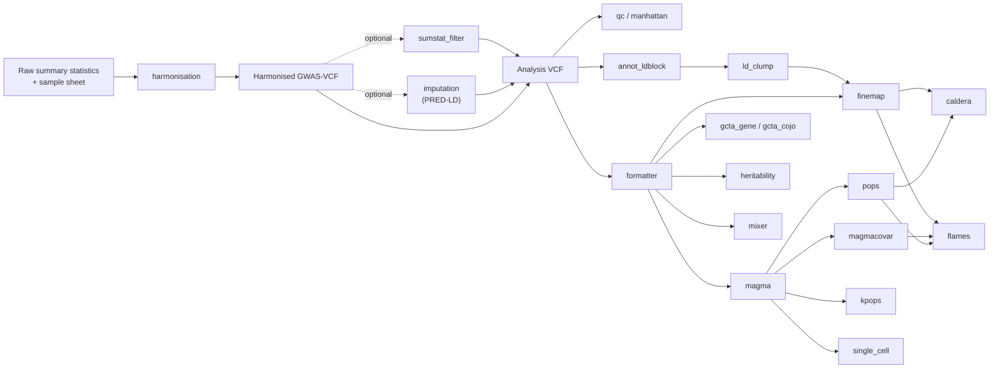

# PostGWAS

PostGWAS is a command-line toolkit that turns raw GWAS summary statistics into a
harmonised GWAS-VCF and runs reproducible post-GWAS analyses from that single
validated starting point. It covers variant-level QC, summary-statistic
imputation, LD-based locus definition, fine-mapping, gene and gene-set
association, gene prioritisation, cell-type association, SNP heritability, and
polygenic architecture modelling.

Every analysis can be run as a standalone command or as a stage of a
dependency-planned pipeline. Both paths share one configuration system, one
logging convention, and one set of input/output contracts.

> PostGWAS is research software. Review the resolved configuration, scientific
> assumptions, QC reports, rejection evidence, and external-tool output before
> interpreting results.

## How PostGWAS is organised

PostGWAS is deliberately split into two stages.

**Stage 1 — Harmonisation** is a standalone command. It reads raw summary
statistics described by a sample sheet, resolves alleles, effect scale, sample
size, frequencies and INFO, infers and lifts genome build, and writes a
GWAS-VCF together with QC evidence and per-variant rejection records.

**Stage 2 — Analysis** starts from a harmonised GWAS-VCF. Analysis modules are
selected by the result you want; in pipeline mode PostGWAS plans and runs the
preceding modules each target requires.



## Analysis modules

Names below are the exact command and `--modules` values. Run
`postgwas --help` for the live list and `postgwas COMMAND --help` for options.

### Preparation and QC

| Command | What it does | Key tool |
|---|---|---|
| `harmonisation` | Raw summary statistics → GWAS-VCF: allele/coordinate resolution, effect and SE reconstruction, build inference and liftover, per-variant rejection evidence. Standalone only. | bcftools, bundled gwas2vcf adapter |
| `sumstat_filter` | Variant-level QC on a GWAS-VCF: −log10 p, MAF, INFO, allele-frequency discordance versus the reference tag, palindromic SNPs, indels, MHC. | bcftools |
| `formatter` | One pass over the GWAS-VCF producing validated inputs for MAGMA, GCTA, SuSiE, FINEMAP, PRED-LD, LDSC and MiXeR. | bcftools |
| `imputation` | Summary-statistic imputation of untyped SNPs per chromosome, then re-harmonisation back to GWAS-VCF. | PRED-LD |
| `annot_ldblock` | Adds population LD-block IDs (Berisa & Pickrell LDetect blocks) as VCF INFO tags. | bcftools |
| `qc` | Tabular QC summary of a GWAS-VCF including allele-frequency concordance counters. | bcftools |
| `manhattan` | Manhattan and QQ plots, optionally with cytoband and consequence annotation. | R (`assoc_plot.R`) |

### Locus-level analysis

| Command | What it does | Key tool |
|---|---|---|
| `ld_clump` | Independent significant variants, lead SNPs and merged genomic risk loci, by LD block and by iterative FUMA-style clumping. | bcftools, tabix, precomputed LD tables |
| `finemap` | Per-locus posterior inclusion probabilities and credible sets from reference-panel LD. | SuSiE-RSS (R) or FINEMAP + LDstore + bgenix |
| `gcta_cojo` | Conditional and joint association analysis (`slct`, `top_snps`, `joint`, `cond`). | GCTA |

### Gene and gene-set analysis

| Command | What it does | Key tool |
|---|---|---|
| `magma` | Gene-level association and competitive gene-set analysis, with selectable SNP-to-gene mappings (`positional`, `emagma`, `h_magma`, `n_magma`, `chrom_magma`). | MAGMA ≥ 1.10 |
| `gcta_gene` | Set-based association: fastBAT gene, segment or set tests, and mBAT-combo. | GCTA |
| `magmacovar` | MAGMA gene-property analysis of continuous gene properties such as tissue expression. | MAGMA |

### Gene prioritisation and integration

| Command | What it does | Key tool |
|---|---|---|
| `pops` | Polygenic Priority Score from MAGMA gene results and a gene-feature matrix. | Vendored PoPS |
| `kpops` | Kernel-based K-POPS using a precomputed gene × gene kernel. | External `k-pops.py` |
| `caldera` | Locus-level causal-gene probabilities from PoPS scores and credible sets. | External CALDERA (R) |
| `flames` | XGBoost integration of credible-set annotation, MAGMA, gene-property and PoPS evidence. | Vendored FLAMES + bundled model |

### Cell type, heritability and architecture

| Command | What it does | Key tool |
|---|---|---|
| `single_cell` | GWAS–cell-type association via `magma_celltype`, `scdrs` and `ldsc_celltype`; select with `--tools`. | MAGMA, scDRS, LDSC |
| `heritability` | Single-trait SNP heritability on the observed scale, plus the liability scale when both prevalences are supplied. | LDSC |
| `mixer` | Single-trait causal-mixture modelling (`univariate`) and GSA-MiXeR gene-set enrichment (`gsa`). | MiXeR / GSA-MiXeR |
| `pathway_enrichment` | Pathway, drug and interaction enrichment for a user-supplied gene list. Standalone terminal analysis; needs API credentials. | External web services |

### Utility commands

| Command | What it does |
|---|---|
| `pipeline` | Plan and execute a dependency-ordered multi-module workflow. |
| `config` | Validate, show and export resolved configuration. |
| `resources` | Install and revalidate the pinned MAGMA functional-mapping bundle. |
| `postgwas --validate` | Compare an input dataset against its harmonised GWAS-VCF (concordance check). |

## Workflow and execution order

In pipeline mode you name the analyses you want; PostGWAS resolves their
dependencies, orders the steps, and refuses plans it cannot satisfy.

| Module | Pipeline dependencies |
|---|---|
| `sumstat_filter`, `annot_ldblock`, `formatter`, `manhattan`, `qc_summary` | none |
| `imputation`, `magma`, `gcta_cojo`, `gcta_gene`, `heritability`, `mixer` | `formatter` |
| `ld_clump` | `annot_ldblock` |
| `finemap` | `ld_clump`, `formatter` |
| `magmacovar`, `pops`, `kpops`, `single_cell` | `magma` |
| `caldera` | `pops`, `finemap` |
| `flames` | `finemap`, `magmacovar`, `pops` |

Resolved steps run in a fixed scientific order: filtering, then
formatting and imputation with optional post-imputation filtering, then LD-block
annotation, then formatting for downstream tools, then the requested analyses,
then plots and the QC summary. `formatter` deliberately runs twice when
imputation is active — once to build the imputation input and once on the
imputed data.

`single_cell` refines its dependencies per tool: `magma_celltype` and `scdrs`
require `magma`, while `ldsc_celltype` requires only `formatter`.

## Installation

PostGWAS depends on many external programs. The repository container is the
complete, reproducible installation definition and is the supported way to run
full analyses.

```console
docker build --platform linux/amd64 -t postgwas:local .
docker run --rm --platform linux/amd64 postgwas:local postgwas --help
```

The image pins bcftools/htslib 1.23.1 with the `liftover` plugin, PLINK 1.9 and
2, MAGMA 1.10, GCTA, LDstore 2.0, FINEMAP 1.4.2, SMR, LDSC, Ensembl VEP,
GSA-MiXeR 2.2.1, K-POPS, CALDERA, and R with SuSiE. `linux/amd64` is required:
several pinned binaries and the MiXeR container are x86-64 only.

For development, configuration inspection and command discovery:

```console
conda env create -f environment.yml
conda activate postgwas
python -m pip install -e .
postgwas --help
```

A plain `pip install -e .` installs only the CLI, configuration and validation
layers. Scientific dependencies live in the `analysis`, `enrichment` and
`single-cell` extras, and **no** external binary or reference resource is
installed by pip. Python 3.10 or newer is required.

The Installation and Resource Setup pages of the
[user guide](docs/wiki/home.md) describe the supported setup paths and the
reference-data tree in full.

## Input requirements

### Stage 1 — raw summary statistics

Harmonisation is driven by a CSV or TSV **sample sheet**, one row per dataset,
with `config_version: 2`. Column names of the raw file are declared in the
sample sheet rather than assumed, so no pre-formatting is needed.

| Group | Sample-sheet columns | Requirement |
|---|---|---|
| Identity | `config_version`, `dataset_id`, `input_file` | required |
| Coordinates | `chromosome_column` + `position_column`, or `chromosome_position_column` | one of the two |
| Alleles | `effect_allele_column`, `other_allele_column` | required |
| Effect | `effect_column` or `z_score_column` (+ `standard_error_column`) | at least one |
| Significance | `p_value_column` | required |
| Frequency | `effect_allele_frequency_column`, or `external_eaf_file` + `external_eaf_column` | exactly one |
| Sample size | `control_count_column`/`control_count`; case-control also needs `case_count_column`/`case_count` | required |
| Imputation quality | `imputation_info_column`, or `external_info_file` + `external_info_column`, or `--fixed-info` | one source |
| Declared or inferred | `trait_type`, `effect_type`, `p_value_type`, `variant_id_column`, `delimiter` | optional, default `auto` |

Templates:

```text
examples/configs/harmonisation/sample_sheet_quantitative.csv
examples/configs/harmonisation/sample_sheet_case_control.csv
examples/configs/harmonisation/run_config.yaml
```

Harmonisation also needs a reference tree containing, per genome build and
chromosome, a reference FASTA, a dbSNP VCF, an allele-frequency VCF, an Ensembl
GFF3 annotation, and chain files for liftover. All resource paths are resolved
from `resources.root` using configurable layout templates.

### Stage 2 — harmonised GWAS-VCF

Every analysis module consumes a bgzipped, tabix-indexed GWAS-VCF carrying the
standard GWAS-VCF FORMAT fields (`ES`, `SE`, `LP`, `AF`, `SI`, `SS`, `NC`,
`EZ` and related). Reference panels for downstream tools — PLINK LD references,
LD-block BEDs, pairwise LD tables, PoPS feature matrices, FLAMES annotations,
LDSC scores — are supplied by configuration and are not bundled.

## Running PostGWAS

Every analysis module has two execution modes with identical scientific
behaviour. **Pipeline mode** is for producing a result from a GWAS-VCF in one
command; **direct mode** is for running, testing or rerunning one step against
inputs you already have.

| | Pipeline mode | Direct mode |
|---|---|---|
| Invocation | `postgwas pipeline --modules finemap` | `postgwas finemap` |
| Step selection | Requested targets plus every dependency, ordered automatically | Exactly the one command you run |
| Upstream inputs | Passed between steps automatically; the options that carry them are hidden | You supply each upstream artifact explicitly |
| Preflight | Registered checks for all planned steps run before the first step executes | The module's own validation only |
| Output layout | `NN_<step>/` under the output directory, numbered in execution order | Written straight into `--output-directory` |
| Continuation | `--resume` / `--overwrite` apply to the whole plan | Per-module `--resume` / `--overwrite` where supported |
| Dry run | not available | `--dry-run` on `gcta_cojo`, `gcta_gene`, `flames`, `mixer` |

`harmonisation`, `pathway_enrichment` and `postgwas --validate` run in direct
mode only.

### 1. Harmonise

```console
postgwas harmonisation \
  --sample-sheet studies.csv \
  --run-config harmonisation.yaml \
  --resource-directory /absolute/path/to/resources \
  --output-directory /absolute/path/to/results
```

One invocation processes every row in the sample sheet; restrict it with
`--dataset-id`. Add `--validate` to compare each input against its merged VCF
immediately after harmonisation, or run the check separately:

```console
postgwas --validate \
  --sample-sheet studies.csv \
  --dataset-id STUDY \
  --vcf results/STUDY/harmonisation/STUDY_GRCh37_merged.vcf.gz \
  --output-directory results
```

### 2. Pipeline mode

Run `postgwas pipeline` with no arguments to list selectable targets, then ask
for the plan and every option a selection needs:

```console
postgwas pipeline --modules finemap --help
```

Then execute:

```console
postgwas pipeline \
  --modules flames \
  --vcf results/STUDY/harmonisation/STUDY_GRCh38_merged.vcf.gz \
  --dataset-id STUDY \
  --output-directory results/analysis \
  --run-config analysis_pipeline.yaml
```

Multiple targets and optional preparation stages combine in one plan:

```console
postgwas pipeline \
  --modules magma pops \
  --apply-filter \
  --apply-manhattan \
  --vcf results/STUDY/harmonisation/STUDY_GRCh38_merged.vcf.gz \
  --dataset-id STUDY \
  --output-directory results/analysis \
  --resume
```

`--apply-filter`, `--apply-imputation`, `--apply-manhattan` and `--heritability`
add optional stages to any selection. Modules are selected on the command line
only; the `pipeline` block of a YAML configuration is validated but does not
select modules.

### 3. Direct mode

Every analysis module is also a top-level command. Modules that read the
GWAS-VCF need only the VCF:

```console
postgwas qc \
  --vcf results/STUDY/harmonisation/STUDY_GRCh38_merged.vcf.gz \
  --dataset-id STUDY \
  --output-directory results/qc
```

Modules further down the graph need the upstream artifact that the pipeline
would otherwise have passed through — here the MAGMA gene results that PoPS
scores:

```console
postgwas pops \
  --magma-association-prefix results/analysis/05_magma/results/STUDY_magma \
  --feature-matrix-prefix /path/to/pops/features \
  --pops-gene-location-file /path/to/gene_annotation.tsv \
  --dataset-id STUDY \
  --output-directory results/pops
```

`postgwas COMMAND --help` lists exactly which artifacts a module expects; the
same options are hidden in pipeline mode because the plan supplies them.

Modules with validated resume — `formatter`, `magma`, `magmacovar`,
`gcta_cojo`, `gcta_gene`, `pops`, `kpops`, `caldera`, `flames`, `single_cell`
and `mixer` — accept `--resume` and `--overwrite` directly, so an expensive step
can be rerun or reused without replaying the pipeline. The Running Modules
Independently page explains the boundary between the two modes.

## Configuration

Settings resolve in a fixed precedence: **packaged defaults → user YAML
(`--run-config`) → explicit command-line values**. Unset flags never override
YAML, and `execution.threads`/`memory_gb` set to `auto` are resolved from the
host after merging. User YAML may pull in other files with an `include:` list.
Unknown keys are rejected with their full dotted path.

Top-level configuration keys:

| Key | Controls |
|---|---|
| `run` | output directory, dataset identifier, `resume`, `overwrite` |
| `execution` | threads, memory, random seed, retries, temporary directory |
| `logging` | console and file levels, log filename, progress display |
| `resources` | resource root, executable locations, genomes, populations |
| `modules` | per-module scientific settings and output layout |

Export a starting configuration instead of copying one from an older run:

```console
postgwas config export \
  --pipeline finemap \
  --style full \
  --output finemap_pipeline.yaml

postgwas config validate --config finemap_pipeline.yaml
postgwas config show --config finemap_pipeline.yaml --module fine_mapping
```

`--pipeline` includes every required preceding module in execution order.
`--style` controls comment density only; the resolved values are identical.

### Reference resources

`postgwas resources` installs and revalidates the pinned MAGMA
functional-mapping bundle, including the eMAGMA, H-MAGMA, nMAGMA and chromMAGMA
mapping sets, with SHA-256 verification and a generated configuration fragment:

```console
postgwas resources prepare magma --output-directory /path/to/resources/magma
```

All other reference data — genome FASTA, dbSNP, allele-frequency panels, chain
files, PLINK references, LD panels, PoPS features, FLAMES annotations, LDSC
scores, single-cell atlases — is prepared by the user. Helper scripts are in
`tools/resource_preparation/`, and the expected layout is documented on the
Reference Resources page.

## Outputs

Harmonisation writes one tree per dataset:

```text
results/
├── run_metadata/                    # resolved config, run summary, top-level log
└── STUDY/
    ├── run_metadata/                # resolved config, sample-sheet row, command
    └── harmonisation/
        ├── STUDY_GRCh37_merged.vcf.gz(.tbi)
        ├── STUDY_GRCh38_merged.vcf.gz(.tbi)
        ├── STUDY_run_manifest.json
        ├── logs/                    # dataset, per-chromosome and combined logs
        ├── rejected/                # rejected variants with reason and step
        ├── qc_summary/              # QC report, reject-reason matrix, concordance
        └── eaf_qc/
```

Pipeline runs number each step in execution order under the output directory,
so the directory listing is the executed plan:

```text
results/analysis/
├── 01_annot_ldblock/
├── 02_formatter/
├── 03_ld_clump/
├── 04_finemap/
├── 05_magma/
├── 06_magma_covar/
├── 07_pops/
└── 08_flames/
```

Within a step, modules use a consistent layout: `results/` for normalised
tables, `raw/` for native tool output, `inputs/` for prepared tool inputs,
`logs/`, and `run_metadata/` for the resolved configuration and completion
manifest. Exact filenames are configuration, so read the resolved YAML rather
than reconstructing paths; the Output Structure page describes the output
classes and how to archive a run.

## QC, logging and reproducibility

- **Rejection evidence.** Harmonisation records every discarded variant with its
  original row, the processing step, and a registered reason, and writes a
  reason-by-chromosome matrix in which a zero is positive evidence that the
  check ran. Row counts are reconciled per chromosome.
- **QC assessment.** After merging, harmonisation evaluates MAF, INFO,
  frequency discordance, palindromic and MHC filters as *reports* without
  removing variants; `sumstat_filter` is where removal happens, and it audits
  how many variants each rule removed.
- **Canonical logs.** Modules log through one formatter with explicit markers
  (`STEP`, `INPUT`, `PARAM`, `DECIDE`, `ACTION`, `RESULT`, `OUTPUT`, `STATUS`),
  so a log can be read as the executed method.
- **Provenance.** Runs write the resolved configuration, the executed command,
  external-tool versions and a run manifest alongside results.
- **Resume.** Modules that support it write a completion manifest recording the
  configuration digest and the checksums of every input and output. `--resume`
  reuses a step only when all of these still match; `--overwrite` always takes
  precedence and reruns the step. Support is per module, not universal.

## Scope and current limitations

- `harmonisation` runs only as a standalone command; it is not a pipeline stage.
  Start pipelines from a harmonised GWAS-VCF.
- `imputation` currently implements the PRED-LD engine only.
- `allele_orientation` is a registered placeholder with no implementation and
  cannot be selected in a pipeline.
- `pathway_enrichment` is a standalone terminal analysis that needs network
  access and user-supplied BioGRID and DAVID credentials; its providers are not
  individually selectable.
- `heritability` provides single-trait h² only — no partitioned heritability and
  no genetic correlation. `mixer` provides single-trait and GSA analyses only;
  cross-trait MiXeR is not exposed.
- `caldera` in pipeline mode supports GRCh37 only.
- `gcta_cojo`, `gcta_gene`, `heritability`, `mixer`, `qc`, `manhattan` and
  `pathway_enrichment` are terminal: no module consumes their results.
- Genome build, ancestry and reference panels must agree across the study and
  every resource; PostGWAS validates what it can but cannot infer intent.
- External tools and reference data are not bundled outside the container.

## Documentation

The complete user guide is stored as version-controlled Markdown in this
repository, so it remains available when GitHub Wiki access is not enabled.
Start with the [PostGWAS User Guide](docs/wiki/home.md), or open a topic below.

**Getting started** ·
[Installation](docs/wiki/getting-started/installation.md) ·
[Quick Start](docs/wiki/getting-started/quick-start.md) ·
[Resource Setup](docs/wiki/getting-started/resource-setup.md)

**Core concepts** ·
[Configuration](docs/wiki/core/configuration.md) ·
[Pipeline Workflow](docs/wiki/core/pipeline-workflow.md) ·
[Input and Output Contracts](docs/wiki/core/input-output-contracts.md) ·
[Logging and Reproducibility](docs/wiki/core/logging-and-reproducibility.md) ·
[Scientific Considerations](docs/wiki/core/scientific-considerations.md) ·
[Running Modules Independently](docs/wiki/core/running-modules-independently.md)

**Harmonisation** ·
[Overview](docs/wiki/harmonisation/overview.md) ·
[Sample Sheet](docs/wiki/harmonisation/sample-sheet.md) ·
[Configuration](docs/modules/harmonisation/configuration.md) ·
[Processing Order](docs/wiki/harmonisation/processing-order.md) ·
[Outputs and QC](docs/wiki/harmonisation/outputs-and-qc.md)

**Analysis modules** ·
[Filtering](docs/wiki/modules/filtering.md) ·
[Formatting](docs/wiki/modules/formatting.md) ·
[QC Summary](docs/wiki/modules/qc-summary.md) ·
[Manhattan Plots](docs/wiki/modules/manhattan.md) ·
[Imputation](docs/wiki/modules/imputation.md) ·
[LD Annotation](docs/wiki/modules/ld-annotation.md) ·
[LD Clumping](docs/wiki/modules/ld-clumping.md) ·
[LDSC Heritability](docs/wiki/modules/ldsc.md) ·
[Fine Mapping](docs/wiki/modules/fine-mapping.md) ·
[MAGMA](docs/wiki/modules/magma.md) ·
[GCTA Gene Analysis](docs/wiki/modules/gcta-gene.md) ·
[MAGMAcovar](docs/wiki/modules/magmacovar.md) ·
[Single-Cell Integration](docs/wiki/modules/single-cell.md) ·
[PoPS](docs/wiki/modules/pops.md) ·
[K-POPS](docs/modules/kpops.md) ·
[CALDERA](docs/modules/caldera.md) ·
[FLAMES](docs/wiki/modules/flames.md) ·
[MiXeR](docs/wiki/modules/mixer.md) ·
[Pathway Enrichment](docs/wiki/modules/pathway-enrichment.md)

**Reference** ·
[Input Data](docs/wiki/reference/input-data.md) ·
[Reference Resources](docs/wiki/reference/reference-resources.md) ·
[Configuration Defaults](docs/wiki/reference/configuration-defaults.md) ·
[Output Structure](docs/wiki/reference/output-structure.md) ·
[Command Reference](docs/wiki/reference/command-reference.md) ·
[Validation Reference](docs/wiki/reference/validation.md) ·
[Scientific References](docs/wiki/reference/scientific-references.md) ·
[scDRS Evidence Review](docs/wiki/reference/scdrs-evidence-review.md)

**Help** ·
[Troubleshooting](docs/wiki/help/troubleshooting.md) ·
[Frequently Asked Questions](docs/wiki/help/faq.md) ·
[Error Messages](docs/wiki/help/error-messages.md)

Module documentation follows the methods of the underlying tools; see
[Scientific References](docs/wiki/reference/scientific-references.md) for the
publications behind MAGMA, GCTA, SuSiE, FINEMAP, LDSC, PoPS, CALDERA, FLAMES,
MiXeR, scDRS and PRED-LD.

## Development

```console
python -m pytest -q
python tools/docs/build_wiki.py --check
python tools/docs/validate_wiki_cli.py
```

The user guide under `docs/wiki/` is the source of truth for the published Wiki:
pages are generated from `docs/wiki.yml`, and CI validates that every documented
command and option exists in the installed CLI. Edit the source pages, not
generated copies.

Repository development must follow [AGENTS.md](AGENTS.md), including scientific
validation, focused regression tests, cumulative-diff review, and protection of
the bundled harmonisation adapters.
