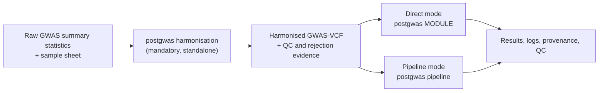

# PostGWAS

PostGWAS is a command-line toolkit that converts heterogeneous genome-wide
association study (GWAS) summary statistics into a validated GWAS-VCF, and then
runs reproducible post-GWAS analyses from that file. It provides one
configuration system, one logging and QC convention, standalone scientific
modules, and a dependency-aware pipeline for multi-stage analyses.

> **Research software.** A command that exits successfully is not evidence that
> the analysis was scientifically valid. Verify the genome build, ancestry,
> allele convention, sample-size definition, reference resources, resolved
> configuration, QC reports, and external-tool output before interpreting
> results.

## Contents

[Overview](#overview) ·
[Supported analyses](#supported-analyses) ·
[Workflow](#workflow) ·
[Execution modes](#execution-modes) ·
[Installation](#installation) ·
[External software](#external-software) ·
[Reference data](#reference-data-and-resource-files) ·
[Input formats](#input-formats) ·
[Configuration](#configuration) ·
[Quick start](#quick-start) ·
[Pipeline mode in detail](#pipeline-mode-in-detail) ·
[Direct mode in detail](#direct-mode-in-detail) ·
[Modules and execution order](#modules-and-execution-order) ·
[Outputs](#outputs) ·
[QC, logging and provenance](#qc-logging-and-provenance) ·
[Troubleshooting](#troubleshooting) ·
[Scope and current limitations](#scope-and-current-limitations) ·
[Documentation](#documentation) ·
[Development](#development) ·
[License](#license)

## Overview

PostGWAS separates data preparation from analysis.

1. **Preparation.** The `harmonisation` command reads raw summary-statistics
   tables described by a sample sheet, standardises coordinates, alleles,
   frequencies, effect statistics, sample sizes and imputation quality, and
   writes a bgzip-compressed, tabix-indexed GWAS-VCF for each requested genome
   build, together with rejection and QC evidence.
2. **Analysis.** Every downstream module reads a harmonised GWAS-VCF, or an
   artifact derived from one. You can run a single module yourself
   (*direct mode*) or ask the `pipeline` command to resolve and execute the
   registered prerequisites of one or more final analyses (*pipeline mode*).

Harmonisation is a mandatory, standalone first step. It is deliberately not a
pipeline stage: the pipeline starts from a harmonised GWAS-VCF and never ingests
the original summary-statistics table.

## Supported analyses

- **Preparation and QC** — harmonisation with rejection provenance, GWAS-VCF
  filtering, GWAS-VCF QC summaries, Manhattan and QQ plots.
- **Variant-level analysis** — LD-block annotation, LD clumping, SuSiE or
  FINEMAP fine-mapping, GCTA-COJO conditional and joint analysis, summary-
  statistic imputation.
- **Gene and gene-set analysis** — MAGMA gene and gene-set association, GCTA
  fastBAT and mBAT-combo, MAGMA gene-property analysis.
- **Gene prioritisation** — PoPS, kernel-based K-POPS, CALDERA, FLAMES.
- **Trait-level and integrative analysis** — LDSC SNP heritability, MiXeR
  polygenic architecture and GSA-MiXeR gene-set analysis, single-cell cell-type
  integration, pathway and interaction enrichment.
- **Reproducibility** — schema-validated YAML, a resolved configuration written
  beside every run, canonical logs, recorded commands and tool versions, QC
  summaries, and completion manifests for the modules that support resume.

## Workflow



Both execution modes consume the same harmonised GWAS-VCF. They differ only in
who is responsible for producing the intermediate artifacts that a module needs.

## Execution modes

### Harmonisation: required preparation for raw data

Harmonisation is driven by a **sample sheet** — a CSV or TSV file with one row
per dataset that maps the column names actually present in each study to the
concepts PostGWAS requires. Column meanings are declared, not guessed, so raw
files do not have to be pre-formatted.

Start from a maintained template:

```text
examples/configs/harmonisation/sample_sheet_quantitative.csv
examples/configs/harmonisation/sample_sheet_case_control.csv
examples/configs/harmonisation/run_config.yaml
```

Then run harmonisation:

```console
postgwas harmonisation \
  --sample-sheet studies.csv \
  --run-config harmonisation.yaml \
  --resource-directory /absolute/path/to/resources \
  --output-directory /absolute/path/to/results \
  --validate
```

`--resource-directory` is required unless `resources.root` is set in
`--run-config`. `--dataset-id` restricts the run to one row of the sample sheet;
without it every row is processed.

Structural and scientific harmonisation checks always run. `--validate` adds an
independent post-harmonisation concordance comparison between each original
dataset and its same-build merged GWAS-VCF. The same comparison can be run later
against an existing file:

```console
postgwas --validate \
  --sample-sheet studies.csv \
  --dataset-id STUDY \
  --vcf results/STUDY/harmonisation/STUDY_GRCh37_merged.vcf.gz \
  --output-directory results
```

**To understand what harmonisation actually does to your data, read
[How Harmonisation Processes Your Data](docs/wiki/harmonisation/processing-order.md).**
It walks through all seven stages and the 29 numbered steps in the exact order
they run — using the same labels that appear in the log files — and explains what
each step reads, decides, and writes.

See also the [harmonisation overview](docs/wiki/harmonisation/overview.md),
[sample-sheet guide](docs/wiki/harmonisation/sample-sheet.md),
[outputs and QC](docs/wiki/harmonisation/outputs-and-qc.md), and the
[validation reference](docs/wiki/reference/validation.md).

### Direct mode: run one module

Use direct mode when the module's required input already exists and you want to
control that one step explicitly.

In direct mode **you** supply every input: the harmonised GWAS-VCF or the
upstream artifact the module consumes, all reference and resource files, and all
module-specific parameters. Direct execution never infers, plans, or recreates a
missing upstream analysis, and it does not verify that inputs produced elsewhere
share a compatible genome build, ancestry, allele convention or sample-size
definition.

```console
postgwas finemap --help
postgwas magma --help
postgwas pathway_enrichment --help
```

### Pipeline mode: request final analyses

Use pipeline mode when PostGWAS should plan and run the registered
prerequisites. You name the final analyses you want with `--modules`; the
planner expands them into a deterministic execution order and runs shared
prerequisites once where possible.

In pipeline mode you supply one harmonised GWAS-VCF, a dataset identifier, an
output directory, a run configuration, and every external reference resource the
selected modules need. PostGWAS supplies the intermediate artifacts that earlier
steps produce; the options that carry those artifacts are hidden from the
contextual help because setting them has no effect.

Inspect the plan and its context-specific options before running anything:

```console
postgwas pipeline --modules finemap magma pops --help
```

## Installation

### Container image (recommended)

The repository `Dockerfile` is the complete software-stack definition and the
only installation path that assembles every external program.

```console
docker build --platform linux/amd64 -t postgwas:local .
docker run --rm --platform linux/amd64 postgwas:local postgwas --help
```

`linux/amd64` is required: several pinned binaries and the GSA-MiXeR container
are x86-64 only.

Mount input, output and reference-resource directories into the container, and
use the paths visible **inside** the container in commands and YAML. Review the
licences of the bundled third-party tools before redistributing an image; the
MAGMA binary in particular may not be redistributable.

### Local installation

```console
conda env create -f environment.yml
conda activate postgwas
python -m pip install -e .
postgwas --help
```

Python 3.10 or newer is required. A plain `pip install -e .` installs only the
CLI, configuration and validation layers; the scientific Python dependencies
live in the `analysis`, `enrichment` and `single-cell` extras. **No** external
binary and **no** reference resource is installed by pip — install and configure
the programs listed below before running a module.

See [Installation](docs/wiki/getting-started/installation.md) for the supported
setup paths and their limitations.

## External software

PostGWAS calls external programs rather than reimplementing them. Every
executable is configurable under `resources.executables`, and most commands also
expose a matching flag such as `--bcftools`, `--plink`, `--magma` or `--gcta`.

| Program | Required by |
|---|---|
| bcftools (with the `liftover` plugin), htslib/tabix, bgzip, bash | `harmonisation`, `sumstat_filter`, `formatter`, `annot_ldblock`, `ld_clump`, `qc` |
| PLINK 1.9 (SuSiE) and PLINK 2 (FINEMAP) | `finemap` |
| R with `susieR`, `data.table`, `ggplot2` and related packages | `finemap` (SuSiE), `manhattan`, `caldera` |
| LDstore 2.0, FINEMAP 1.4.2 and `bgenix` | `finemap` (FINEMAP engine) |
| MAGMA 1.10 or newer | `magma`, `magmacovar`, `single_cell` |
| GCTA 1.94.1 or newer | `gcta_cojo`, `gcta_gene` |
| LDSC (`ldsc.py`, `munge_sumstats.py`) | `heritability`, `single_cell` (LDSC cell-type analysis) |
| scDRS 1.0.3 | `single_cell` (scDRS analysis) |
| GSA-MiXeR 2.2.1 (native install or container) | `mixer` |
| PyTorch and the upstream `k-pops.py` script | `kpops` |
| The upstream CALDERA R repository | `caldera` |
| Ensembl VEP and CADD, or their web APIs | `flames` |
| Network access plus BioGRID and DAVID credentials | `pathway_enrichment` |

The container image pins bcftools/htslib 1.23.1 with the `liftover` plugin,
PLINK 1.9 and 2, MAGMA 1.10, GCTA 1.95.0, LDstore 2.0, FINEMAP 1.4.2, SMR,
LDSC, Ensembl VEP 113, GSA-MiXeR 2.2.1, K-POPS, CALDERA, and R with SuSiE.

## Reference data and resource files

Reference data is a scientific input, not an installation detail. PostGWAS does
not download a universal bundle, and resource compatibility is never inferred
from a filename.

**Harmonisation** resolves its resources from `resources.root` using configurable
path templates. For each genome build it needs a per-chromosome reference FASTA,
dbSNP VCF and allele-frequency VCF, an Ensembl GFF3 annotation, a tabular
allele-frequency reference used for strand and MAF/EAF resolution, chain files
for liftover, and build-check tables. Indexed resources must carry their `.tbi`,
`.csi` or `.fai` companions. The packaged build transition is GRCh37 ↔ GRCh38.

**Downstream modules** need their own references — PLINK genotype panels,
LD-block BED files, pairwise LD tables, LDSC LD scores and weights, gene-location
annotations, gene sets, PoPS or K-POPS feature matrices, FLAMES annotation
bundles, MiXeR LD resources, single-cell atlases. None of these are bundled.

One bundle has an installer. `postgwas resources` downloads, SHA-256 verifies and
installs the pinned MAGMA functional-mapping bundle, including the eMAGMA,
H-MAGMA, nMAGMA and chromMAGMA mapping sets, and writes a matching configuration
fragment:

```console
postgwas resources prepare magma --output-directory /path/to/resources/magma
```

Everything else is prepared by the user. Helper scripts are in
`tools/resource_preparation/`. The expected trees and a preparation checklist
are on the [Resource Setup](docs/wiki/getting-started/resource-setup.md) and
[Reference Resources](docs/wiki/reference/reference-resources.md) pages.

## Input formats

### Stage 1 — raw summary statistics

Harmonisation reads a CSV or TSV **sample sheet** with `config_version: 2` and
one row per dataset. Unrecognised columns are rejected.

| Group | Sample-sheet columns | Requirement |
|---|---|---|
| Identity | `config_version`, `dataset_id`, `input_file` | required |
| Coordinates | `chromosome_column` + `position_column`, or `chromosome_position_column` | one of the two |
| Alleles | `effect_allele_column`, `other_allele_column` | required |
| Effect | `effect_column` or `z_score_column`, with optional `standard_error_column` | at least one |
| Significance | `p_value_column` | required |
| Frequency | `effect_allele_frequency_column`, or `external_eaf_file` + `external_eaf_column` | exactly one source |
| Sample size | `control_count_column` or `control_count`; case-control also needs `case_count_column` or `case_count` | required |
| Imputation quality | `imputation_info_column`, or `external_info_file` + `external_info_column`, or the `--fixed-info` flag | one source |
| Declared or inferred | `trait_type`, `effect_type`, `p_value_type`, `variant_id_column`, `delimiter` | optional; the inferable fields default to `auto` |

Relative `input_file` and external-file paths are resolved from the directory
containing the sample sheet. The full column reference, accepted values and
validation rules are in [Input Data](docs/wiki/reference/input-data.md) and the
[sample-sheet guide](docs/wiki/harmonisation/sample-sheet.md).

### Stage 2 — harmonised GWAS-VCF

Every analysis module consumes a bgzipped, tabix-indexed GWAS-VCF carrying the
standard GWAS-VCF FORMAT fields (`ES`, `SE`, `LP`, `AF`, `SI`, `SS`, `NC`, `EZ`
and related). Some modules consume a table derived from that VCF by `formatter`
rather than the VCF itself; the per-module input contract is stated on each
module page and summarised under
[Input and Output Contracts](docs/wiki/core/input-output-contracts.md).

## Configuration

Settings resolve in a fixed precedence: **packaged defaults → user YAML
(`--run-config`) → explicit command-line values**. Unset flags never override
YAML. `execution.threads` and `execution.memory_gb` set to `auto` are resolved
from the host after merging. A user YAML file may pull in other files with an
`include:` list. Unknown keys are rejected with their full dotted path.

| Top-level key | Controls |
|---|---|
| `config_version` | configuration schema version |
| `run` | output directory, dataset identifier, `resume`, `overwrite` |
| `execution` | threads, memory, random seed, retries, temporary directory |
| `logging` | console and file levels, log filename, progress display |
| `resources` | resource root, executable locations, container settings, genome builds, populations |
| `pipeline` | a validated record of the intended module list; module selection itself comes from `--modules` |
| `modules` | per-module scientific settings and output layout |

Export a starting configuration instead of copying one from an older run:

```console
postgwas config export \
  --pipeline finemap \
  --style full \
  --output finemap_pipeline.yaml

postgwas config validate --config finemap_pipeline.yaml
postgwas config show --config finemap_pipeline.yaml --module fine_mapping
```

`--pipeline` accepts pipeline target names and includes every required preceding
module in execution order. `--module` accepts configuration module names, which
are not always identical to command names — for example `filtering`,
`fine_mapping`, `qc_summary` and `enrichment`. `--style` controls comment
density only; the resolved values are identical.

See [Configuration](docs/wiki/core/configuration.md) and
[Configuration Defaults](docs/wiki/reference/configuration-defaults.md).

## Quick start

1. **Install** the container image or the local environment, and confirm the
   external programs your analyses need are on the path.
2. **Prepare reference data** for your genome build and ancestry.
3. **Write a sample sheet** from a template in
   `examples/configs/harmonisation/`.
4. **Harmonise**, then read the QC and rejection reports before going further:

   ```console
   postgwas harmonisation \
     --sample-sheet studies.csv \
     --run-config harmonisation.yaml \
     --resource-directory /absolute/path/to/resources \
     --output-directory results \
     --validate
   ```

5. **Choose an execution mode** and export a configuration for it:

   ```console
   postgwas config export \
     --pipeline finemap magma pops \
     --style full \
     --output analysis_pipeline.yaml
   ```

6. **Fill in the resource paths** in `analysis_pipeline.yaml`, then run the
   analysis from the harmonised GWAS-VCF:

   ```console
   postgwas pipeline \
     --modules finemap magma pops \
     --vcf results/STUDY/harmonisation/STUDY_GRCh37_merged.vcf.gz \
     --dataset-id STUDY \
     --output-directory results/analysis \
     --run-config analysis_pipeline.yaml
   ```

7. **Review the run as a scientific record** — resolved configuration, canonical
   logs, tool versions, QC summaries and completion status, not only the final
   table or plot.

The [Quick Start](docs/wiki/getting-started/quick-start.md) page expands each
step.

## Pipeline mode in detail

**What you provide**

- one harmonised GWAS-VCF (`--vcf`), a dataset identifier (`--dataset-id`) and
  an output directory (`--output-directory`);
- a run configuration (`--run-config`) containing the scientific settings and
  reference paths for every selected module;
- the final analyses you want (`--modules`), plus any optional workflow
  switches.

**What PostGWAS provides**

- the execution order, including modules you did not name;
- the intermediate artifacts passed between steps, such as the LD-block
  annotated VCF, formatter tables, the clumped locus file, MAGMA gene results
  and PoPS scores.

**Selecting and ordering modules.** `--modules` accepts one or more pipeline
target names from the table below. Each target's registered dependencies are
expanded recursively, cycles are rejected, and the resulting steps are emitted
in a fixed order: filtering, then formatting and imputation (with an automatic
post-imputation filtering step when both filtering and imputation are active),
then LD-block annotation, then formatting for downstream tools, then the
analysis modules, then plotting and QC summaries. Formatting can legitimately
appear twice, because the pre-imputation and post-imputation representations are
different data.

**Optional workflow switches.** `--apply-filter`, `--apply-imputation`,
`--apply-manhattan` and `--heritability` add `sumstat_filter`, `imputation`,
`manhattan` and `heritability` to the plan without naming them as targets.

**Inspect before running.** With `--help`, the pipeline prints the exact steps
that will run and only the options that apply to them:

```console
postgwas pipeline --modules finemap magma pops --help
```

For the example above the plan is `annot_ldblock`, `formatter`, `ld_clump`,
`magma`, `pops`, `finemap`.

**Run the plan.**

```console
postgwas pipeline \
  --modules finemap magma pops \
  --vcf STUDY_GRCh37_merged.vcf.gz \
  --dataset-id STUDY \
  --output-directory results \
  --run-config analysis_pipeline.yaml
```

Execution stops at the first failed step. A later step is never reported as
complete unless execution reached it successfully. See
[Pipeline Workflow](docs/wiki/core/pipeline-workflow.md).

## Direct mode in detail

**What you provide:** everything. The module's own input artifact, every
reference file, and every scientific parameter.

Read the module page and the installed `--help` output together before running a
module directly — the module page explains the input contract and the
interpretation, and `postgwas COMMAND --help` is authoritative for option names
and packaged defaults.

Filter a harmonised GWAS-VCF:

```console
postgwas sumstat_filter \
  --vcf STUDY_GRCh37_merged.vcf.gz \
  --dataset-id STUDY \
  --output-directory results \
  --run-config filtering.yaml \
  --minimum-maf 0.01 \
  --minimum-info 0.7 \
  --remove-mhc
```

Run MAGMA from formatter output:

```console
postgwas magma \
  --snp-location-file STUDY_magma_snp_loc.tsv \
  --p-value-file STUDY_magma_p_values.tsv \
  --magma-ld-reference /path/to/reference/g1000_eur \
  --gene-location-file /path/to/reference/NCBI37.3.gene.loc \
  --dataset-id STUDY \
  --output-directory results
```

Placeholders used above: `STUDY` is your `--dataset-id`;
`STUDY_GRCh37_merged.vcf.gz` is a merged GWAS-VCF written by harmonisation;
`STUDY_magma_snp_loc.tsv` and `STUDY_magma_p_values.tsv` are written by
`formatter`; paths beginning `/path/to/reference/` are user-prepared resources.

See [Running Modules Independently](docs/wiki/core/running-modules-independently.md).

## Modules and execution order

The table reflects the current public command registry. **Direct** means the
module has its own `postgwas COMMAND` interface. **Pipeline** gives the target
name accepted by `postgwas pipeline --modules`, and **Requires** lists the
pipeline dependencies the planner inserts automatically.

| Command | Purpose | Direct | Pipeline | Requires |
|---|---|:---:|:---:|---|
| [`harmonisation`](docs/wiki/harmonisation/overview.md) | Standardise raw summary statistics and create validated GWAS-VCF artifacts. | Yes | No — required before the pipeline | — |
| [`sumstat_filter`](docs/wiki/modules/filtering.md) | Apply configured GWAS-VCF quality-control filters. | Yes | `sumstat_filter` | — |
| [`formatter`](docs/wiki/modules/formatting.md) | Create validated inputs for downstream scientific tools. | Yes | `formatter` | — |
| [`imputation`](docs/wiki/modules/imputation.md) | Impute missing summary statistics. | Yes | `imputation` | `formatter` |
| [`annot_ldblock`](docs/wiki/modules/ld-annotation.md) | Annotate variants with population-specific LD blocks. | Yes | `annot_ldblock` | — |
| [`ld_clump`](docs/wiki/modules/ld-clumping.md) | Identify independent significant variants and genomic loci. | Yes | `ld_clump` | `annot_ldblock` |
| [`manhattan`](docs/wiki/modules/manhattan.md) | Generate Manhattan and QQ plots. | Yes | `manhattan` | — |
| [`qc`](docs/wiki/modules/qc-summary.md) | Generate a GWAS-VCF QC summary. | Yes | `qc_summary` | — |
| [`heritability`](docs/wiki/modules/ldsc.md) | Estimate SNP heritability with LDSC. | Yes | `heritability` | `formatter` |
| [`finemap`](docs/wiki/modules/fine-mapping.md) | Run SuSiE or FINEMAP fine-mapping. | Yes | `finemap` | `ld_clump`, `formatter` |
| [`magma`](docs/wiki/modules/magma.md) | Run MAGMA gene and gene-set association analysis. | Yes | `magma` | `formatter` |
| [`gcta_cojo`](docs/modules/gcta_cojo/README.md) | Run GCTA-COJO conditional, joint, or stepwise association analysis. | Yes | `gcta_cojo` | `formatter` |
| [`gcta_gene`](docs/wiki/modules/gcta-gene.md) | Run GCTA fastBAT or mBAT-combo gene, segment, or set analysis. | Yes | `gcta_gene` | `formatter` |
| [`magmacovar`](docs/wiki/modules/magmacovar.md) | Run MAGMA gene-property analysis. | Yes | `magmacovar` | `magma` |
| [`single_cell`](docs/wiki/modules/single-cell.md) | Identify GWAS-associated cell types using single-cell expression data. | Yes | `single_cell` | `magma`, or `formatter` for LDSC cell-type analysis |
| [`pops`](docs/wiki/modules/pops.md) | Prioritise genes with PoPS. | Yes | `pops` | `magma` |
| [`kpops`](docs/modules/kpops.md) | Prioritise genes with kernel-based K-POPS. | Yes | `kpops` | `magma` |
| [`caldera`](docs/modules/caldera.md) | Prioritise causal genes using PoPS and fine-mapped credible sets. | Yes | `caldera` | `pops`, `finemap` |
| [`flames`](docs/wiki/modules/flames.md) | Integrate fine-mapping, MAGMA, gene-property, and PoPS evidence. | Yes | `flames` | `finemap`, `magmacovar`, `pops` |
| [`mixer`](docs/wiki/modules/mixer.md) | Run single-trait MiXeR architecture or GSA gene-set analysis. | Yes | `mixer` | `formatter` |
| [`pathway_enrichment`](docs/wiki/modules/pathway-enrichment.md) | Run pathway and interaction enrichment analyses. | Yes | No — standalone terminal analysis | — |

One additional step, `post_imputation_filter`, is internal: the planner inserts
it automatically when filtering and imputation are combined, and it cannot be
selected on the command line.

Supporting commands are not scientific pipeline targets:

| Command | Purpose |
|---|---|
| `postgwas config` | Validate, inspect, show, and export resolved configuration. |
| `postgwas resources` | Install or validate supported pinned scientific resource bundles. |
| `postgwas pipeline` | Plan and execute a multi-module downstream workflow. |
| `postgwas --validate` | Compare an original summary-statistics dataset with an existing same-build harmonised GWAS-VCF. |

Run `postgwas --help` for the authoritative installed command list, and
`postgwas COMMAND --help` for the current options of a module. The
[Command Reference](docs/wiki/reference/command-reference.md) maps every command
to its documentation page.

## Outputs

Harmonisation writes one tree per dataset:

```text
results/
├── run_metadata/                    # resolved config, run summary, top-level log
└── STUDY/
    ├── run_metadata/                # resolved config, sample-sheet row, command
    └── harmonisation/
        ├── STUDY_GRCh37_merged.vcf.gz(.tbi)
        ├── STUDY_GRCh38_merged.vcf.gz(.tbi)
        ├── STUDY_run_manifest.json
        ├── STUDY_screen_report.txt
        ├── logs/                    # dataset, per-chromosome and combined logs
        ├── rejected/                # rejected variants with reason and step
        ├── qc_summary/              # QC report, reject-reason matrix, concordance
        └── eaf_qc/
```

Pipeline runs number each step in execution order directly below
`--output-directory`, so the directory listing is the executed plan. For
`--modules flames` the tree is:

```text
<output-directory>/
├── 01_annot_ldblock/
├── 02_formatter/
├── 03_ld_clump/
├── 04_magma/
├── 05_magma_covar/
├── 06_pops/
├── 07_finemap/
└── 08_flames/
```

Step numbers are positions in the plan, not fixed module identifiers: the same
module can appear twice with two different numbers, and a different target set
produces different numbers.

Within a step, modules use a consistent layout — `results/` for normalised
tables, `raw/` for native tool output, `inputs/` for prepared tool inputs,
`logs/`, and `run_metadata/` for the resolved configuration and completion
manifest. Exact filenames are configuration, so read the resolved YAML rather
than reconstructing paths. [Output Structure](docs/wiki/reference/output-structure.md)
describes the output classes and how to archive a run.

## QC, logging and provenance

- **Rejection evidence.** Harmonisation records every discarded variant with its
  original row, the processing step, and a registered reason, and writes a
  reason-by-chromosome matrix in which a zero is positive evidence that the check
  ran. Row counts are reconciled per chromosome.
- **QC assessment.** After merging, harmonisation evaluates MAF, INFO, frequency
  discordance, palindromic and MHC criteria as *reports* without removing
  variants. Removal happens in `sumstat_filter`, which audits how many variants
  each rule removed.
- **Canonical logs.** Modules log through one formatter with explicit markers
  (`STEP`, `INPUT`, `PARAM`, `DECIDE`, `ACTION`, `RESULT`, `OUTPUT`, `STATUS`),
  so a log can be read as the executed method.
- **Provenance.** Runs write the resolved configuration, the executed command,
  external-tool versions and a run manifest alongside results.
- **Failure reporting.** A failed step records `STATUS: FAILED` with the external
  command, its output and the corrective guidance. Partially written outputs are
  not evidence of completion; harmonisation additionally reports per-dataset
  statuses such as `PARTIAL`, `FAILED` and `PREFLIGHT_FAILED` in its run summary.
- **Resume.** Modules that support it write a completion manifest recording the
  configuration digest and the checksums of every input and output. `--resume`
  reuses a step only when all of these still match; `--overwrite` always takes
  precedence and reruns the step. Support is per module, not universal.

See [Logging and Reproducibility](docs/wiki/core/logging-and-reproducibility.md).

## Troubleshooting

Start from the first validation or execution error, not the final missing-file
symptom.

| Symptom | First checks |
|---|---|
| Command not found | The environment is active and the checkout is installed; external tools such as bcftools, PLINK, MAGMA, GCTA or R are on the path. |
| Configuration rejected | Run `postgwas config validate` on the same file, then `postgwas config show` for the module. Unknown keys are reported with their full dotted path. |
| Sample-sheet paths fail | Relative paths resolve from the sample sheet's directory; check the delimiter, header spelling, duplicate dataset IDs, and the mutually exclusive internal-versus-external frequency and INFO mappings. |
| Few variants survive | Read the rejection-reason matrix and the filter reason summary before changing thresholds. |
| Poor reference join rate | Check genome build, chromosome naming, variant-ID representation, allele order, population and resource release. |
| External tool failed | Read both the PostGWAS canonical log and the tool's own log; confirm every companion file and index exists. |
| Unexpected pipeline order | Print the plan with `--help`; the planner inserts dependencies and can repeat formatting around imputation. |

[Troubleshooting](docs/wiki/help/troubleshooting.md),
[Frequently Asked Questions](docs/wiki/help/faq.md) and
[Error Messages](docs/wiki/help/error-messages.md) cover these in full.

## Scope and current limitations

- `harmonisation` runs only as a standalone command; it is not a pipeline stage.
  Start pipelines from a harmonised GWAS-VCF.
- `pathway_enrichment` is a standalone terminal analysis. It requires network
  access and user-supplied BioGRID and DAVID credentials, and its providers are
  not individually selectable.
- `imputation` currently implements the PRED-LD engine only.
- `heritability` provides single-trait observed- and liability-scale h² only —
  no partitioned heritability and no genetic correlation. `mixer` provides
  single-trait and GSA analyses only; cross-trait MiXeR is not exposed.
- `caldera` supports GRCh37 only in pipeline mode. In direct mode GRCh38 is
  accepted when the credible-set file carries a gene or rsID column.
- `single_cell`, `kpops`, `caldera`, `flames`, `gcta_cojo`, `gcta_gene`,
  `heritability`, `mixer`, `qc`, `manhattan` and `pathway_enrichment` are
  terminal: no module consumes their results.
- `--apply-filter` cannot currently be combined with a target whose plan also
  defines a genome-build option, including `finemap`, `ld_clump`, `caldera`,
  `flames`, `mixer`, `gcta_cojo` and `gcta_gene`. Run `sumstat_filter` as a
  separate step and pass the filtered VCF to the pipeline instead.
- Genome build, ancestry and reference panels must agree across the study and
  every resource. PostGWAS validates what it can, but it cannot infer intent.
- External tools and reference data are not bundled outside the container.

## Documentation

The complete user guide is stored as version-controlled Markdown in this
repository, so it remains available when GitHub Wiki access is not enabled.
Start with the [PostGWAS User Guide](docs/wiki/home.md), or open a topic below.

**Getting started** ·
[Installation](docs/wiki/getting-started/installation.md) ·
[Quick Start](docs/wiki/getting-started/quick-start.md) ·
[Resource Setup](docs/wiki/getting-started/resource-setup.md)

**Core concepts** ·
[Configuration](docs/wiki/core/configuration.md) ·
[Pipeline Workflow](docs/wiki/core/pipeline-workflow.md) ·
[Input and Output Contracts](docs/wiki/core/input-output-contracts.md) ·
[Logging and Reproducibility](docs/wiki/core/logging-and-reproducibility.md) ·
[Scientific Considerations](docs/wiki/core/scientific-considerations.md) ·
[Running Modules Independently](docs/wiki/core/running-modules-independently.md)

**Harmonisation** ·
[Overview](docs/wiki/harmonisation/overview.md) ·
[Sample Sheet](docs/wiki/harmonisation/sample-sheet.md) ·
[Configuration](docs/modules/harmonisation/configuration.md) ·
[How Harmonisation Processes Your Data](docs/wiki/harmonisation/processing-order.md) ·
[Outputs and QC](docs/wiki/harmonisation/outputs-and-qc.md)

**Analysis modules** ·
[Filtering](docs/wiki/modules/filtering.md) ·
[Formatting](docs/wiki/modules/formatting.md) ·
[QC Summary](docs/wiki/modules/qc-summary.md) ·
[Manhattan Plots](docs/wiki/modules/manhattan.md) ·
[Imputation](docs/wiki/modules/imputation.md) ·
[LD Annotation](docs/wiki/modules/ld-annotation.md) ·
[LD Clumping](docs/wiki/modules/ld-clumping.md) ·
[LDSC Heritability](docs/wiki/modules/ldsc.md) ·
[Fine Mapping](docs/wiki/modules/fine-mapping.md) ·
[MAGMA](docs/wiki/modules/magma.md) ·
[GCTA Gene Analysis](docs/wiki/modules/gcta-gene.md) ·
[MAGMAcovar](docs/wiki/modules/magmacovar.md) ·
[Single-Cell Integration](docs/wiki/modules/single-cell.md) ·
[PoPS](docs/wiki/modules/pops.md) ·
[K-POPS](docs/modules/kpops.md) ·
[CALDERA](docs/modules/caldera.md) ·
[FLAMES](docs/wiki/modules/flames.md) ·
[MiXeR](docs/wiki/modules/mixer.md) ·
[Pathway Enrichment](docs/wiki/modules/pathway-enrichment.md)

**Reference** ·
[Input Data](docs/wiki/reference/input-data.md) ·
[Reference Resources](docs/wiki/reference/reference-resources.md) ·
[Configuration Defaults](docs/wiki/reference/configuration-defaults.md) ·
[Output Structure](docs/wiki/reference/output-structure.md) ·
[Command Reference](docs/wiki/reference/command-reference.md) ·
[Validation Reference](docs/wiki/reference/validation.md) ·
[Scientific References](docs/wiki/reference/scientific-references.md) ·
[scDRS Evidence Review](docs/wiki/reference/scdrs-evidence-review.md)

**Help** ·
[Troubleshooting](docs/wiki/help/troubleshooting.md) ·
[Frequently Asked Questions](docs/wiki/help/faq.md) ·
[Error Messages](docs/wiki/help/error-messages.md)

`gcta_cojo` is documented in [docs/modules/gcta_cojo/README.md](docs/modules/gcta_cojo/README.md).
Module documentation follows the methods of the underlying tools; see
[Scientific References](docs/wiki/reference/scientific-references.md) for the
publications behind MAGMA, GCTA, SuSiE, FINEMAP, LDSC, PoPS, CALDERA, FLAMES,
MiXeR, scDRS and PRED-LD.

## Development

```console
python -m pytest -q
python tools/docs/build_wiki.py --check
python tools/docs/validate_wiki_cli.py
```

The user guide under `docs/wiki/` is the source of truth for the published
guide: pages are listed in `docs/wiki.yml`, and CI validates that every
documented command and option exists in the installed CLI. Edit the source
pages, not generated copies. When adding a page, follow the contract in
[docs/wiki/README.md](docs/wiki/README.md) and start module pages from
[docs/templates/module-page.md](docs/templates/module-page.md).

Repository development must follow [AGENTS.md](AGENTS.md), including scientific
validation, focused regression tests, cumulative-diff review, and protection of
the bundled harmonisation adapters.

## License

See [LICENSE](LICENSE). Third-party tools and reference datasets carry their own
terms, which apply independently of this repository's licence.
