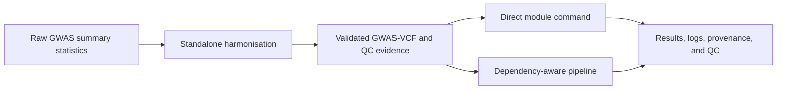

# PostGWAS

PostGWAS is a command-line toolkit for converting heterogeneous genome-wide
association study (GWAS) summary statistics into validated GWAS-VCF and for
running reproducible post-GWAS analyses. It provides one configuration system,
consistent logging and QC, standalone scientific modules, and a dependency-aware
pipeline for multi-stage analyses.

> **Research software:** validate the genome build, ancestry, allele convention,
> sample-size definition, reference resources, resolved configuration, QC
> reports, and external-tool output before interpreting results.

## At a glance

- **Input:** raw GWAS summary-statistics tables for harmonisation, or a
  harmonised GWAS-VCF for downstream analysis.
- **Core preparation:** coordinate, allele, frequency, effect-statistic,
  sample-size, INFO, reference, and VCF validation with rejection provenance.
- **Execution:** run one module directly or let the pipeline resolve and execute
  the registered dependencies for one or more final analyses.
- **Analysis:** filtering, imputation, LD analysis, fine-mapping, heritability,
  gene and gene-set testing, gene prioritisation, single-cell integration,
  architecture analysis, enrichment, plotting, and QC reporting.
- **Reproducibility:** schema-validated YAML, resolved settings, canonical logs,
  commands, software metadata, QC summaries, and completion validation.

## Workflow



Harmonisation is deliberately performed before the downstream pipeline. The
pipeline starts from a harmonised GWAS-VCF; it does not ingest the original raw
summary-statistics table.

## Execution modes

### Harmonisation: required preparation for raw data

Create one version-2 sample-sheet row per GWAS dataset, using the maintained
[quantitative](examples/configs/harmonisation/sample_sheet_quantitative.csv) or
[case-control](examples/configs/harmonisation/sample_sheet_case_control.csv)
template. Map the columns actually present in the study rather than renaming or
guessing their scientific meaning.

```console
postgwas harmonisation \
  --sample-sheet studies.csv \
  --run-config harmonisation.yaml \
  --resource-directory /absolute/path/to/resources \
  --output-directory /absolute/path/to/results \
  --validate
```

Normal harmonisation validation is always active. `--validate` adds a
post-harmonisation concordance comparison between each original dataset and its
same-build merged GWAS-VCF. See the [harmonisation overview](docs/wiki/harmonisation/overview.md),
[sample-sheet guide](docs/wiki/harmonisation/sample-sheet.md), and
[processing order](docs/wiki/harmonisation/processing-order.md).

### Direct mode: run one module

Use direct mode when the required upstream artifact already exists and you want
to control one module explicitly:

```console
postgwas finemap --help
postgwas magma --help
postgwas pathway_enrichment --help
```

In direct mode, you are responsible for supplying all required inputs and for
confirming that their genome build, ancestry, alleles, identifiers, sample-size
definition, and reference resources are compatible. Direct execution does not
infer or recreate missing upstream analyses.

### Pipeline mode: request final analyses

Use pipeline mode when PostGWAS should plan and run registered dependencies.
Select the final results you want; the planner expands them into a deterministic
execution order and runs shared prerequisites once where possible.

Inspect the plan and its context-specific options first:

```console
postgwas pipeline \
  --modules finemap magma pops \
  --apply-filter \
  --help
```

Export a complete configuration for the selected workflow:

```console
postgwas config export \
  --pipeline finemap magma pops \
  --style full \
  --output analysis_pipeline.yaml
```

Then run from the harmonised GWAS-VCF:

```console
postgwas pipeline \
  --modules finemap magma pops \
  --apply-filter \
  --vcf STUDY_GRCh37_merged.vcf.gz \
  --dataset-id STUDY \
  --output-directory results \
  --run-config analysis_pipeline.yaml
```

Optional pipeline switches can add pre-analysis filtering, imputation,
Manhattan/QQ plotting, and LDSC heritability. Formatting may intentionally run
before and after imputation because those stages produce different artifacts.
See [Pipeline Workflow](docs/wiki/core/pipeline-workflow.md).

## Supported modules

The table below reflects the current public command registry. **Direct** means
the module has its own `postgwas COMMAND` interface. **Pipeline** shows the
target name accepted by `postgwas pipeline --modules`.

| Command | Purpose | Direct | Pipeline |
|---|---|:---:|:---:|
| [`harmonisation`](docs/wiki/harmonisation/overview.md) | Standardise raw summary statistics and create validated GWAS-VCF artifacts. | Yes | No — required before the pipeline |
| [`sumstat_filter`](docs/wiki/modules/filtering.md) | Apply configured GWAS-VCF quality-control filters. | Yes | `sumstat_filter` |
| [`formatter`](docs/wiki/modules/formatting.md) | Create validated inputs for downstream scientific tools. | Yes | `formatter` |
| [`imputation`](docs/wiki/modules/imputation.md) | Impute missing summary statistics. | Yes | `imputation` |
| [`annot_ldblock`](docs/wiki/modules/ld-annotation.md) | Annotate variants with population-specific LD blocks. | Yes | `annot_ldblock` |
| [`ld_clump`](docs/wiki/modules/ld-clumping.md) | Identify independent significant variants and genomic loci. | Yes | `ld_clump` |
| [`manhattan`](docs/wiki/modules/manhattan.md) | Generate Manhattan and QQ plots. | Yes | `manhattan` |
| [`qc`](docs/wiki/modules/qc-summary.md) | Generate a GWAS-VCF QC summary. | Yes | `qc_summary` |
| [`heritability`](docs/wiki/modules/ldsc.md) | Estimate SNP heritability with LDSC. | Yes | `heritability` |
| [`finemap`](docs/wiki/modules/fine-mapping.md) | Run SuSiE or FINEMAP fine-mapping. | Yes | `finemap` |
| [`magma`](docs/wiki/modules/magma.md) | Run MAGMA gene and gene-set association analysis. | Yes | `magma` |
| [`gcta_cojo`](docs/modules/gcta_cojo/README.md) | Run GCTA-COJO conditional, joint, or stepwise association analysis. | Yes | `gcta_cojo` |
| [`gcta_gene`](docs/wiki/modules/gcta-gene.md) | Run GCTA fastBAT or mBAT-combo gene, segment, or set analysis. | Yes | `gcta_gene` |
| [`magmacovar`](docs/wiki/modules/magmacovar.md) | Run MAGMA gene-property analysis. | Yes | `magmacovar` |
| [`single_cell`](docs/wiki/modules/single-cell.md) | Identify GWAS-associated cell types using single-cell expression data. | Yes | `single_cell` |
| [`pops`](docs/wiki/modules/pops.md) | Prioritise genes with PoPS. | Yes | `pops` |
| [`kpops`](docs/modules/kpops.md) | Prioritise genes with kernel-based K-POPS. | Yes | `kpops` |
| [`caldera`](docs/modules/caldera.md) | Prioritise causal genes using PoPS and fine-mapped credible sets. | Yes | `caldera` |
| [`flames`](docs/wiki/modules/flames.md) | Integrate fine-mapping, MAGMA, gene-property, and PoPS evidence. | Yes | `flames` |
| [`mixer`](docs/wiki/modules/mixer.md) | Run single-trait MiXeR architecture or GSA gene-set analysis. | Yes | `mixer` |
| [`pathway_enrichment`](docs/wiki/modules/pathway-enrichment.md) | Run pathway and interaction enrichment analyses. | Yes | No — standalone terminal analysis |

Supporting commands are not scientific pipeline targets:

| Command | Purpose |
|---|---|
| `postgwas config` | Validate, inspect, show, and export resolved configuration. |
| `postgwas resources` | Install or validate supported pinned scientific resource bundles. |
| `postgwas pipeline` | Plan and execute a multi-module downstream workflow. |
| `postgwas --validate` | Compare an original summary-statistics dataset with an existing same-build harmonised GWAS-VCF. |

Run `postgwas --help` for the authoritative installed command list and
`postgwas COMMAND --help` for the current options of a direct module.

## Installation

### Recommended: container

The repository Dockerfile is the complete software-stack definition. Build it
from the repository root:

```console
docker build --platform linux/amd64 -t postgwas:local .
docker run --rm --platform linux/amd64 postgwas:local postgwas --help
```

Mount input, output, and reference-resource directories into the container and
use the paths visible inside the container in commands and YAML. Review the
licenses of bundled third-party tools before redistributing an image.

### Local development

```console
conda env create -f environment.yml
conda activate postgwas
python -m pip install -e .
postgwas --help
```

A Python installation alone does not install every external bioinformatics
program, R package, or scientific reference dataset required by all modules.
See [Installation](docs/wiki/getting-started/installation.md) and
[Resource Setup](docs/wiki/getting-started/resource-setup.md).

## Inputs and reference resources

### Raw summary statistics

Harmonisation accepts delimited, optionally compressed summary-statistics files
through a version-2 CSV or TSV sample sheet. The sheet maps study-specific
columns to coordinates, alleles, effect statistics, P values, frequency, INFO,
sample size, trait type, and optional external lookup files. See
[Input Data](docs/wiki/reference/input-data.md).

### Downstream input

The downstream pipeline starts from a harmonised, indexed GWAS-VCF. Direct
modules may instead accept a GWAS-VCF or a validated module-specific artifact,
depending on the command. Do not hand-edit VCF fields or reuse a table prepared
for a different scientific consumer.

### References

Reference genomes, dbSNP, allele-frequency panels, LD panels, gene annotations,
expression matrices, and tool-specific resources must match the configured
genome build, population, allele convention, identifier system, and software
release. PostGWAS does not treat these resources as interchangeable. See
[Reference Resources](docs/wiki/reference/reference-resources.md).

## Validation and QC

PostGWAS validates configuration and required inputs before expensive work,
then applies module-specific scientific and technical checks. Harmonisation
additionally validates coordinates, alleles, duplicates, genome-build evidence,
strand orientation, EAF/MAF interpretation, sample size, INFO, BETA/OR, SE, Z,
P-value consistency, chromosome completion, VCF structure, indexes, liftover,
merge completeness, and variant accounting.

To validate an existing same-build merged GWAS-VCF against its original input:

```console
postgwas --validate \
  --sample-sheet studies.csv \
  --dataset-id STUDY \
  --vcf STUDY_GRCh37_merged.vcf.gz \
  --output-directory results
```

Retain rejection reports and QC evidence. A result file alone does not prove
that its stage completed successfully.

## Configuration and reproducibility

Configuration is resolved in this order:

1. packaged, schema-validated YAML defaults;
2. values from `--run-config`;
3. explicit command-line overrides.

Inspect or export the effective configuration rather than copying options from
an older run:

```console
postgwas config show --module harmonisation

postgwas config export \
  --module harmonisation \
  --style full \
  --output harmonisation.yaml

postgwas config validate --config harmonisation.yaml
```

Archive the input manifest, resolved configuration, canonical logs, executed
commands, tool versions, primary outputs, QC and rejection reports, and resource
provenance with every analysis. See [Logging and Reproducibility](docs/wiki/core/logging-and-reproducibility.md)
and [Output Structure](docs/wiki/reference/output-structure.md).

## Documentation

Because GitHub Wiki access is not enabled for this private repository, the
version-controlled pages below are the canonical PostGWAS user guide.

### Getting started

- [Home](docs/wiki/home.md)
- [Installation](docs/wiki/getting-started/installation.md)
- [Quick Start](docs/wiki/getting-started/quick-start.md)
- [Resource Setup](docs/wiki/getting-started/resource-setup.md)

### Core concepts

- [Configuration](docs/wiki/core/configuration.md)
- [Pipeline Workflow](docs/wiki/core/pipeline-workflow.md)
- [Input and Output Contracts](docs/wiki/core/input-output-contracts.md)
- [Logging and Reproducibility](docs/wiki/core/logging-and-reproducibility.md)
- [Scientific Considerations](docs/wiki/core/scientific-considerations.md)
- [Running Modules Independently](docs/wiki/core/running-modules-independently.md)

### Harmonisation

- [Harmonisation Overview](docs/wiki/harmonisation/overview.md)
- [Harmonisation Sample Sheet](docs/wiki/harmonisation/sample-sheet.md)
- [Harmonisation Configuration](docs/modules/harmonisation/configuration.md)
- [Harmonisation Processing Order](docs/wiki/harmonisation/processing-order.md)
- [Harmonisation Outputs and QC](docs/wiki/harmonisation/outputs-and-qc.md)

### Analysis modules

- [Filtering](docs/wiki/modules/filtering.md)
- [Formatting](docs/wiki/modules/formatting.md)
- [QC Summary](docs/wiki/modules/qc-summary.md)
- [Manhattan Plots](docs/wiki/modules/manhattan.md)
- [Imputation](docs/wiki/modules/imputation.md)
- [LD Annotation](docs/wiki/modules/ld-annotation.md)
- [LD Clumping](docs/wiki/modules/ld-clumping.md)
- [LDSC Heritability](docs/wiki/modules/ldsc.md)
- [Fine Mapping](docs/wiki/modules/fine-mapping.md)
- [MAGMA](docs/wiki/modules/magma.md)
- [GCTA-COJO](docs/modules/gcta_cojo/README.md)
- [GCTA Gene Analysis](docs/wiki/modules/gcta-gene.md)
- [MAGMAcovar](docs/wiki/modules/magmacovar.md)
- [Single-Cell Integration](docs/wiki/modules/single-cell.md)
- [PoPS](docs/wiki/modules/pops.md)
- [K-POPS](docs/modules/kpops.md)
- [CALDERA](docs/modules/caldera.md)
- [FLAMES](docs/wiki/modules/flames.md)
- [MiXeR](docs/wiki/modules/mixer.md)
- [Pathway Enrichment](docs/wiki/modules/pathway-enrichment.md)

### Reference

- [Input Data](docs/wiki/reference/input-data.md)
- [Reference Resources](docs/wiki/reference/reference-resources.md)
- [Configuration Defaults](docs/wiki/reference/configuration-defaults.md)
- [Output Structure](docs/wiki/reference/output-structure.md)
- [Command Reference](docs/wiki/reference/command-reference.md)
- [Validation Reference](docs/wiki/reference/validation.md)
- [Scientific References](docs/wiki/reference/scientific-references.md)
- [scDRS Evidence Review](docs/wiki/reference/scdrs-evidence-review.md)

### Help

- [Troubleshooting](docs/wiki/help/troubleshooting.md)
- [Frequently Asked Questions](docs/wiki/help/faq.md)
- [Error Messages](docs/wiki/help/error-messages.md)

## Development

```console
python -m pytest -q
python tools/docs/build_wiki.py --check
python tools/docs/validate_wiki_cli.py
```

Repository development must follow [AGENTS.md](AGENTS.md), including scientific
validation, focused regression tests, cumulative-diff review, and protection of
the bundled harmonisation adapters.

## License

See [LICENSE](LICENSE). Third-party tools and reference datasets may have
additional terms that apply independently.
