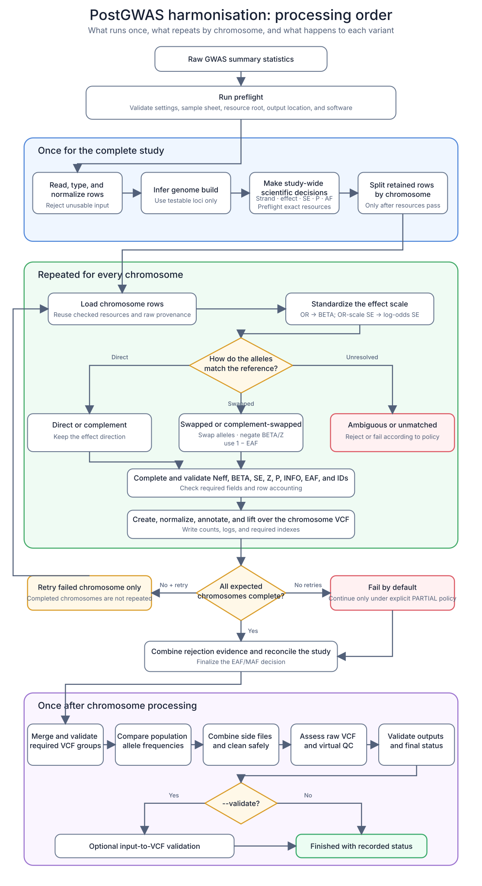

# Harmonisation Processing Order

PostGWAS takes a study's raw GWAS summary-statistics table and produces
allele-aligned, build-resolved GWAS-VCFs with QC and rejection evidence.

This page follows the real processing order. It first gives a visual map, then
explains every logged step in plain English.

## Visual workflow

Read this diagram from top to bottom. The three large boxes show which work is
performed once for the complete study, which work repeats for each chromosome,
and which work happens only after chromosome processing.



The unresolved-variant branch does not rejoin the retained-variant path. The
retry arrow represents failed chromosomes only; completed chromosomes are not
needlessly repeated.

The most important distinction is:

- **Study-wide decisions are made once.** Genome build, strand consensus,
  beta versus odds ratio, SE scale, P-value representation, and initial EAF/MAF
  classification must be the same for every chromosome.
- **Variant orientation is checked row by row.** After the study-wide decisions
  are known, each variant is compared with its chromosome reference and may be
  kept, swapped, reverse-complemented, rejected, or reported as unresolved.

Therefore, “study strand is forward” does **not** mean PostGWAS blindly leaves
every allele unchanged. It still checks every variant against the reference.

## Key terms

| Term | Plain meaning |
|---|---|
| Effect allele | The allele to which BETA, OR, Z, and EAF refer. |
| Other allele | The second allele in the study file. |
| EAF | Frequency of the effect allele. It changes to `1 − EAF` when effect and other alleles are swapped. |
| MAF | Frequency of the less common allele. It is not necessarily tied to the reported effect allele. |
| INFO | Variant-level imputation-quality score. |
| Neff | Effective sample size, especially for an unbalanced case-control study. |
| REF/ALT | The reference and alternate alleles in a genome-build reference or VCF. |

The configured population-frequency panel helps with allele orientation and
frequency QC. It does not silently replace a missing study EAF.

## Where each part happens

| Level | How often? | Main purpose |
|---|---:|---|
| Run preflight | Once per command | Check the sample sheet, resource root, configuration, and software. |
| Exact resource preflight | Once per study | Check every resource needed by the inferred build and observed chromosomes. |
| Dataset preparation | Once per study | Clean the input and make decisions shared by all chromosomes. |
| Chromosome processing | Once per chromosome | Harmonise individual variants and create chromosome VCFs. |
| Dataset finalization | Once after chromosome work | Merge VCFs, assess QC, and write final status. |
| Concordance validation | Only with `--validate` | Compare the original input with the same-build merged VCF. |

## Stage A — Check the run before reading the large file

PostGWAS performs these checks first:

1. Combine packaged defaults, optional run YAML, and explicit CLI options. CLI
   options have highest priority.
2. Read and validate the version-2 sample sheet. If `--dataset-id` is supplied,
   select only that dataset.
3. Resolve the INFO source. Priority is internal INFO, then external INFO, then
   the explicit `--fixed-info` value when neither file-based source exists.
   With no usable INFO source, the run stops.
4. Check the resource root, output directory, required executables, and the
   configured bcftools liftover plugin. Exact chromosome files cannot yet be
   selected because the study's build and observed chromosomes are not known.
5. Save the resolved configuration, command, normalized sample-sheet row, and
   initial logs.
6. Process sample-sheet datasets one at a time. A failed dataset does not erase
   another dataset that completed successfully.

If one of these checks fails, chromosome analysis has not started.

## Stage B — Prepare the complete dataset

These eight steps run once on the complete study.

1. **Dataset step 1 — Check configuration.** PostGWAS checks column mappings,
   alternative inputs, EAF/INFO sources, sample-size declarations, resources,
   and policy compatibility. The full study file is not read yet.

2. **Dataset step 2 — Check the header.** It confirms that every configured
   column exists. It then checks that the input stream is readable and not
   obviously truncated, and counts the data rows for later accounting.

3. **Dataset step 3 — Read and clean the study.** Polars reads the configured
   columns. PostGWAS assigns a stable source-row number and preserves the raw
   values for rejection provenance. It then, in order:

   - rejects rows missing mandatory values;
   - splits a combined coordinate such as `1:100000`, when configured;
   - normalizes chromosome labels, positions, and alleles;
   - rejects invalid coordinates and unusable alleles;
   - converts configured scientific columns to numeric types while keeping
     identifiers as strings;
   - identifies duplicate groups and deterministically retains or rejects rows
     according to the configured ranking; and
   - normalizes an internal INFO column when present.

4. **Dataset step 4 — Check the parsed values.** PostGWAS verifies that the
   mapped columns contain usable data. It measures missing sample-size values
   across the whole study. If mean or median filling is configured, one
   dataset-wide fill value is calculated here and reused by every chromosome.
   Too much missing sample size stops the dataset.

5. **Dataset step 5 — Determine the genome build.** Study coordinates and
   alleles are compared with the configured GRCh37 and GRCh38 build-check
   files. Only positions that can actually be tested are used in the match
   denominator. Weak or ambiguous evidence stops unless an explicit compatible
   build setting resolves it.

6. **Dataset step 6 — Determine strand consensus.** Informative,
   non-palindromic matches are counted as forward or reverse-complement.
   Palindromic and ambiguous matches do not vote. The result is a study-level
   guide for the later per-variant orientation step.

7. **Dataset step 7 — Determine statistic types.** PostGWAS decides or verifies:

   - BETA versus odds ratio;
   - for odds ratios, log-odds SE versus raw OR-scale SE;
   - raw P versus negative-log10 P versus negative-natural-log P; and
   - EAF-like versus MAF-like frequency distribution.

   Explicit sample-sheet declarations remain visible and are compared with the
   detected evidence. Automatic beta/OR inference produces a warning because
   an all-positive beta column can resemble odds ratios.

Before step 8, PostGWAS performs the **exact resource preflight**. It resolves
the source and target build resources for every chromosome actually present in
the study, then checks all problems in one pass:

- required files must exist, be regular files, and be non-empty;
- comparison-AF and dbSNP VCF indexes must be present and readable, and their
  exact chromosome labels must match the study with at least one indexed record;
- the comparison-AF VCF header must define every configured INFO frequency tag
  as a numeric allele value (`Type=Float`, `Number=A` or `Number=1`);
- the source FASTA index must contain the study chromosome label, while target
  FASTA contigs must match the target labels declared by the liftover chain;
- default EAF and configured external EAF/INFO table headers must contain their
  mapped chromosome, position, allele, and value columns, without duplicates,
  and the table must contain data rows; and
- GFF and liftover-chain files must contain a readable record of the expected
  format.

Shared files are checked once. If anything is missing or incompatible,
PostGWAS reports the complete grouped list and starts no chromosome worker.
The resolved per-chromosome resource paths and successful check counts are
stored in the dataset log and run manifest.

The index checks follow the
[bcftools annotation/index requirements](https://samtools.github.io/bcftools/bcftools)
and the standard
[FASTA `.fai` index format](https://www.htslib.org/doc/faidx.html).

8. **Dataset step 8 — Split by chromosome.** This happens only after resource
   preflight passes. Only retained rows are partitioned.
   PostGWAS also resolves how many chromosomes may run together and how many
   threads each chromosome receives.

At this point PostGWAS has not yet created VCFs. It has a validated study,
recorded study-wide decisions, and one work file per chromosome.

## Stage C — Process every chromosome

Chromosomes may run in parallel, but the following sixteen steps always occur
in this order inside each chromosome.

1. **Chromosome step 1 — Load the partition.** Read the validated chromosome
   rows and connect them to the raw source snapshot used for rejected output.

2. **Chromosome step 2 — Find the reference files.** Reuse this chromosome's
   already preflighted frequency panel, optional external EAF/INFO, dbSNP,
   source and target FASTA, annotation file, and liftover chain. A lightweight
   existence/index recheck protects against a file being removed between
   dataset preflight and worker startup; the worker does not repeat the full
   schema and bcftools validation.

3. **Chromosome step 3 — Put effects on the BETA scale.** A beta remains beta.
   An odds ratio becomes `BETA = ln(OR)`. If SE was determined to be raw
   OR-scale, it is converted before allele swapping. This ordering is important:
   after conversion, swapping negates BETA while leaving log-odds SE unchanged.

4. **Chromosome step 4 — Orient alleles and obtain EAF.** Every variant is
   matched to the supplied chromosome reference using chromosome, position,
   and alleles. A multiallelic position is not accepted by position alone.
   PostGWAS selects one safe orientation, updates allele-specific statistics,
   and rejects or fails unresolved variants according to policy.

   It then validates the internal EAF or allele-matches the configured external
   EAF. If the whole-study screen marked an internal column as MAF-like, the
   reference performs the second check here. A column confirmed as true MAF is
   not silently called EAF; PostGWAS stops with an actionable message.

5. **Chromosome step 5 — Calculate sample size.** Case-control studies use
   cases and controls to calculate
   `Neff = 4 / (1/Ncase + 1/Ncontrol)`. Quantitative studies use total analyzed
   N and cannot enter the case-control formula. The whole-study missing-value
   plan is applied consistently.

6. **Chromosome step 6 — Recover BETA or SE from Z when needed.** Supplied BETA
   and SE are kept. Missing values may be reconstructed from Z, EAF, and Neff
   when scientifically possible. See the decision table below.

7. **Chromosome step 7 — Harmonise P values.** Apply the study-wide P-value
   representation, create the internal raw and negative-log10 forms, and count
   missing, invalid, clipped, or exactly zero values.

8. **Chromosome step 8 — Derive a still-missing SE.** If SE was neither supplied
   nor recovered from Z, derive it from BETA and P using the configured tail
   assumption. The packaged GWAS default is two-sided. A reported `p = 0`
   without SE or usable Z fails by default because zero is underflow/censoring,
   not an exact probability.

9. **Chromosome step 9 — Produce the final Z score.** Keep a supplied Z;
   otherwise calculate `Z = BETA / SE`. A finite negative BETA is valid, and a
   valid zero BETA gives `Z = 0`. SE must be finite and positive.

10. **Chromosome step 10 — Check statistical agreement.** Validate BETA, SE,
    and Z, check `Z ≈ BETA / SE`, and compare Z with the harmonised P value
    using the two-sided GWAS relationship and configured tolerance.

11. **Chromosome step 11 — Obtain INFO.** Use internal INFO first, otherwise
    external allele-matched INFO, otherwise the explicitly requested fixed INFO.
    Missing and out-of-range values follow the resolved policy. A fixed value is
    clearly logged as user-assigned rather than measured.

12. **Chromosome step 12 — Complete variant identifiers.** Preserve and
    normalize a supplied study ID. Fill missing IDs with a deterministic
    chromosome-position-allele ID. dbSNP IDs are assigned later by exact CHROM,
    POS, REF, and ALT matching.

13. **Chromosome step 13 — Check required output fields.** Confirm that every
    required column exists and that required row values are present. A completely
    absent required column fails rather than being skipped.

Before export, PostGWAS verifies:

```text
rows read − rows rejected = rows ready for export
```

An imbalance stops the chromosome because a row was lost or counted twice.

14. **Chromosome step 14 — Export adapter input.** Write the harmonised table,
    JSON column mapping, counts, and summaries required by GWAS-to-VCF.

15. **Chromosome step 15 — Create the first VCF.** Run the bundled GWAS-to-VCF
    adapter in the inferred input build. Exact commands, exit status, and
    adapter counts are recorded.

16. **Chromosome step 16 — Normalize, annotate, and lift over.** bcftools:

    1. normalizes against the input-build FASTA and splits multiallelic records;
    2. removes exact duplicate records and clears temporary record IDs;
    3. adds dbSNP IDs using exact allele matching and fills remaining IDs with
       the configured coordinate-allele form;
    4. adds configured population AF fields using exact allele matching;
    5. adds consequence annotations;
    6. lifts records to the opposite build;
    7. applies the configured allele-swap policy; and
    8. normalizes, sorts, compresses, indexes, and counts the target-build VCF.

    Non-lifted records are saved. Excessive liftover loss follows configured
    warning/failure thresholds, and a required target VCF with zero surviving
    variants always fails.

## A simple allele-swapping example

Assume one input row contains:

| Field | Study value |
|---|---:|
| Effect allele | A |
| Other allele | G |
| OR | 1.50 |
| EAF | 0.70 |

The chromosome reference says `REF=A` and `ALT=G`. The study effect allele is
therefore the reference allele, but PostGWAS writes the association relative to
ALT. This is a `forward_swapped` variant.

The ordered transformations are:

1. Convert OR before swapping: `ln(1.50) = +0.405`.
2. Set effect allele to G and other allele to A.
3. Negate the effect: `BETA = −0.405`.
4. Invert the frequency: `EAF = 1 − 0.70 = 0.30`.
5. Negate a supplied Z score. Keep a log-odds SE unchanged.

The direction changed because the reported allele changed. The biological
association did not change.

## Possible allele-orientation results

| Result | What PostGWAS does |
|---|---|
| Forward | Keep the direction. |
| Forward swapped | Swap alleles; negate BETA/Z; use `1 − EAF`. |
| Reverse complement | Complement alleles; keep the effect direction. |
| Reverse complement swapped | Complement and swap; negate BETA/Z; use `1 − EAF`. |
| Palindromic resolved | Use strand consensus and informative EAF to select one orientation. |
| Palindromic ambiguous | Reject or fail because A/T or C/G cannot be oriented safely. |
| Reference ambiguous | Reject or fail because more than one reference orientation remains. |
| Reference unmatched | Reject or fail because no reference allele pair matches. |

## How missing effect statistics are completed

| Values available after effect conversion | Action |
|---|---|
| BETA and SE | Keep both. Z is kept if supplied, otherwise calculated later. |
| BETA and Z, but no SE | Calculate `SE = BETA / Z` where Z is usable. |
| Z and SE, but no BETA | Calculate `BETA = Z × SE`. |
| Z only | Estimate standardized BETA and SE using Z, EAF, and Neff. |
| BETA and P, but no SE or Z | Derive SE from BETA and P, then calculate Z. |
| Neither BETA nor Z | Fail because an effect cannot be reconstructed. |

The Z-only calculation produces a standardized effect estimate. It depends on
correct EAF and sample-size assumptions. EAF from a population reference rather
than the measured study sample may make the approximation less accurate.

## Stage D — Handle chromosome failures and reconcile rows

After each chromosome round:

1. Keep completed chromosomes.
2. Clean partial files and retry failed chromosomes up to the configured limit.
3. Stop retrying when the limit is reached or a retry round makes no progress.
4. Fail the dataset by default if a chromosome still fails. If partial output
   was explicitly allowed, label the result `PARTIAL`, never `OK`.
5. Combine input-stage and chromosome-stage rejected rows into one rejection
   file and one reason-by-chromosome report.
6. Fail finalization if required rejection provenance cannot be written.
7. Reconcile total rows across completed chromosomes.
8. Finalize the EAF/MAF decision using chromosome reference evidence. This final
   decision replaces the initial MAF suspicion in later QC and concordance.

## Stage E — Merge chromosome results and run final QC

These five steps run once after chromosome processing.

1. **Post-merge step 1 — Merge chromosome VCFs.** Validate every expected VCF
   and index, create a missing index when possible, and concatenate required
   input-build, target-build, and raw adapter groups. Missing inputs, invalid
   files, failed merges, or missing indexes count as failures. Merges are
   retried, and required merge failure stops the dataset by default.

2. **Post-merge step 2 — Compare population frequencies.** Query the raw,
   unfiltered, concatenated input-build VCF once. For each configured population,
   report missingness, Pearson correlation, and mean absolute AF difference.
   Report the closest population and warn when it conflicts with the selected
   population or an external EAF/INFO filename token.

3. **Post-merge step 3 — Combine side files and clean up.** Merge adapter
   summaries and mappings, archive adapter inputs, compress configured outputs,
   and remove only intermediates whose required result was successfully created.

4. **Post-merge step 4 — Assess the raw merged VCF.** One extraction calculates
   raw VCF metrics and evaluates the configured EAF, INFO, reference-AF,
   variant-type, palindromic, and MHC rules. It also calculates metrics for the
   combined **virtual** QC-passed subset. Rule counts can overlap. The raw VCF
   is not replaced by a filtered VCF.

5. **Post-merge step 5 — Finish the dataset.** Validate promised primary VCFs,
   indexes, chromosome status, and merge status. Write detailed QC, the final
   QC takeaways, combined log, elapsed time, output paths, and terminal manifest
   status.

In the final QC display:

- ✅ means the summarized requirement passed;
- ⚠️ means the section contains something the user should inspect; and
- ❌ means a required operation failed.

For example, the allele-frequency card shows ⚠️ when even a small number of
variants are discordant or missing reference AF. That warning does not by
itself mean the complete dataset failed.

## Stage F — Optional input-to-VCF validation

This stage runs only with `--validate`, after required VCFs and QC are complete.

1. Select the merged VCF in the inferred input build.
2. Stage the original input, duplicate evidence, optional external EAF, and VCF
   values.
3. Confirm that the VCF header build agrees with the inferred input build.
4. Compare one chromosome partition at a time to limit memory.
5. Report SNP, indel, and other-variant matching separately. SNP orientation can
   consider direct, swapped, complement, and complement-swapped alleles. Indels
   require exact representation; possible normalization-related differences are
   reported but not claimed as proven matches.
6. Compare oriented effect, final EAF, and Z values using configured tolerances.
7. Write summary, mismatch, input-only, VCF-only, duplicate-VCF, and optional
   all-match reports, then add the result to the run manifest.

A validation failure does not erase harmonised files, but the dataset is not
reported as successfully validated.

## What can happen to one input row?

| Final outcome | Meaning | Where to look |
|---|---|---|
| Retained unchanged | The row was already usable and correctly oriented. | Chromosome log and final VCF. |
| Retained after correction | OR conversion, allele swapping, frequency inversion, or statistic derivation was applied and counted. | Chromosome log and final VCF. |
| Rejected during harmonisation | An explicit policy removed the row. Original input values and the reason are preserved. | Dataset rejected-variant file and reason report. |
| Not emitted by the adapter | The row reached GWAS-to-VCF but the adapter did not emit it. | Adapter summary and transcript. |
| Not lifted | The input-build record exists, but no target-build record was produced. | Non-lifted VCF and liftover counts. |
| Dataset failed | Continuing would be incomplete or scientifically unsafe, or required output/provenance could not be validated. | Dataset log and run manifest. |

## What should the user check before downstream analysis?

1. Final status is `OK` and all expected chromosomes completed.
2. Genome build and strand evidence are convincing.
3. Effect type, SE scale, P-value type, and final EAF/MAF decisions are correct.
4. Rejection counts and reasons are acceptable.
5. Input, exported, adapter, and final VCF counts are understood.
6. Required VCFs and indexes are present and liftover retention is acceptable.
7. Reference-AF concordance and closest-population results are sensible.
8. Raw and virtual QC counts are acceptable for the intended downstream method.
9. Optional concordance passed when `--validate` was requested.

See [Harmonisation Outputs and QC](outputs-and-qc.md) for file locations and
[Harmonisation Configuration](../../modules/harmonisation/configuration.md) for
the policies controlling these decisions.
