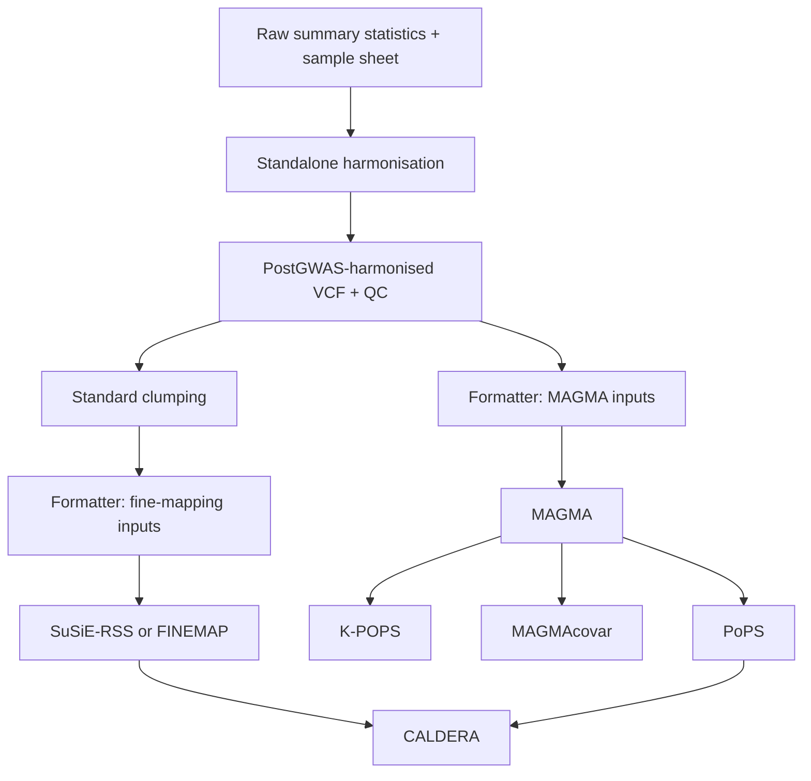

# PostGWAS user guide

This is the complete documentation index for PostGWAS. The repository README
provides installation, the analysis catalogue and a short introduction; use the
pages below for input contracts, method-specific commands and interpretation.
All guides remain available as ordinary repository Markdown without a separate
GitHub Wiki deployment.

## Start with your input

| What you have | Where to go |
|---|---|
| Raw summary statistics | [Quick start](getting-started/quick-start.md), then [sample-sheet preparation](harmonisation/sample-sheet.md) and [harmonisation](harmonisation/overview.md) |
| A PostGWAS-harmonised VCF | [Pipeline workflow](core/pipeline-workflow.md) or a VCF-consuming module in the index below |
| Compatible tool-specific results | [Running modules independently](core/running-modules-independently.md), then the selected module's input requirements |
| No installation or reference data yet | [Installation](getting-started/installation.md) and [resource setup](getting-started/resource-setup.md) |

Pipeline entry requires an indexed, single-sample PostGWAS-harmonised VCF with
provenance, not an arbitrary VCF. Direct commands accept their documented file
types; some can use compatible inputs prepared outside PostGWAS. Harmonisation
and pathway enrichment are standalone-only; the direct QC command is
`postgwas qc`, while its pipeline target is `qc_summary`.

## How analysis branches connect

The following example shows two branches leading to gene prioritisation. It
is not a request to run every module and does not show external references,
which remain user inputs. Start at the VCF when it already exists.

This diagram explicitly selects standard clumping. Region clumping adds
LD-block annotation; COJO selection adds formatting and a PLINK reference.
MAGMA cell typing and scDRS use the MAGMA branch in pipeline mode, whereas LDSC
cell typing uses formatter/LDSC inputs without MAGMA. CALDERA consumes PoPS,
not K-POPS. The [pipeline guide](core/pipeline-workflow.md) explains the remaining
branches, conditional dependencies and current limitations.

## Find the right level of detail

- For a first run, use the [connected tutorial](getting-started/quick-start.md).
- To understand harmonisation decisions, read the [processing walkthrough](harmonisation/processing-order.md), then the [complete policy reference](harmonisation/policies.md).
- For an analysis, open its module guide: required inputs and resources come
  before commands; outputs and interpretation follow them.
- To investigate a result, start with [output structure](reference/output-structure.md), [validation](reference/validation.md) and [troubleshooting](help/troubleshooting.md).

## Complete documentation index

- [Home](home.md)

### Getting Started

- [Installation](getting-started/installation.md)
- [Quick Start](getting-started/quick-start.md)
- [Resource Setup](getting-started/resource-setup.md)

### Core Concepts

- [Configuration](core/configuration.md)
- [Pipeline Workflow](core/pipeline-workflow.md)
- [Pipeline Input Validation](core/pipeline-input-validation.md)
- [Input and Output Contracts](core/input-output-contracts.md)
- [Logging and Reproducibility](core/logging-and-reproducibility.md)
- [Analysis Assumptions and Limitations](core/scientific-considerations.md)
- [Running Modules Independently](core/running-modules-independently.md)

### Harmonisation

- [Harmonisation Overview](harmonisation/overview.md)
- [Harmonisation Sample Sheet](harmonisation/sample-sheet.md)
- [Harmonisation Configuration](../modules/harmonisation/configuration.md)
- [Harmonisation Workflow and Policy Reference](harmonisation/policies.md)
- [How Harmonisation Processes Your Data](harmonisation/processing-order.md)
- [Harmonisation Outputs and QC](harmonisation/outputs-and-qc.md)

### Analysis Modules

- [Filtering](modules/filtering.md)
- [Formatting](modules/formatting.md)
- [QC Summary](modules/qc-summary.md)
- [Manhattan Plots](modules/manhattan.md)
- [Imputation](modules/imputation.md)
- [LD Annotation](modules/ld-annotation.md)
- [LD Clumping](modules/ld-clumping.md)
- [LDSC Heritability](modules/ldsc.md)
- [Fine Mapping](modules/fine-mapping.md)
- [MAGMA](modules/magma.md)
- [GCTA Gene Analysis](modules/gcta-gene.md)
- [GCTA-COJO](../modules/gcta_cojo/README.md)
- [MAGMAcovar](modules/magmacovar.md)
- [Single-Cell Integration](modules/single-cell.md)
- [PoPS](modules/pops.md)
- [K-POPS](../modules/kpops.md)
- [CALDERA](../modules/caldera.md)
- [FLAMES](modules/flames.md)
- [MiXeR](modules/mixer.md)
- [Pathway Enrichment](modules/pathway-enrichment.md)

### Reference

- [Input Data](reference/input-data.md)
- [Reference Resources](reference/reference-resources.md)
- [Configuration Defaults](reference/configuration-defaults.md)
- [Output Structure](reference/output-structure.md)
- [Command Reference](reference/command-reference.md)
- [Validation Reference](reference/validation.md)
- [Method References](reference/scientific-references.md)
- [scDRS Evidence Review](reference/scdrs-evidence-review.md)

### Help

- [Troubleshooting](help/troubleshooting.md)
- [Frequently Asked Questions](help/faq.md)
- [Error Messages](help/error-messages.md)
