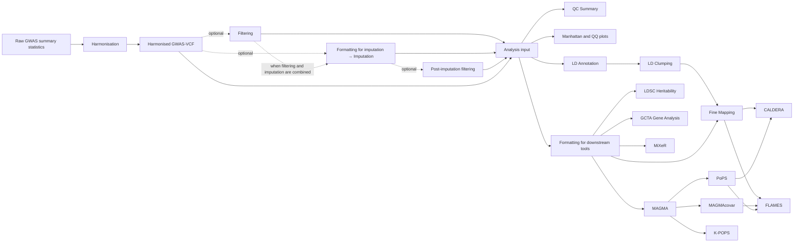

# PostGWAS user guide

PostGWAS is a command-line toolkit for preparing GWAS summary statistics and
running post-GWAS analyses through standalone commands or a validated pipeline.

## Start here

- [Installation](getting-started/installation.md) explains the supported local
  and container setup paths and their limitations.
- [Quick Start](getting-started/quick-start.md) shows the two-stage journey:
  harmonise raw summary statistics, then run downstream analyses.
- [Input Data](reference/input-data.md) describes the raw-summary-statistics
  sample sheet and the harmonised GWAS-VCF boundary.
- [Reference Resources](reference/reference-resources.md) explains why genome
  build and ancestry must agree across the study and every reference panel.
- [Resource Setup](getting-started/resource-setup.md) gives the current
  harmonisation resource tree and validation checklist.

## Understand the workflow

- [Configuration](core/configuration.md) explains configuration precedence,
  validation, inspection, and export.
- [Pipeline Workflow](core/pipeline-workflow.md) explains target selection,
  dependency planning, and execution order.
- [Input and Output Contracts](core/input-output-contracts.md) explains the
  scientific metadata and file boundaries between stages.
- [Logging and Reproducibility](core/logging-and-reproducibility.md) explains
  the run information needed to audit and reproduce an analysis.
- [Scientific Considerations](core/scientific-considerations.md) summarizes
  the compatibility decisions that must be made before analysis.
- [Running Modules Independently](core/running-modules-independently.md)
  explains the boundary between standalone commands and pipeline execution.

## How the modules connect

All workflows begin by converting raw GWAS summary statistics into a
harmonised GWAS-VCF. The downstream pipeline then adds the preparation steps
required by the final analysis you select.



Filtering, imputation, Manhattan plots, and LDSC heritability can be added to a
pipeline with workflow switches. Solid arrows between analysis modules show
required pipeline dependencies; dotted arrows show optional preparation paths.
The diagram does not mean that every branch runs in every analysis. See
[Pipeline Workflow](core/pipeline-workflow.md) before selecting targets.

## Choose an analysis

Select the result you want. In pipeline mode, PostGWAS plans the required
preceding modules automatically.

| Research task | User guide | Pipeline selection |
|---|---|---|
| Prepare raw summary statistics | [Harmonisation](harmonisation/overview.md) | Standalone first stage |
| Apply variant-level QC rules | [Filtering](modules/filtering.md) | `--modules sumstat_filter` or `--apply-filter` |
| Create external-tool input files | [Formatting](modules/formatting.md) | `--modules formatter` or planned automatically |
| Summarise GWAS-VCF quality | [QC Summary](modules/qc-summary.md) | `--modules qc_summary` |
| Draw Manhattan and QQ plots | [Manhattan Plots](modules/manhattan.md) | `--modules manhattan` or `--apply-manhattan` |
| Impute missing summary statistics | [Imputation](modules/imputation.md) | `--modules imputation` or `--apply-imputation` |
| Assign variants to LD blocks | [LD Annotation](modules/ld-annotation.md) | `--modules annot_ldblock` |
| Identify independent loci | [LD Clumping](modules/ld-clumping.md) | `--modules ld_clump` |
| Estimate SNP heritability | [LDSC Heritability](modules/ldsc.md) | `--modules heritability` or `--heritability` |
| Fine-map association signals | [Fine Mapping](modules/fine-mapping.md) | `--modules finemap` |
| Test gene and gene-set association | [MAGMA](modules/magma.md) | `--modules magma` |
| Run GCTA gene, segment, or set tests | [GCTA Gene Analysis](modules/gcta-gene.md) | `--modules gcta_gene` |
| Run GCTA-COJO conditional or joint analysis | `docs/modules/gcta_cojo/README.md` in the repository | `--modules gcta_cojo` |
| Test gene properties with MAGMA | [MAGMAcovar](modules/magmacovar.md) | `--modules magmacovar` |
| Identify GWAS-associated cell types | [Single-Cell Integration](modules/single-cell.md) | `--modules single_cell` |
| Prioritise genes with PoPS | [PoPS](modules/pops.md) | `--modules pops` |
| Prioritise genes with K-POPS | [K-POPS](../modules/kpops.md) | `--modules kpops` |
| Combine PoPS with credible sets | [CALDERA](../modules/caldera.md) | `--modules caldera` |
| Integrate fine-mapping and gene evidence | [FLAMES](modules/flames.md) | `--modules flames` |
| Model polygenic architecture or run MiXeR GSA | [MiXeR](modules/mixer.md) | `--modules mixer` |
| Run pathway and interaction enrichment | [Pathway Enrichment](modules/pathway-enrichment.md) | Standalone terminal analysis |

## Command discovery

Use the live command help together with this guide. The help output reflects the
installed checkout, while the Wiki explains inputs, workflow context, outputs,
and interpretation.

```console
postgwas --help
postgwas harmonisation --help
postgwas pipeline --help
```
